# Component Library

Screenshots of the course's reusable components, each captured from a live use in the course. Full prop documentation lives in `briefing.md` under "Components"; this gallery is the visual index.

Captured 2026-06-10 at 1200px viewport from the lessons noted below. If a component's design changes, recapture from the same spot.

## Activity shells (InteractiveBox)

All activities sit on `InteractiveBox`, which has three variants: `try` on the mint surface (✎ TRY IT), `see` on the sand surface (◉ SEE IT), and `lab` on the teal surface (⚒ LAB). The header row carries the eyebrow, title, and usually an `ActivityCounter`; an `ActivityInstruction` line sits below the title.

### TRY IT — Pattern 2 (parallel)
All items visible at once in one `InnerCard`, one `ScenarioRow` per item with `FeedbackPill` answer controls and per-item feedback; counter tracks answered. Shown with the first row answered. Canonical reference: "Match the Task to the Effort" in The Effort Dial (`effort`).

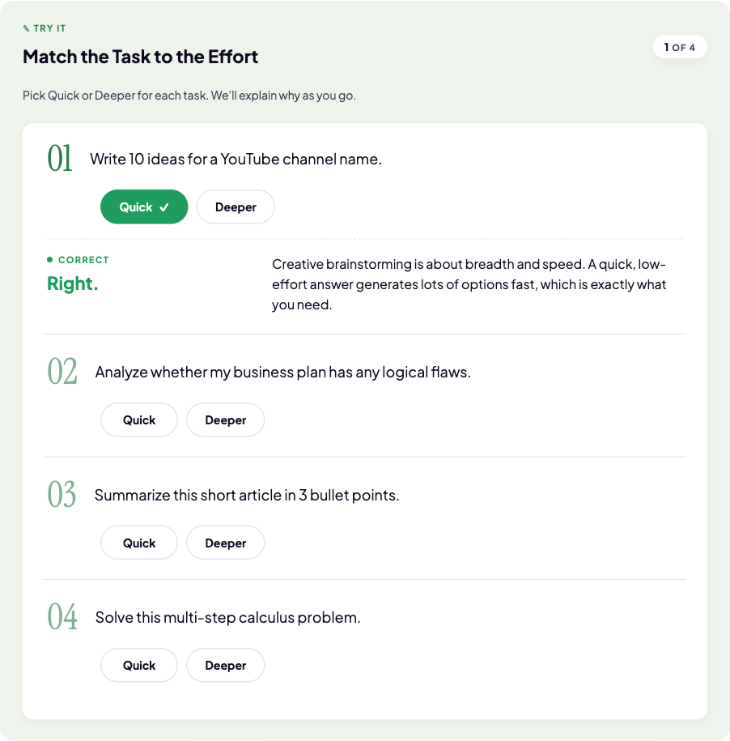

### TRY IT — Pattern 1 (sequential)
A `RevealSequence` steps through items one at a time (here an `InnerCard` scenario plus a `QuizBlock`), with Next gated on answering. Canonical reference: "What Did the Model Actually Learn?" in Training Bias Trap (`trainingbias`).

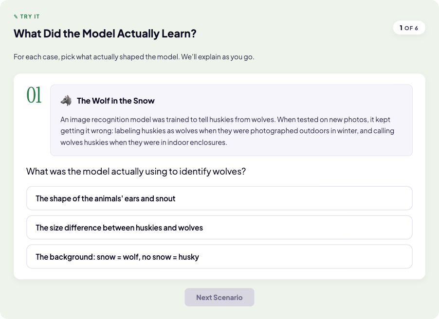

### TRY IT — completed, with Takeaway
Sequential TRY ITs end on a `Takeaway` (the RevealSequence's `completionElement`), which makes a conceptual point and marks completion. Parallel TRY ITs do NOT carry a Takeaway. Example: "Name That Drink" in Embeddings (`embeddings`).

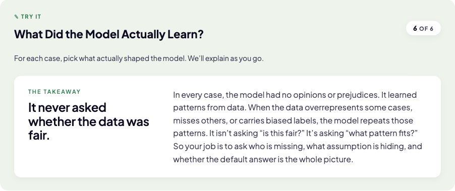

### SEE IT
The sand-surface demonstration box; interiors are bespoke per demo. Shown mid-interaction (one letter revealed). Example: "What's an LLM?" in Meet the Tool (`llms`).

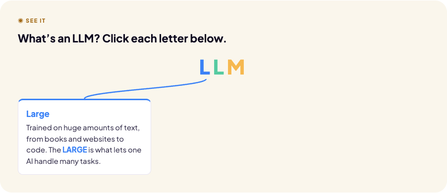

### LAB
The teal-surface variant for hands-on labs, with a `labNumber` in the eyebrow and checkbox steps. Example: LAB 01 "Build Your Course Notebook" in Study with AI (`studying`).

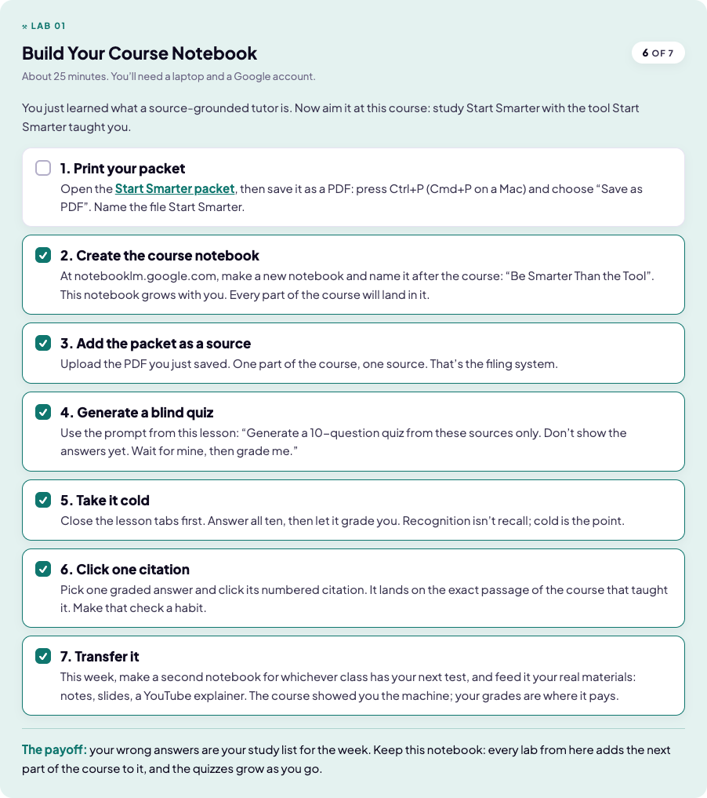

## The compare family

### CompareBox + ComparePanel + CompareHead
The "X vs Y" frame: faint-purple band holding two tinted panels, each with a colored CompareHead and a white body card. Example: Rules vs Patterns (`aivscode`).

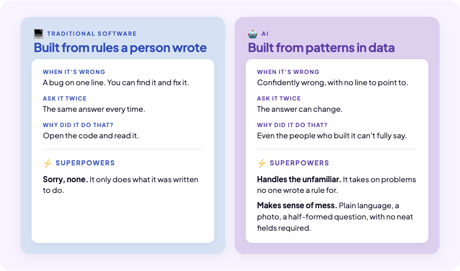

### CompareRows
The aligned point-for-point variant: split-tint header band, one white card of rows pairing left item N against right item N with a double arrow. Use when the comparison is a list of one-line contrasts; use CompareBox/ComparePanel when the two sides are free-form bodies. Example: Does AI Think? (`doesaithink`).

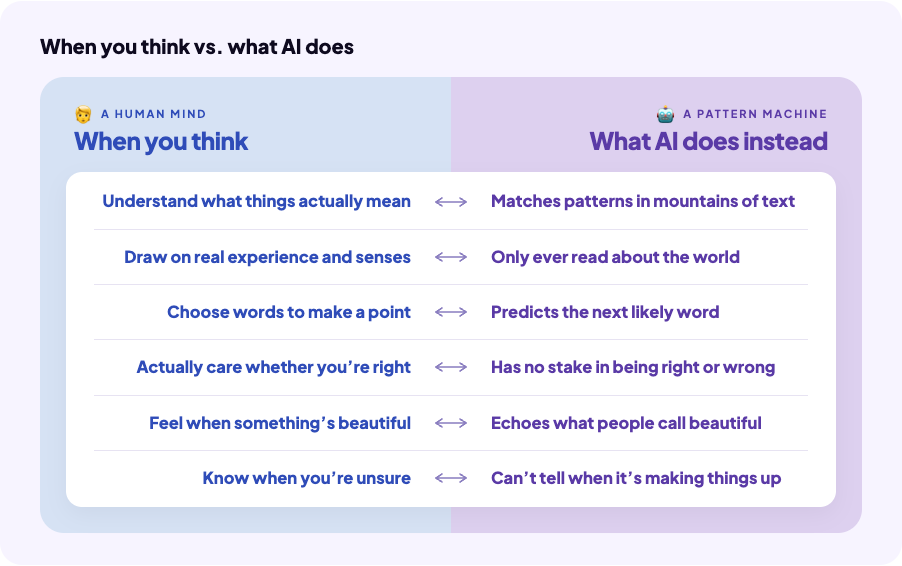

## Single-point bands

### KeyInsight
The 🔑 band that lands a lesson's main point. Example: end of Tokens (`tokens`).

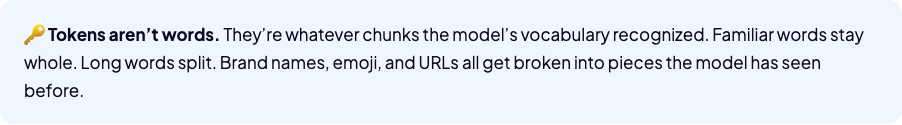

### KeyTerm
The slate 📖 definition band; pulls its definition from the shared `TERMS` array by term name. Example: Support Trap (`supporttrap`) — currently its only use in the course.

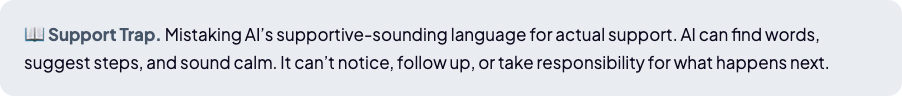

### ShowcaseBox
The workhorse display box: optional kicker, headline, intro, free-form body on a faint-purple band. Example: Why Learn AI? (`whydeeper`).

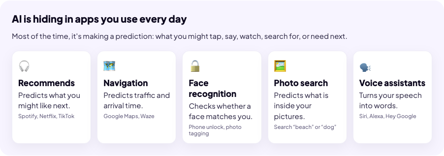

### NumberedRows
The numbered-list box, for an ordered list of named things with explanations: outlined circle numbers, emoji + bold title per row, hairline separators, and an optional quoted monospace prompt callout. Example: "Best practices" in Study with AI (`studying`).

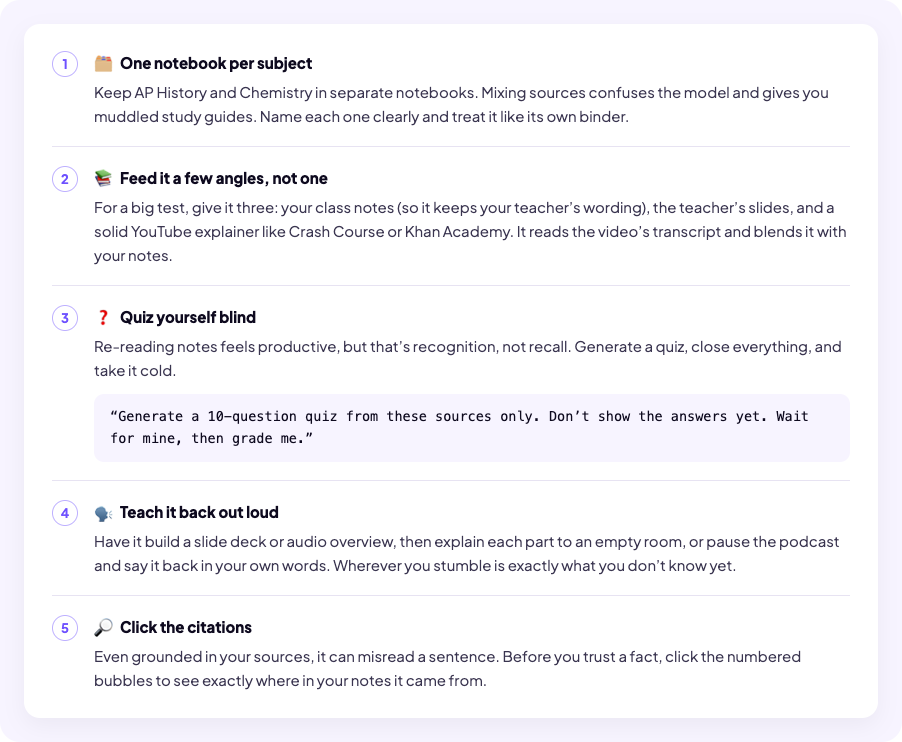

## Shared diagrams

### CoreLoopBox
The four-ideas anchor (Learn once: Training → Patterns | Answer, every word: Probability → Prediction). Single source of truth, rendered in both What Is AI? (`aihistory`) and How We Got Here (`howwegothere`).

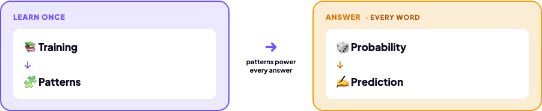

### TrainingLoopBox
The reads → guesses → corrects training loop with the "Repeat billions of times" pill. Rendered in What Is AI? (`aihistory`) and Training (`training`).

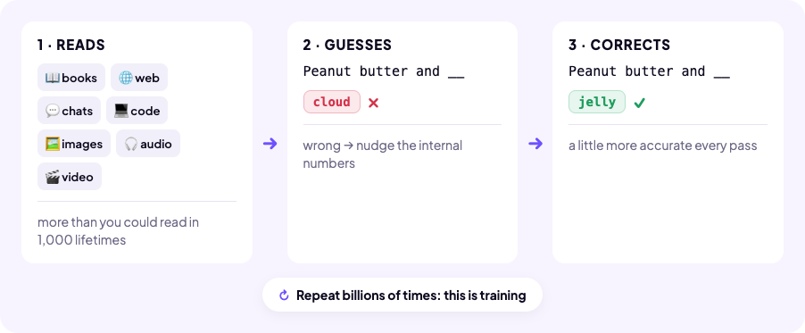

## Chrome and support

### Illustration
The terracotta display band that frames opener art and serif display phrases. Example: the Understand AI opener (`openerfoundations`).

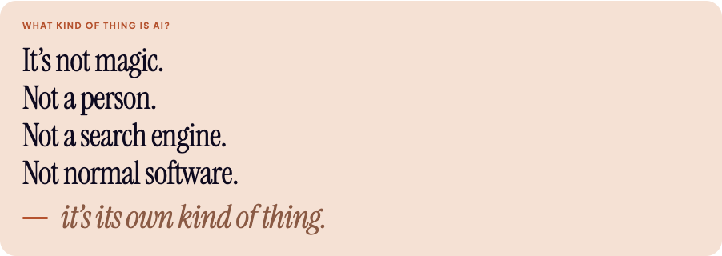

### UserBubble / AIBubble
The chat-mockup bubbles for prompt/response examples. Example: the "What should we cover next?" exchange in Customization & Memory (`customization`).

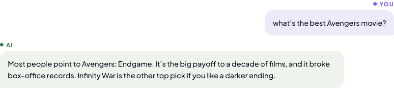

## Not pictured

- **CompareCard** — the tinted-card primitive the panels are built from; visible as the panels inside the CompareBox shot. Its rare solo uses sit inside interactive reveals.
- **InnerCard** — the white inner card primitive; visible inside nearly every band above.
