# Component Library

Screenshots of the course's reusable components, captured from current live uses in the course. Full prop documentation lives in `briefing.md` under "Components"; this gallery is the visual index, while `index.html` remains authoritative for current call sites and behavior.

Most screenshots were first captured 2026-06-10 at a 1200px viewport, with later recapture dates noted below. If a component's design or cited example changes, recapture it from a current live use and update the note.

## Activity shells (InteractiveBox)

The current `InteractiveBox` implementation recognizes `try` and `lab` variants; mint, sand, and teal are separate surface choices. The header row carries the eyebrow and optional title, and checkbox labs may add an `ActivityCounter`. Static demonstrations use `ShowcaseBox` or lesson-specific markup.

### TRY IT — Pattern 2 (parallel)
All items visible at once in one `InnerCard`, one `ScenarioRow` per item with `FeedbackPill` answer controls and per-item feedback. No `ActivityCounter` — every item is on screen, so an "N of M answered" pill is redundant. Question prompts are non-bold; answer pills stay bold. Captured from the live "Match the Task to the Effort" activity in Tune the Model (`choosemodel`).

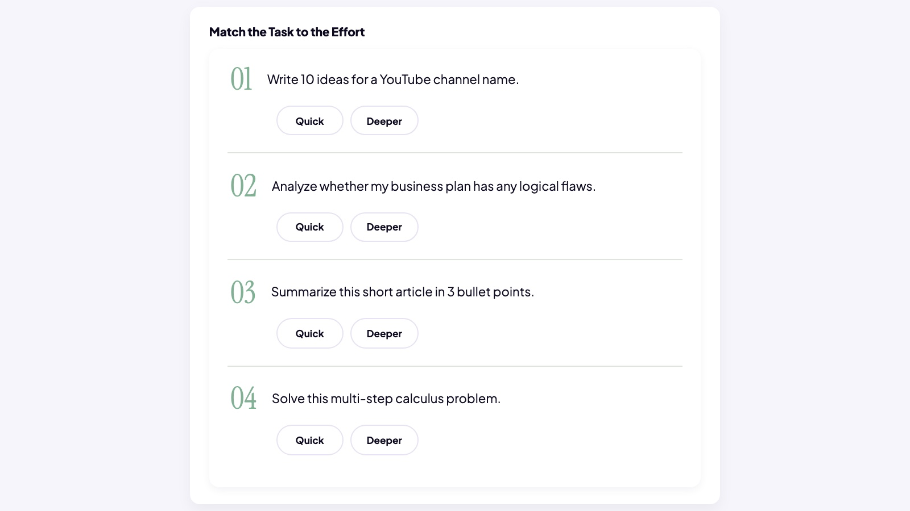

### TRY IT — completed, with Takeaway
`Takeaway` is an optional concluding card, not a rule tied to one interaction pattern. It can be supplied as a `RevealSequence` completion element or rendered directly after a custom activity. Formerly captured from Thought Partner (`thoughtpartner`, dissolved 2026-08-15 in the Finish Smarter merge — see `docs/parking-lot.html`); the pattern's current live example is the Bayesian Mind Reader TRY IT's "Each clue reshaped the odds, not your number." Takeaway in AI is Math (`aiismath`). Screenshot recapture pending.

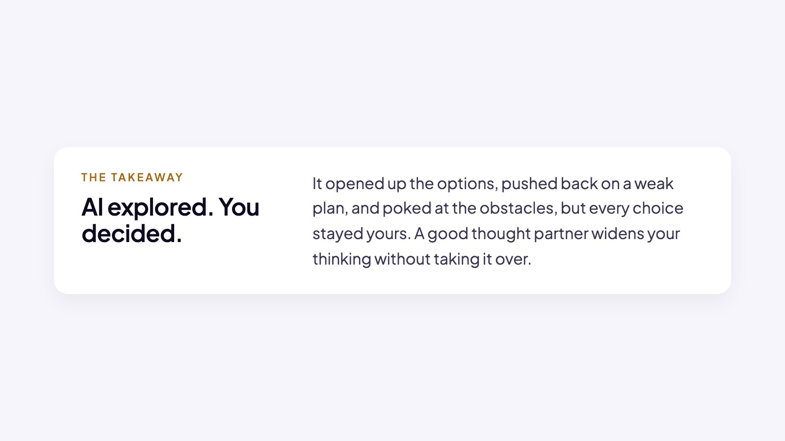

### LAB
The teal-surface variant for hands-on labs, with a `labNumber` in the eyebrow and checkbox steps. Only the checkbox toggles completion (the row is a plain div so step text can be selected and copied). Example: LAB 09 "Build Your Course Notebook" in Learn with AI (`studying`).

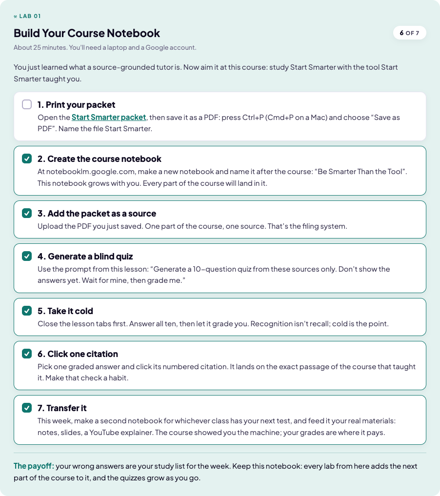

## The compare family

### CompareBox + ComparePanel + CompareHead
The "X vs Y" frame: faint-purple band holding two tinted panels, each with a colored CompareHead and a white body card. Example: Rules vs Patterns (`aivscode`).

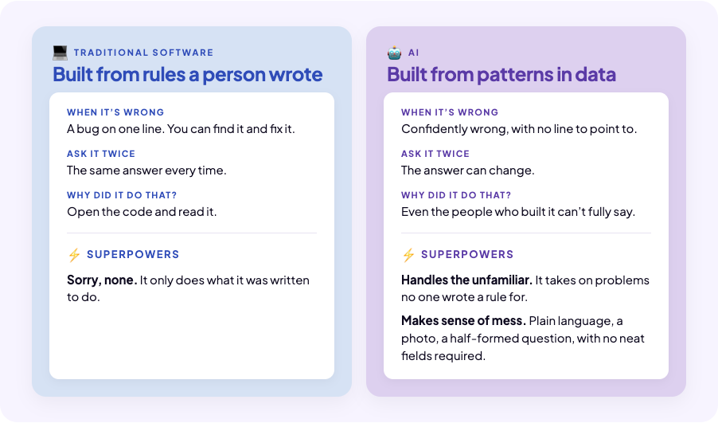

### CompareRows
The aligned point-for-point variant: split-tint header band, one white card of rows pairing left item N against right item N with a double arrow. Use when the comparison is a list of one-line contrasts; use CompareBox/ComparePanel when the two sides are free-form bodies. Example: Does AI Think? (`doesaithink`).

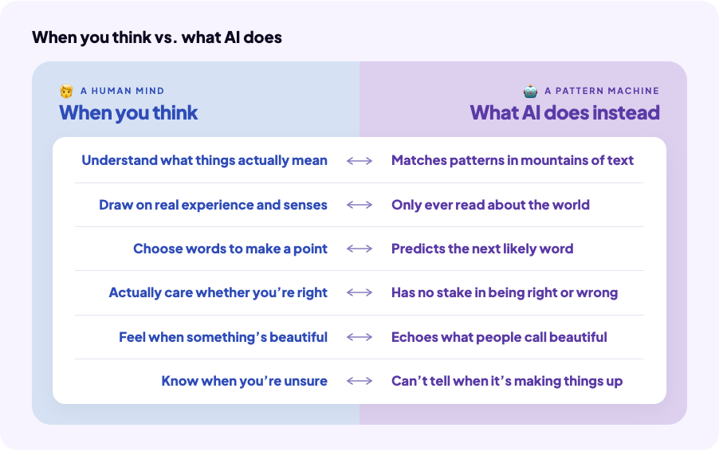

### ExperienceCompare
The scenario-story variant: a white pill headline states one setup, then two tinted side panels each tell the experience of living it — emoji + colored tagline, a white card with an italic narrative, one or more labeled bullet groups (default label "WHAT HAPPENED"; Work Changes splits its With AI side into "WHAT AI DOES" / "WHAT YOU DO"), and a bottom-pinned bold verdict that can carry its own label ("THE RESULT"). Use when both sides narrate the same scenario to a verdict; use CompareBox/ComparePanel for free-form X-vs-Y bodies. Examples: Drive with GPS vs. Self-Driving Car in Rise of Agents (`agents`) and Before AI vs. With AI in Work Changes (`workchanges`). Captured 2026-08-14.

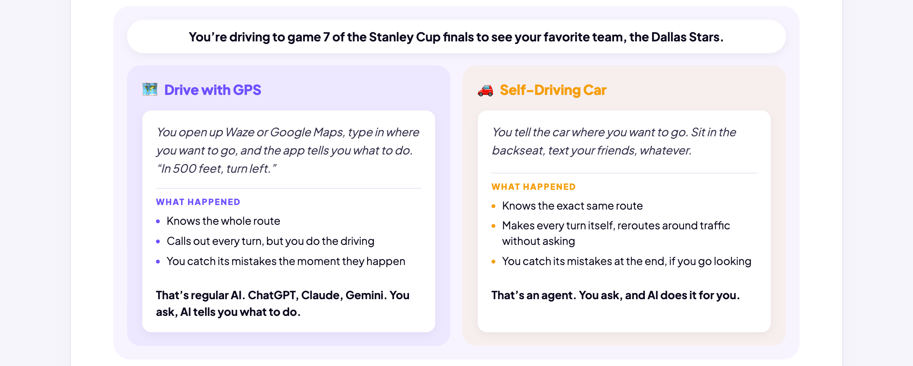

## Single-point bands

### ShowcaseBox
The workhorse display box: optional kicker, headline, intro, free-form body on a faint-purple band. Example: Why Learn AI? (`whydeeper`).

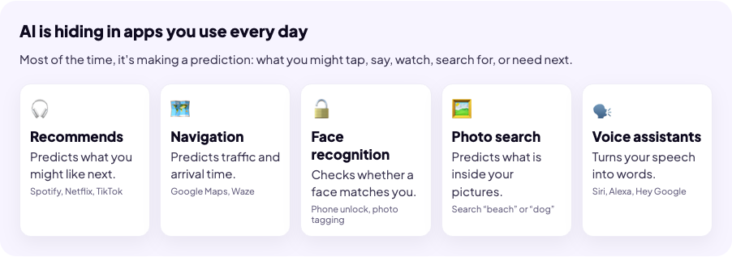

### PullQuote
The sourced-quotation card: a large primary quotation mark over a serif quote on a faint-purple band, with a two-part attribution row — a short primary rule plus an uppercase `cite` label, then a muted `source`. For verbatim quotes from real documents or people (source punctuation kept as-is). Example: the White House AI Action Plan quote in Why Learn AI? (`whydeeper`). Recaptured 2026-06-16.

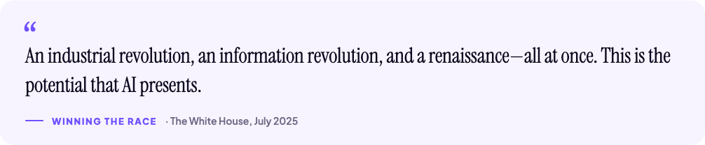

### NumberedRows
The numbered-list box, for an ordered list of named things with explanations: filled circle numbers (purple, white numeral), emoji + bold title per row, hairline separators, and an optional quoted monospace prompt callout. Rows can be title-only (body is optional). Example: "Best practices" in Learn with AI (`studying`). Recaptured 2026-06-12.

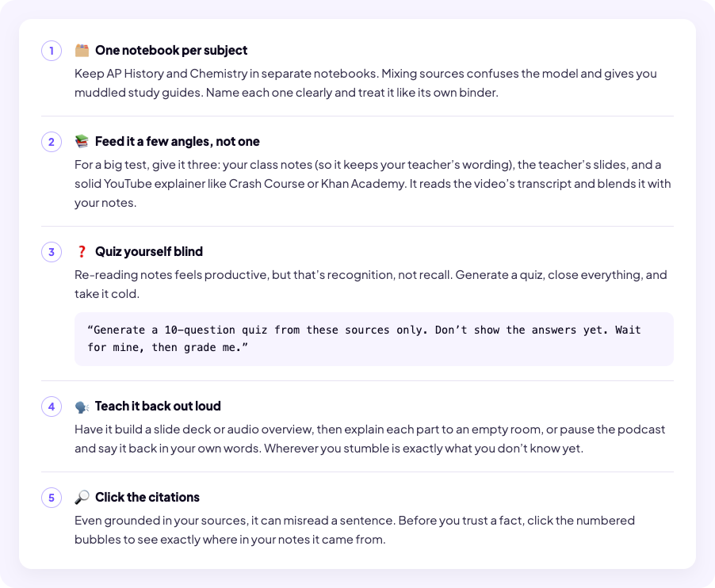

### NumberedColumns
The numbered-card grid, for an ordered sequence shown side by side: white cards in an auto-fit grid, each with a filled purple number chip, bold label, and short body. Numbering is automatic; an item can set `muted` to gray its chip for a step that is deliberately not yours. Use NumberedRows when items need full-width explanations; use NumberedColumns when the point is the sequence itself. Current examples include "Here’s your path." in Welcome (`welcome`) and "Two skills. Both grow with what you know." in Does School Matter? (`whybother`), both inside a `ShowcaseBox`. Captured 2026-06-12.

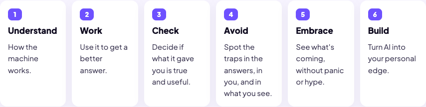

### WatchOverview
The watch strip: a slim soft-gold (#fcf5d8, hairline #eddfa8 border) utility band directly under the lesson H1 with a navy (#1b2153) play disc (gold triangle), a dark-gold (#a8842c) "▸ WATCH" eyebrow with muted duration, and one line — "Watch the video version or read the lesson below." — ending in a bold per-lesson tail from `LESSON_VIDEOS.cta` that names the lesson's true final activity ("Both end at the same TRY IT." / "…LAB." / "Both walk the same section map." for openers). Gold field + navy disc deliberately reads as a media control (gold is the course's action color, echoing the Continue button), not a violet teaching box (redesign 2026-08-12; the entry's `title` field is no longer rendered — reserved as the video's public/share title). Collapsed by default; expands to a native `<video controls preload="metadata">` plus caption. Recaptured 2026-08-12.

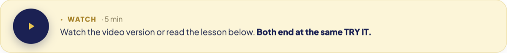

### LabeledCardStack
The accent-striped card family: white cards with a 4px colored left stripe, each carrying an accent-colored eyebrow, an optional bold headline, and a body. Optional `means` adds a hairline rule plus a "WHAT IT MEANS" label and text below the body (mirrors Where AI Works Best's divider + Examples treatment). Optional `grid` prop renders a 2-col card grid with roomier chrome instead of the stack; optional per-item `pill` adds an outlined status chip above the eyebrow and mutes the eyebrow/means labels so the pill and stripe carry the accent. Shown: the 4 Terms grid in Pace of Change (`paceofchange`) — grid + pills + means, uniform primary accent. Stack form (per-card accents, no pills): formerly the modes/roles boxes in When AI Judges You (`aijudges`, retired 2026-08-15 in the Finish Smarter merge — see `docs/parking-lot.html`); the current live example is the "What you see / What you're allowed to do / What gets attached to your name" cards in the Privacy half of Habits for the Road (`integrity`, embedded `PrivacySection`). Screenshot recapture pending. Captured 2026-08-11.

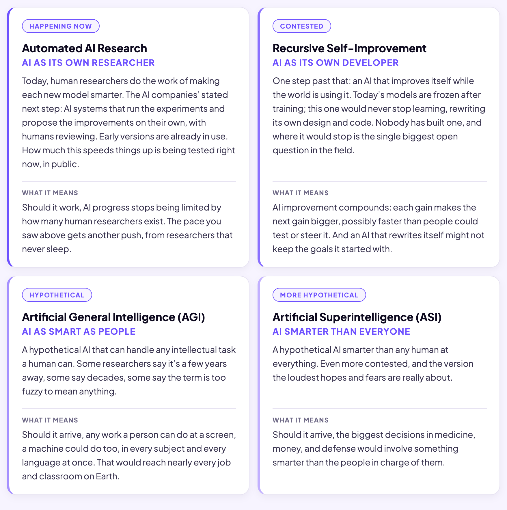

## Shared diagrams

### CoreLoopBox
The four-ideas anchor (Learn once: Training → Patterns | Answer, every word: Probability → Prediction). Rendered in How an LLM Works (`aihistory`), AI Is Different (`aivscode`), and How We Got Here (`howwegothere`).

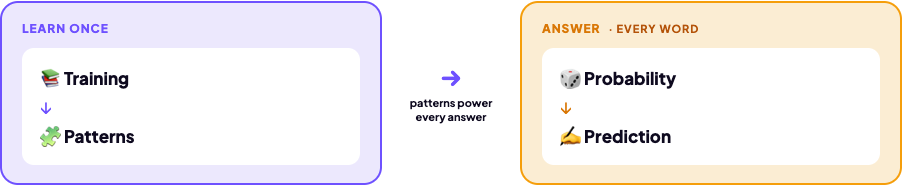

### TrainingLoopBox
The reads → guesses → corrects training loop. Rendered in How an LLM Works (`aihistory`) and Training (`training`); the "repeat billions of times, that's training" takeaway sits in the host lesson copy rather than inside the component. Recaptured 2026-06-16.

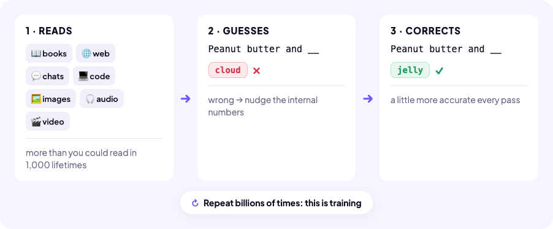

## Chrome and support

### Illustration
The terracotta display band that frames opener art and serif display phrases. Example: the Understand AI opener (`openerfoundations`).

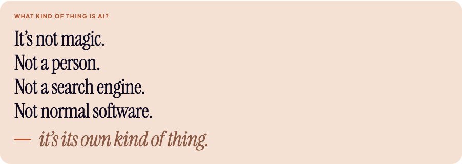

### UserBubble / AIBubble
The chat-mockup bubbles for prompt/response examples. Example: the "what's the best Avengers movie?" exchange in Tokens (`tokens`). Recaptured 2026-07-14 after the bubble text changed from 14px to 15px.

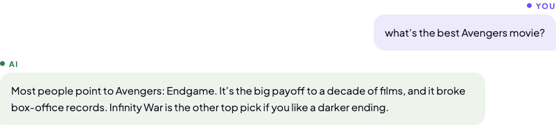

## Not pictured

- **CompareCard** — the tinted-card primitive the panels are built from; visible as the panels inside the CompareBox shot. Its rare solo uses sit inside interactive reveals.
- **InnerCard** — the white inner card primitive; visible inside nearly every band above.
