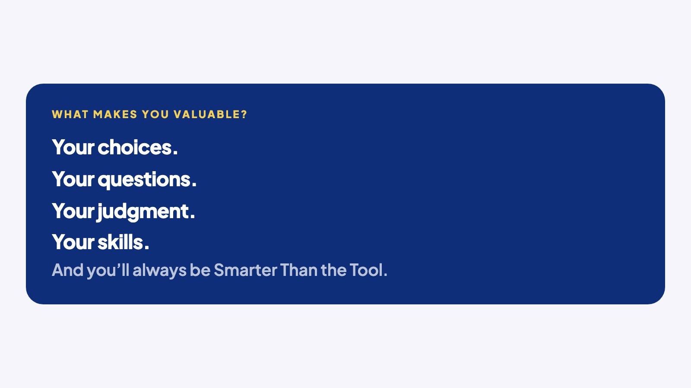
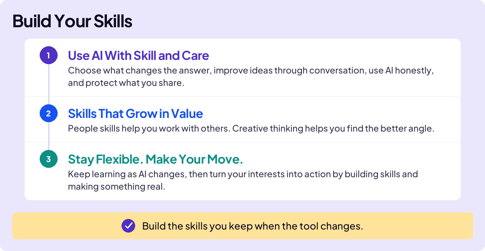
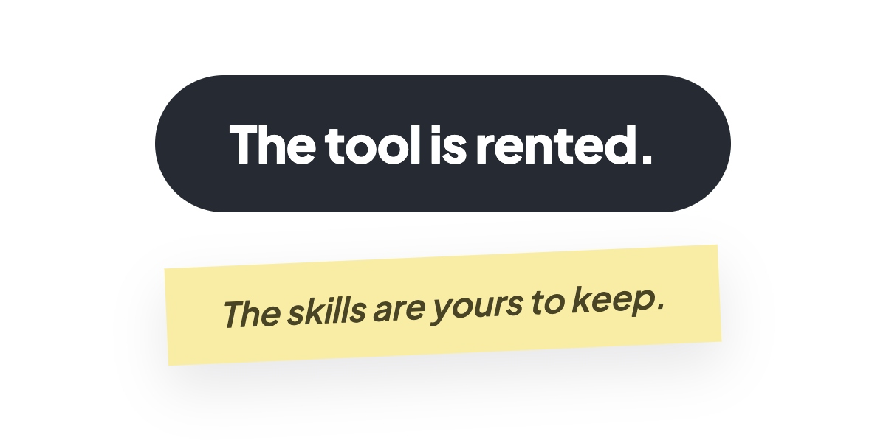

## BUILD YOUR SKILLS

# Opener

### Board 1: What Makes You Valuable?

**Image file:** `build-your-skills-opener-creed.jpg`

**Teaching content:**

What makes you valuable? Your choices. Your questions. Your judgment. Your skills. And you’ll always be Smarter Than the Tool.

This is the last section where you build new skills, and it’s the one you keep.

Think about learning to ride a bike. You outgrew it and moved on to another bike. But you had learned a key skill: balance. That skill made you a better cyclist, and it carried over into other physical activities, such as skating or playing basketball. Whether you became a serious cyclist or just rode for fun, the skill stayed with you. Nobody could give you balance. You had to build it.

This section is about skills like that: the ones you build once and keep forever. Some of them are AI skills. The most important ones aren’t. You’ll build both here.

### Board 2: Build Your Skills, the Section Map

**Image file:** `build-your-skills-opener-section-map.jpg`

**Teaching content:**

The section has three parts.

First, use AI with skill and care. You choose what changes the answer, improve ideas through conversation, use AI honestly, and protect what you share.

Second, skills that grow in value. People skills help you work with others. Creative thinking helps you find the better angle.

Third, stay flexible and make your move. You keep learning as AI changes, then turn your interests into action by building skills and making something real.

**Takeaway:** Build the skills you keep when the tool changes.

## Keep This Question in Mind

Keep one question in mind through the whole section. Everyone will have the same tool. What do I bring that it doesn’t? This section is how you build your answer.

### Board 3: Close

**Image file:** `build-your-skills-opener-close.jpg`

## Closing Message

The tool is rented.

The skills are yours to keep.
