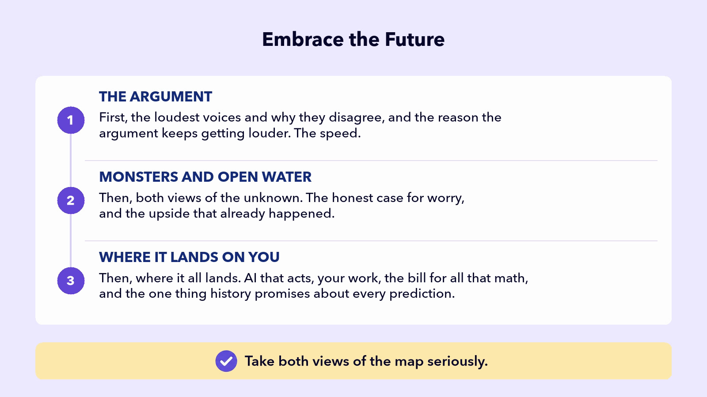
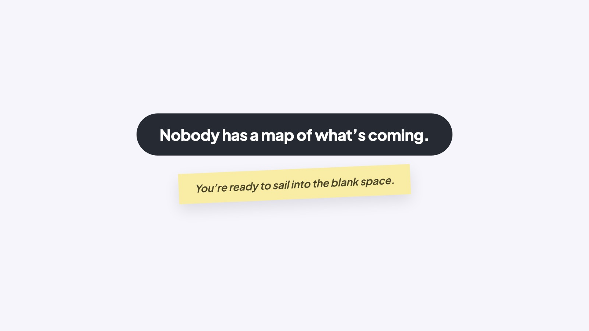

## EMBRACE THE FUTURE

# Opener

## WHAT EVERYONE’S SAYING

“It’s going to cure diseases.” “It’s going to take your job.” “It’ll do the boring parts for you.” “It will hurt society.” Who’s right? Nobody knows.

You now know how to use AI, and you understand the engine underneath, so its strange behavior makes more sense. Your goal is to Be Smarter Than the Tool. Done.

Now comes the question almost everyone is arguing about: where does all this land? You’ve heard the voices already. You probably know an AI Optimist who thinks AI is amazing, fantastic, and every other superlative they can think of. And you know an AI Worrier who’s sure it will hurt society. And maybe a Doubter who rolls their eyes at both.

Here’s the honest part: nobody knows. Not them, not us, not the people building AI.

## THE EDGE OF THE MAP

Think back to history class. Centuries ago, mapmakers sometimes filled waters they did not understand with sea monsters and strange serpents.

### Board 1: The Edge of the Map

**Image file:** `opener-embrace-1-edge-of-the-map.jpg`

**Teaching content:**

Two teens stand on an old map at the edge of an unknown ocean. On the stormy side, sea monsters coil out of dark water. On the sunlit side, open water leads to a green island and a ship on the horizon. Both views of the same unknown.

The future of AI is like the unknown parts of the ocean on those old maps. The AI Worriers fill the unknown parts with AI monsters that destroy jobs, hack systems, and take over the world. AI Optimists look at the same unknown parts and see easy, clear sailing through open water.

Those sailors didn’t find sea monsters, and rarely found easy, clear sailing. They usually found something unexpected. Consider Magellan. He didn’t set off to sail around the world. But that’s what his crew did. And he died before the voyage ended. Did he expect either? No.

This section takes both views of the map seriously: the monsters and the open water. And only one thing is certain: AI is here to stay. Not that it keeps getting better forever. Just that it isn’t going away.

### Board 2: Embrace the Future, the Section Map

**Image file:** `opener-embrace-2-map.jpg`

**Teaching content:**

The section has three parts.

First, the argument: the loudest voices, why they disagree, and why the speed makes the argument louder.

Second, monsters and open water: the honest case for worry alongside the real-world upside that has already happened.

Third, where it lands on you: how AI acts, how work may change, the bill for all that math, and what history teaches about predictions.

Take both views of the map seriously.

### Close

**Image file:** `opener-embrace-3-close.jpg`

## Closing Message

Nobody has a map of what’s coming.

You’re ready to sail into the blank space.
