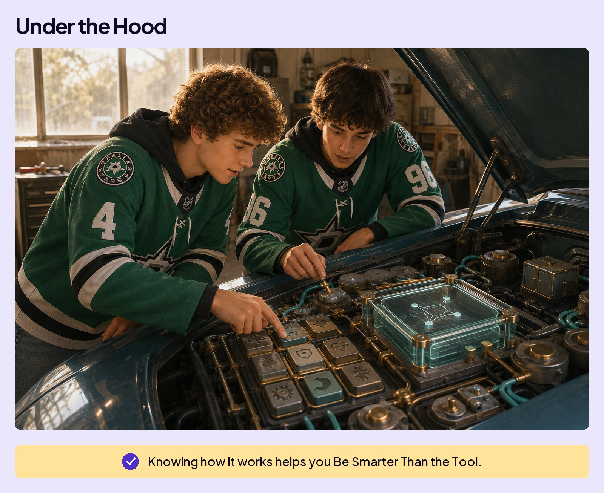

## UNDERSTAND AI

# Opener

## WHAT KIND OF THING IS AI?

It’s not magic.

Not a person.

Not normal software.

it’s its own kind of thing.

Sometimes working with AI feels like having a PhD expert at your side. Other times, it makes a mistake you’d expect from a six-year-old. How can the same tool do both? Understanding what happens inside helps explain why.

Think about driving a car. You can get good at it without ever opening the hood. But knowing what’s happening underneath helps you understand what the car can do and why something might go wrong. The same goes for AI. Knowing how it works helps you Be Smarter Than the Tool.

This section takes you inside the machine, one piece at a time. Some of this will be new to you, but each piece builds on the one before it. You don’t need to memorize every term. The goal is to understand how your words become an answer.

1. **How AI Learned:** How training builds the patterns AI uses to answer you.
2. **Why Probability Matters:** How the information AI has changes what is likely to come next.
3. **How Words Become Numbers:** How text becomes tokens, and tokens get numbers that represent meaning.
4. **How Meaning Takes Shape:** How words affect one another, changing their numbers and the relationships those numbers represent.
5. **How AI Builds an Answer:** How AI chooses each next token, why answers vary, and what keeps a conversation going.

The machine won’t feel like magic anymore.

Take it a piece at a time.
