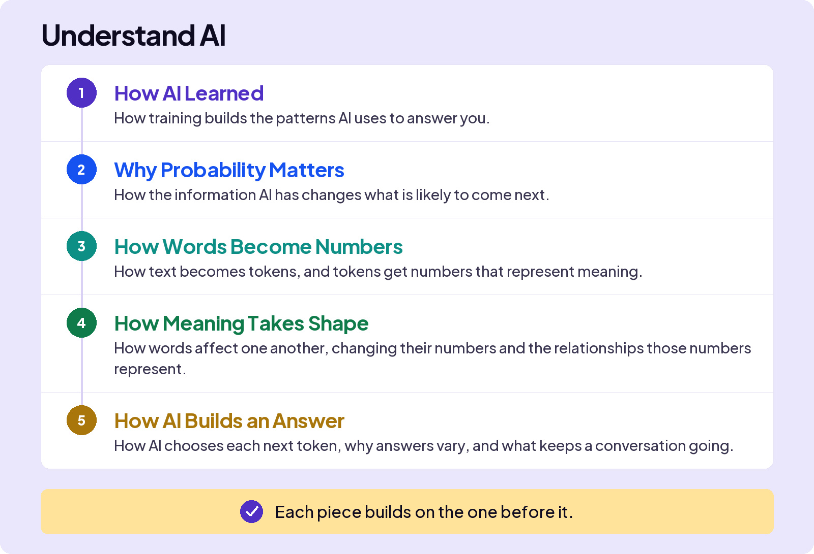

## UNDERSTAND AI

# Opener

## WHAT KIND OF THING IS AI?

It’s not magic.

Not a person.

Not normal software.

it’s its own kind of thing.

This is when AI stops being magic. Once you see how the machine actually works, the hype, the fear, the weird mistakes all start to make sense, and the judgment you’ve started building gets a lot harder to fool.

Think about driving a car. You can get good at it without ever opening the hood. But the driver who knows what the engine is doing reads trouble early, pushes the machine further, and never gets fooled by a strange noise. Knowing what’s underneath is what turns a user into someone Smarter Than the Tool.

That’s what this section is. It’s the longest and most complicated section in the course, because AI works unlike anything you’ve used before. That’s normal. Take it a piece at a time. Each one builds on the last, and by the end, the machine won’t feel like magic anymore.

The machine won’t feel like magic anymore.

Take it a piece at a time.
