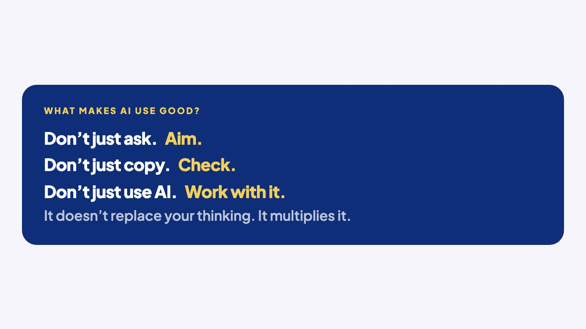
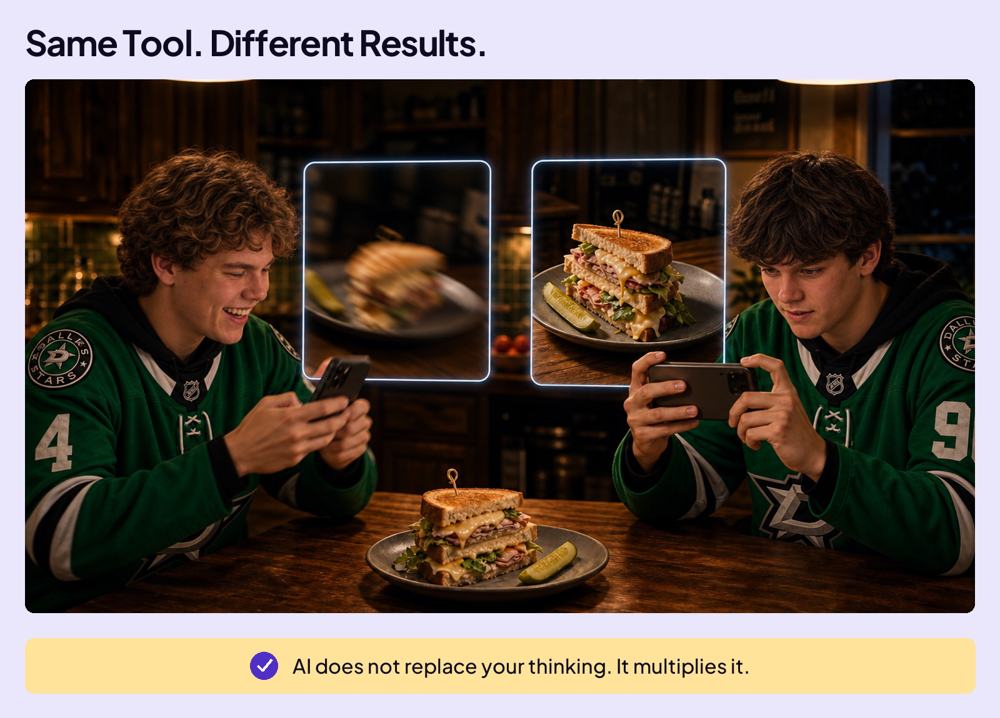
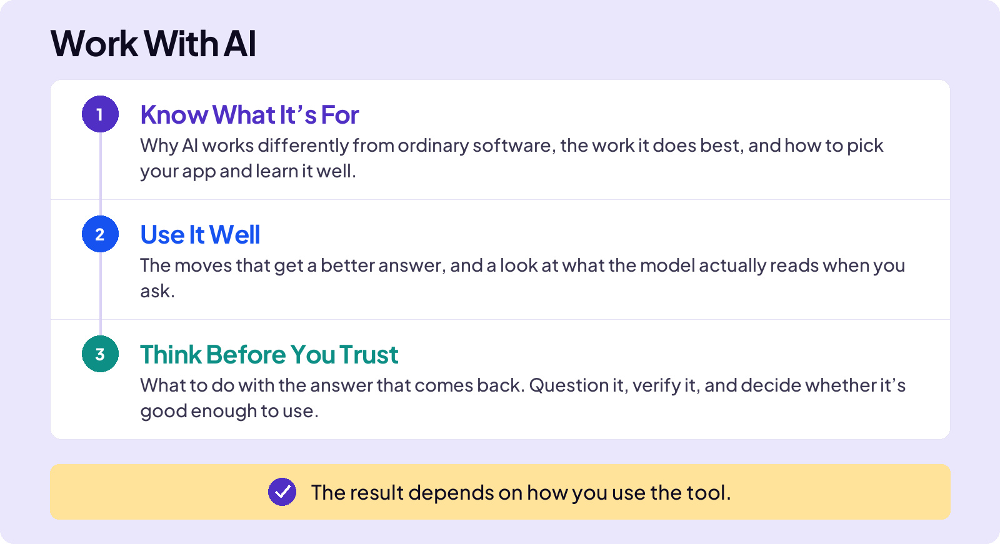
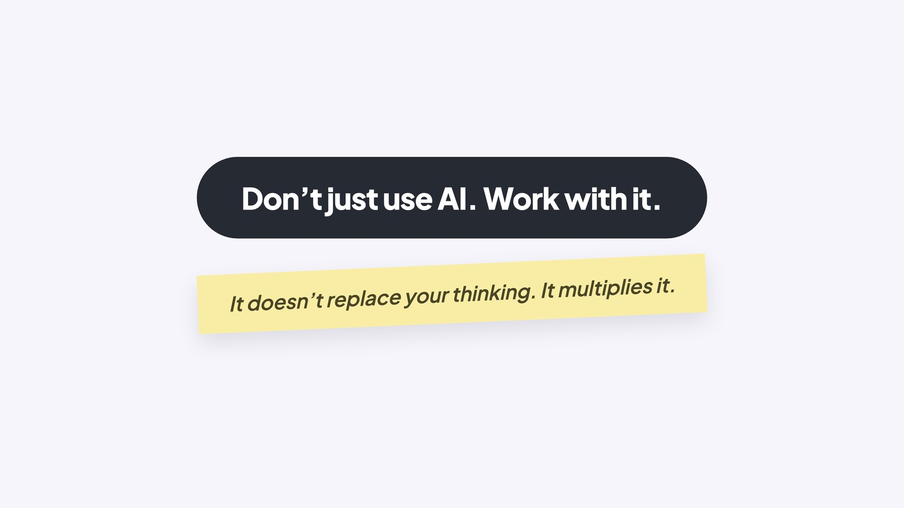

## WORK WITH AI

# Opener

### Board 1: What Makes AI Use Good?

**Image file:** `opener-work-1-refrain.jpg`

**Teaching content:**

Don’t just ask. Aim.

Don’t just copy. Check.

Don’t just use AI. Work with it.

It doesn’t replace your thinking. It multiplies it.

You’ve met the tool and seen what it can do. Now it gets practical: how do you actually work with it?

Here’s what most people miss: two people can use the same AI and get very different results. Think of a camera. The same phone that takes one person’s blurry lunch photo takes a photographer’s cover shot, and the tool never changed. The same idea applies to AI. Knowing how to work with it helps you get more out of it.

### Board 2: Same Tool. Different Results.

**Image file:** `opener-work-2-same-tool.jpg`

**Teaching content:**

Two people, two identical phones, one sandwich. One rushed, blurry picture. One carefully framed, crisp shot. The phone never changed. AI does not replace your thinking. It multiplies it.

### Board 3: Work With AI, the Section Map

**Image file:** `opener-work-3-section-map.jpg`

**Teaching content:**

This section has three parts.

First, Know What It’s For: why AI works differently from ordinary software, the work it does best, and how to pick your app and learn it well.

Second, Use It Well: the moves that get a better answer, and a look at what the model actually reads when you ask.

Third, Think Before You Trust: what to do with the answer that comes back. Question it, verify it, and decide whether it’s good enough to use.

**Takeaway:** The result depends on how you use the tool.

### Board 4: Close

**Image file:** `opener-work-4-close.jpg`

## Closing Message

Don’t just use AI. Work with it.

It doesn’t replace your thinking. It multiplies it.
