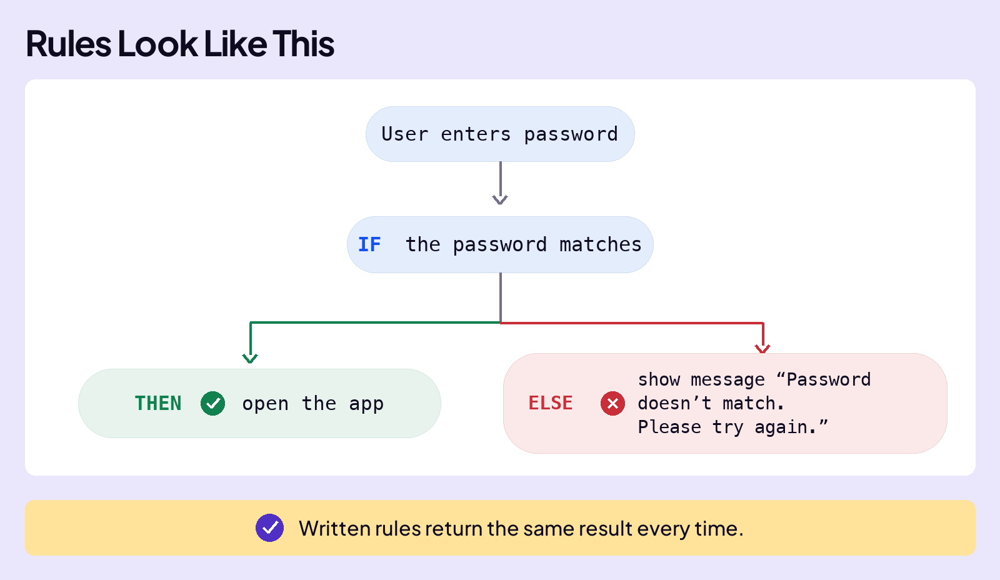
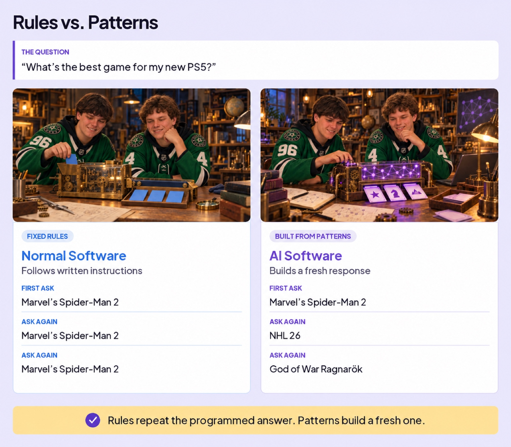
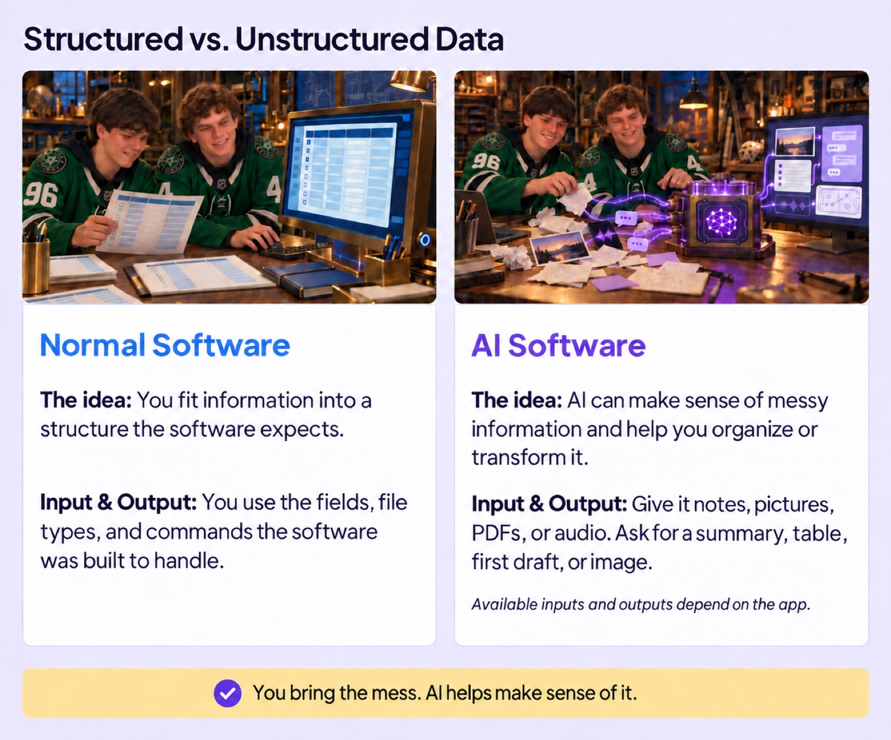
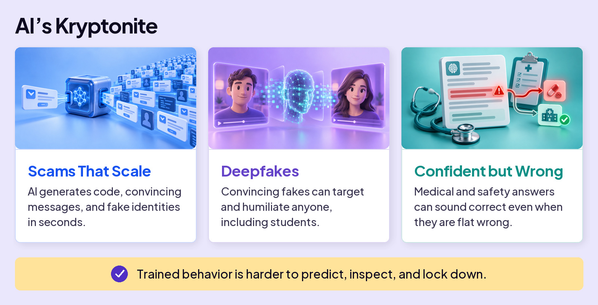
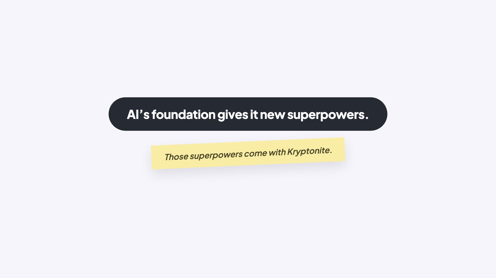

## WORK WITH AI

# AI is Different

AI is taking the world by storm. It has superpowers that set it apart from any other software. The reason is simple:

**AI is built on a different foundation.**

Consider how normal (non-AI) software is created, like the calculator app on your phone or Microsoft Excel. A programmer sits down and writes code line-by-line that tells the software exactly what to do.

The core of normal software is something called **Rules**. The best way to understand them is the most common kind: **IF-THEN-ELSE** statements. Here’s what that looks like.

### Board 1: Rules Look Like This

**Image file:** `ai-is-different-1-rules.jpg`

**Teaching content:**

A user enters a password. IF the password matches, THEN open the app. ELSE show the message “Password doesn’t match. Please try again.” Written rules return the same result every time.

## AI IS Based On Patterns

AI is different. A programmer doesn’t write out the rules for every situation. Instead, AI uses patterns it learned during training.

### Board 2: Learn Once. Answer Every Word.

**Image file:** `ai-is-different-2-learn-once.jpg`

**Teaching content:**

Learn once. Step one, Training: the model learns from enormous amounts of data once, before you use it. Step two, Patterns: training turns examples into learned numerical patterns. Those patterns power every answer.

Answer every word. Step three, Probability: for every next word, the model scores what is most likely. Step four, Prediction: it chooses one likely next word, then runs the process again.

Learn once. Use the patterns for every answer.

That’s the difference: someone writes the rules for ordinary software. AI learns patterns it can use in situations it hasn’t seen before.

Wrapping your head around this is important, so here’s a cooking analogy.

Normal software is like a robot cooking a recipe from a cookbook: someone wrote every step, and the robot follows the rules and makes the same exact dish every time.

AI is like a chef: no one handed it a cookbook. AI cooked thousands of dishes, recognized the cooking patterns, so it can handle a dish it’s never made. Same kitchen, completely different way to get to dinner.

That difference shows up everywhere: how each one solves a problem, how it reaches an answer, how it fails, and whether you can even trace why.

## RULES (Normal Software) VS PATTERNS (AI Software)

Watch what each one does with the same question.

### Board 3: Rules vs. Patterns

**Image file:** `ai-is-different-3-rules-vs-patterns.jpg`

**Teaching content:**

The question: “What’s the best game for my new PS5?”

Normal software follows written instructions. First ask: Marvel’s Spider-Man 2. Ask again: Marvel’s Spider-Man 2. Ask again: Marvel’s Spider-Man 2.

AI software builds a fresh response. First ask: Marvel’s Spider-Man 2. Ask again: NHL 26. Ask again: God of War Ragnarök.

Rules repeat the programmed answer. Patterns build a fresh one.

In this example, normal software follows a rule: when you ask for the best PS5 game, show the top game on a preset list. AI builds an answer using learned patterns, so you can ask the same question again and get a different recommendation.

## STRUCTURED VS UNSTRUCTURED DATA

Here’s another AI superpower: your information doesn’t have to arrive neatly organized. To calculate your GPA in a spreadsheet, you enter grades and credits into rows and columns. That’s **structured data**. AI can also read those details scribbled on the back of a Chick-fil-A receipt or buried in a copied text message. That’s **unstructured data**. It can help turn that mess into a table, ready for the calculation.

A good example is how we wrote this lesson. We sketched out messy notes on a legal pad. We scratched through lines, drew arrows to move things around, the works. It was MESSY. Just saving a picture of those notes wouldn’t turn them into a lesson. Something still had to make sense of them.

That something was AI. It read the notes, followed the changes, and turned them into a first draft.

### Board 4: Structured vs. Unstructured Data

**Image file:** `ai-is-different-4-structured.jpg`

**Teaching content:**

Normal software. The idea: you fit information into a structure the software expects. Input and output: you use the fields, file types, and commands the software was built to handle.

AI software. The idea: AI can make sense of messy information and help you organize or transform it. Input and output: give it notes, pictures, PDFs, or audio. Ask for a summary, table, first draft, or image. Available inputs and outputs depend on the app.

You bring the mess. AI helps make sense of it.

## THE RIGHT TOOL FOR THE JOB

Here’s the catch: a superpower isn’t the same as the right tool. When a job is exact, runs the same way every time, and has to stay consistent, like calculating a GPA or checking a password, normal software wins.

AI earns its place on the messy, open-ended jobs no one could write a rule for. So the skill isn’t reaching for AI every time. It’s knowing which kind of job you’re looking at, and picking the tool that fits.

## AI’S KRYPTONITE

A human can hold Kryptonite, toss it in a backpack, whatever. Not Superman, for him it can be fatal.

AI has its own Kryptonite. It’s not fatal, but you need to be aware of it.

Because AI runs on learned patterns and not rules, it’s harder to control. **Trained behavior is harder to predict, inspect, and lock down than written rules.** And no one, not the engineers who built it, the researchers who study it, or the company that ships it, can fully predict what it will do. And sometimes, people use its superpowers to cause harm. You need to recognize these risks.

### Board 5: AI’s Kryptonite

**Image file:** `ai-is-different-5-kryptonite.jpg`

**Teaching content:**

You’ll see stories like this.

Scams that scale: AI generates code, convincing messages, and fake identities in seconds.

Deepfakes: convincing fakes can target and humiliate anyone, including students.

Confident but wrong: medical and safety answers can sound correct even when they are flat wrong.

Trained behavior is harder to predict, inspect, and lock down.

## THE INDUSTRY’S ANSWER: GUARDRAILS

AI companies don’t ignore this. During training, they teach AI to avoid harmful behavior. They also add a safety layer to the apps: **guardrails**. These help block, redirect, or limit harmful requests. But none are perfect. They can miss something dangerous or block something harmless.

### Close

**Image file:** `ai-is-different-6-close.jpg`

## Closing Message

AI’s foundation gives it new superpowers.

Those superpowers come with Kryptonite.
