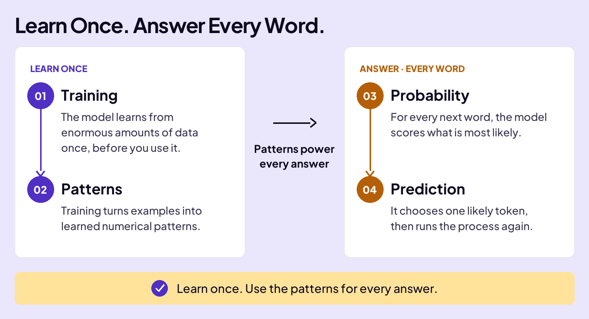

## WORK WITH AI

# AI is Different

AI is taking the world by storm. It has superpowers that set it apart from any other software. The reason is simple:

**AI is built on a different foundation.**

Consider how normal (non-AI) software is created, like the calculator app on your phone or Microsoft Excel. A programmer sits down and writes code line-by-line that tells the software exactly what to do.

The core of normal software is something called **Rules**. The best way to understand them is the most common kind: **IF-THEN-ELSE** statements. Here’s what that looks like.

## AI IS Based On Patterns

As you learned earlier, AI is based on patterns, not rules.

Wrapping your head around this is important, so here’s a cooking analogy.

- **Normal software is like a robot cooking a recipe from a cookbook:** someone wrote every step, and the robot follows the rules and makes the same exact dish every time.
- **AI is like a chef:** no one handed it a cookbook. AI cooked thousands of dishes, recognized the cooking patterns, so it can handle a dish it’s never made. Same kitchen, completely different way to get to dinner.
That difference shows up everywhere: how each one solves a problem, how it reaches an answer, how it fails, and whether you can even trace why.

## RULES (Normal Software) VS Patterns (AI Software)

Watch what each one does with the same question.

That’s the split. Normal software follows fixed rules, so it hands back the same preset list no matter who asks or why. AI is built from patterns, so it does the opposite: it builds a fresh answer every time, shaped to your exact question.

## STRUCTURED VS UNSTRUCTURED DATA

Here’s another AI superpower. What you give it, and what it returns, doesn’t have to follow a set structure.

A good example is how we wrote this lesson. We sketched out messy notes on a legal pad. We scratched through lines, drew arrows to move things around, the works. It was MESSY. We couldn’t hand that to normal software like Microsoft Word or Excel, because that software needs data in nice rows and columns.

But AI is different. It read our messy notes and turned them into whatever we asked for.

## THE RIGHT TOOL FOR THE JOB

Here’s the catch: a superpower isn’t the same as the right tool. When a job is exact, runs the same way every time, and has to stay consistent, like calculating a GPA or checking a password, normal software wins. It’s faster, it never drifts, and you can always see exactly why it did what it did.

AI earns its place on the messy, open-ended jobs no one could write a rule for. So the skill isn’t reaching for AI every time. It’s knowing which kind of job you’re looking at, and picking the tool that fits.

## AI’S KRYPTONITE

A human can hold Kryptonite, toss it in a backpack, whatever. Not Superman, for him it can be fatal.

AI has its own Kryptonite. It’s not fatal, but you need to be aware of it.

Because AI runs on learned patterns and not rules, it’s harder to control. **Trained behavior is harder to predict, inspect, and lock down than written rules.** And no one, not the engineers who built it, the researchers who study it, or the company that ships it, can fully predict what it will do.

When you hear stories like these, remember the mechanism: AI is being steered, not authored. What’s inside isn’t rules, or even readable patterns; it’s millions of learned numbers, which is exactly why you can’t open it up and read it.

## THE INDUSTRY’S ANSWER: GUARDRAILS

AI companies don’t ignore this. They can’t rewrite the model’s learned patterns, so they wrap a safety layer around it instead. That layer has a name.

It’s called a **guardrail**, and its job is to block, redirect, or limit specific behaviors, like medical dosage advice or harmful content. Guardrails come in different forms, and none of them are perfect, so they catch some things and miss others.

So when an app refuses something dangerous, that’s the guardrail talking, not the AI making a call of its own.

Written rules or learned patterns.

Patterns handle the mess. Rules stay consistent.
