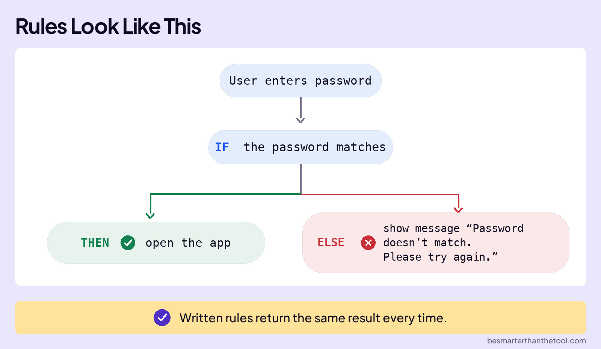
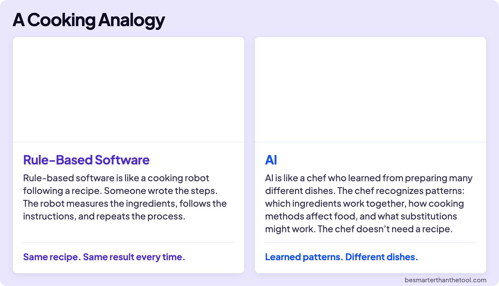
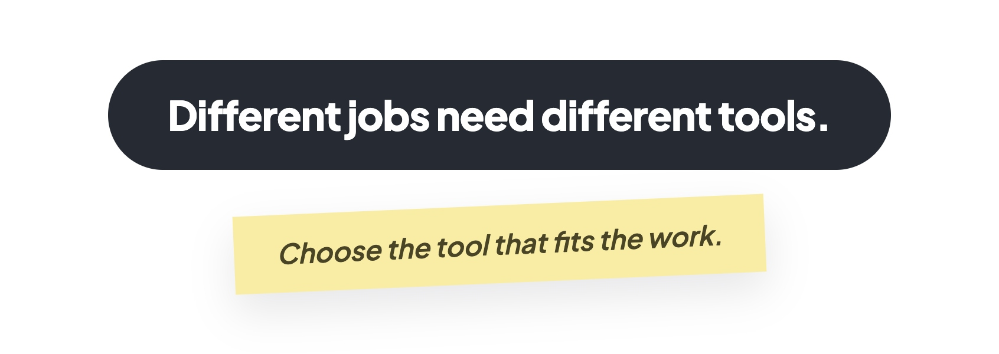

## WORK WITH AI

# AI is Different

You’re signing into Spotify. You enter the wrong password. Should the app open because you were close? Or because your spelling was creative?

No. You want it to follow a rule: **let me in only if the password matches.**

Non-AI software is based on instructions like this that people wrote. A calculator follows instructions for mathematical operations. A spreadsheet applies formulas to the information you enter.

### Board 1: Rules Look Like This

**Image file:** `ai-is-different-rules.jpg`

**Teaching content:**

Rules look like this. A user enters a password. If the password matches, then the app opens. Otherwise, the app shows “Password doesn’t match. Please try again.”

Written rules return the same result every time.

## When rules aren’t enough

You and your friends hand-wrote a Spotify playlist for your homecoming dance.

But the handwritten notes are messy. There are crossed-out ideas, arrows pointing to replacement songs, abbreviations, and a few jokes in the margins. Before you can build the playlist, someone has to figure out which songs you actually chose.

Imagine a programmer tried to write a separate instruction for every possible scribble, pointing arrow, and scratch-through. Impossible.

This is where AI’s foundation matters.

An LLM learns patterns during training.

So it doesn’t need pre-written instructions to make sense of your notes. AI can help turn the planning mess into a list you can use.

AI is still software.

People still write the code that trains and runs AI. The difference is that they haven’t written each answer or a separate rule for every request.

### Board 2: A Cooking Analogy

**Image file:** `ai-is-different-cooking-analogy-faceless.jpg`

**Teaching content:**

Here’s a cooking analogy. Rule-based software is like a cooking robot following a recipe. Someone wrote the steps. The robot measures the ingredients, follows the instructions, and repeats the process.

Same recipe. Same result every time.

AI is like a chef who learned from preparing many different dishes. The chef recognizes patterns: which ingredients work together, how cooking methods affect food, and what substitutions might work.

The chef doesn’t need a recipe.

Learned patterns. Different dishes.

## Structured vs. Unstructured Data

To calculate your GPA in a spreadsheet, you put grades and credits into the right rows and columns. That’s **structured data**: information organized into consistent fields.

But suppose you took a picture while visiting a college and want to know the names of the dorms. That’s **unstructured data**: the information isn’t arranged into consistent fields. AI can use visible signs and other clues to help identify the buildings.

## The downside

Using learned patterns makes AI flexible, but its response can be harder to predict and inspect than a written rule like the password check.

It might miss a crossed-out song or confidently give you the wrong dorm name.

It might look great, but still have mistakes.

## Closing Message

**Image file:** `ai-is-different-close.jpg`

Different jobs need different tools.

Choose the tool that fits the work.
