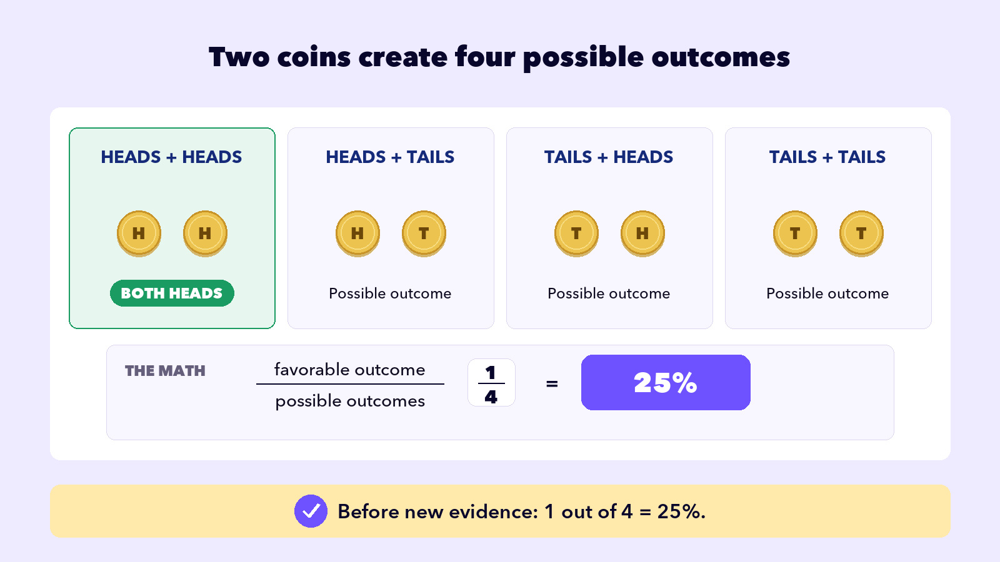
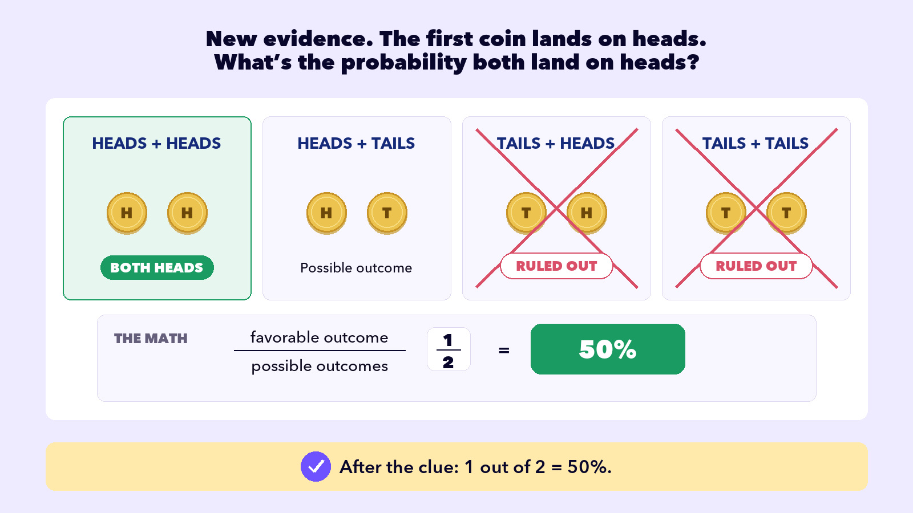
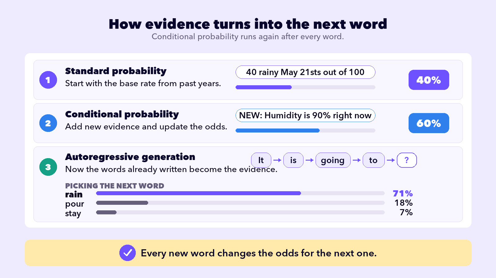

## UNDERSTAND AI

# AI is Math

What’s the magic that powers ChatGPT, Claude, and every other AI you’ve used? **Math**. You met these ideas by name back in How an LLM Works. Now you’ll see how each one actually works.

## WHERE PROBABILITY MATH BEGAN

In 1654, two French mathematicians, Blaise Pascal and Pierre de Fermat, traded letters about gambling. That correspondence is where **standard probability** is usually dated from. The math was clean: list every possible outcome, confirm they’re equally likely, and you can calculate the chance of each one.

The Math

Ways it happens

Total outcomes

=

Probability

## ONE COIN, TWO OUTCOMES

Take a simple example.

## The Question

Toss a coin. How likely is it to land on *heads*?

Possible Outcomes

## Heads

H

## Tails

T

The Math

Ways it happens (1)

Total outcomes (2)

=

Probability (50%)

## TWO COINS, FOUR OUTCOMES

Now make it a little harder.

## CONDITIONAL PROBABILITY

Standard probability could count what you could see, like the coins, but it couldn’t tell you how much to change your mind when fresh evidence arrived. Thomas Bayes worked that part out. A minister, mathematician, and philosopher, he found the math for updating a belief as new evidence arrives, now known as Bayes’ Theorem.

The evidence didn’t just rule things out, it moved the probability that both coins are heads from **25%** to **50%**. That update is **conditional probability**.

## AUTOREGRESSIVE GENERATION

Remember your phone’s keyboard suggesting the next word? Autoregressive generation is that, but it doesn’t stop after one word. After AI picks a word, it uses that word to pick the next one. Then it uses both to pick the third. Every prediction depends on every word that came before it. Each new word is its own conditional-probability problem: given everything written so far, which word most likely comes next?

No outside clue this time, the words it already wrote are the clue. Given “It is going to,” it picks the most probable next word, then feeds that back in and does it all over again.

The real math behind LLMs goes way past what’s here. Linear algebra moves the numbers. Calculus tunes the model during training. Plenty of other math is in there too. But two ideas from probability, plus the loop that turns them into language, are the foundation. Once you understand them, you understand the shape of how AI works. Everything else is engineering.

A chance. A clue. One word at a time.

Everything else is engineering.
