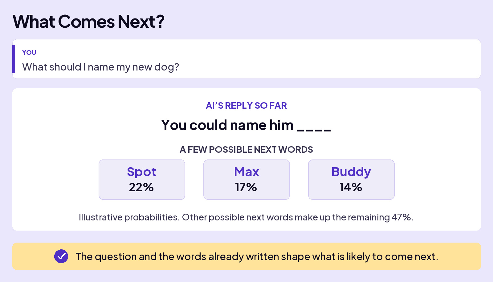

## UNDERSTAND AI

# AI is Math

What’s the magic that powers ChatGPT, Claude, and every other AI you’ve used? **Math**.

A big part of that math is probability: how likely something is. When AI builds an answer, it calculates probabilities for what comes next.

## WHERE PROBABILITY MATH BEGAN

In 1654, two French mathematicians, Blaise Pascal and Pierre de Fermat, traded letters about gambling. Their work helped lay the foundation for modern probability.

Start with something simple: when every outcome is equally likely, you can calculate a probability by counting the possibilities.

### Board 1: Standard Probability

**Image file:** `ai-is-math-the-math-editorial.jpg`

**Teaching content:**

When every outcome is equally likely:

**Ways to get the result ÷ Total possible outcomes = Probability.**

### Board 2: Counting the Possibilities

**Image file:** `ai-is-math-two-coins-editorial.jpg`

**Teaching content:**

**The scenario:** You toss two coins. What’s the chance that both land on heads?

| First coin | Second coin | Both heads? |
| --- | --- | --- |
| Heads | Heads | Yes |
| Heads | Tails | No |
| Tails | Heads | No |
| Tails | Tails | No |

There is one way to get two heads out of four equally likely outcomes: **1 ÷ 4 = 25%**.

**Takeaway:** Before new evidence: 1 out of 4 = 25%.

## CONDITIONAL PROBABILITY

New evidence can change the odds. Conditional probability takes that evidence into account.

### Board 3: A Clue Changes the Odds

**Image file:** `ai-is-math-conditional-probability-editorial.jpg`

**Teaching content:**

**The scenario:** You toss two coins. Someone peeks and tells you the first coin landed heads. What’s the chance that both coins landed heads now?

| First coin | Second coin | After the clue |
| --- | --- | --- |
| Heads | Heads | Still possible; both heads |
| Heads | Tails | Still possible |
| Tails | Heads | Ruled out |
| Tails | Tails | Ruled out |

The clue rules out both outcomes that start with tails. One of the two remaining outcomes has two heads: **1 ÷ 2 = 50%**.

**Takeaway:** After the clue: 1 out of 2 = 50%.

The coins didn’t change when someone peeked. What you knew about them did. That changed the odds from **25%** to **50%**.

## PREDICTING WHAT COMES NEXT

AI uses conditional probability to build answers. Your question and the words already written shape the chances of what comes next. Each new word joins that text, and the process repeats.

### Board 4: What Comes Next?

**Image file:** `ai-is-math-what-comes-next-editorial.jpg`

**Teaching content:**

**You:** “What should I name my new dog?”

**AI’s reply so far:** “You could name him ____.”

| Possible next word | Probability |
| --- | --- |
| Spot | 22% |
| Max | 17% |
| Buddy | 14% |

Other possible next words make up the remaining 47%. These are the illustrative probabilities on the board.

**Takeaway:** The question and the words already written shape what is likely to come next.

## Closing Message

AI builds answers with probabilities.

One prediction at a time.
