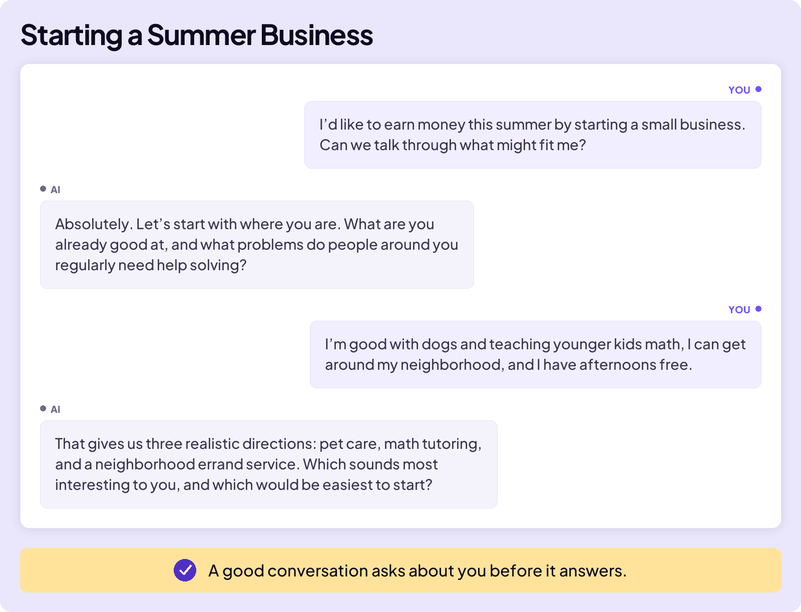
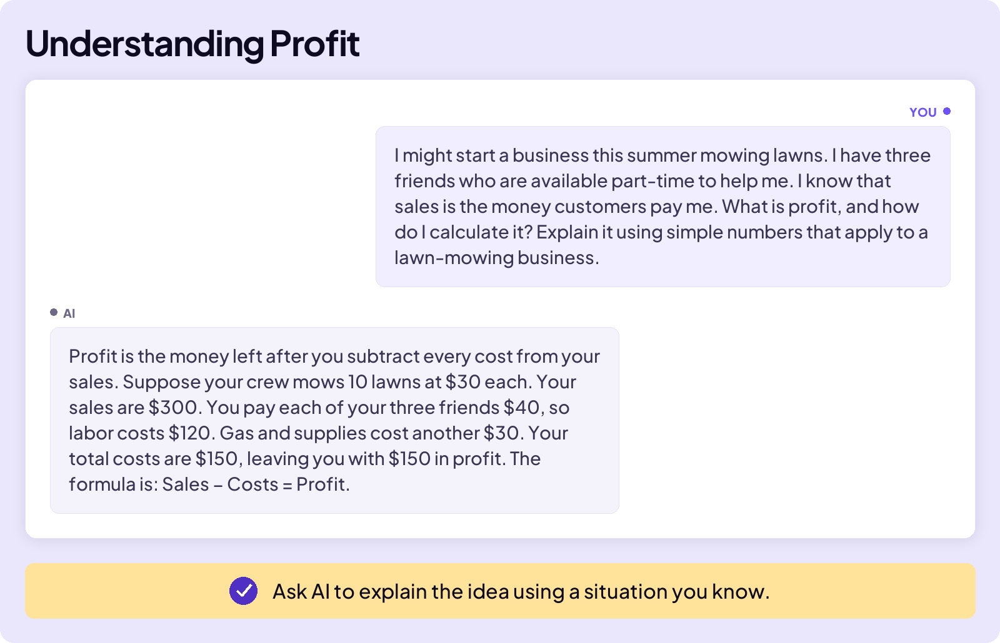

## BUILD YOUR SKILLS

# Next Level Moves

Most people think AI works like this: you type the perfect prompt, and AI returns the perfect answer. But that is not how you take your AI skills to the next level.

Think back to the best history group project you’ve been part of. Nobody began with the perfect finished project. You shared ideas, figured out what was missing, and improved it together. Working with AI follows a similar process. The group is smaller, just you and AI, but the best result still takes a conversation and several rounds of improvement.

## THOUGHT PARTNER

During that history project, your group brainstormed ideas, asked questions, suggested next steps, and helped one another decide what worked. The group acted as your thought partner. You did not have to arrive with the perfect answer. You developed it together.

AI can be a thought partner in much the same way. It can ask questions, suggest possibilities, and help you compare tradeoffs. It should not make the decision for you.

## LEARN WITH AI

During the history group project, some members probably knew more about the subject than others. When you ran into something you did not understand, you could ask the group. That is one reason a group can be powerful: people share what they know and ask one another questions.

Work with AI in the same way. When something does not make sense, ask it to explain. Ask follow-up questions, connect the idea to something you already know, and check whether you understand it.

## FIND A PLACE TO START

For the history project, the teacher gave your group a clear topic, such as “What caused the Civil War?” You knew the question you were trying to answer, so the group had a place to begin.

Life is not always that clear. Sometimes you face a big decision or unfamiliar problem and do not even know which questions to ask. In those moments, use AI to find a place to start.

## ITERATE WITH AI

That history group project lasted four weeks. By the time you presented it to the class, it looked very different from the version your group had at the end of week one. You started with a topic, built a first version, and improved it week after week.

That process is called **iteration**. To iterate means to build something in versions, using each version to improve the next.

Working with AI follows the same pattern. AI can only work with the idea, draft, or plan you give it. As each answer gets better, AI has better material to question, evaluate, and improve.

The next level starts after the first answer.

Think with AI. Learn with it. Keep improving the result.
