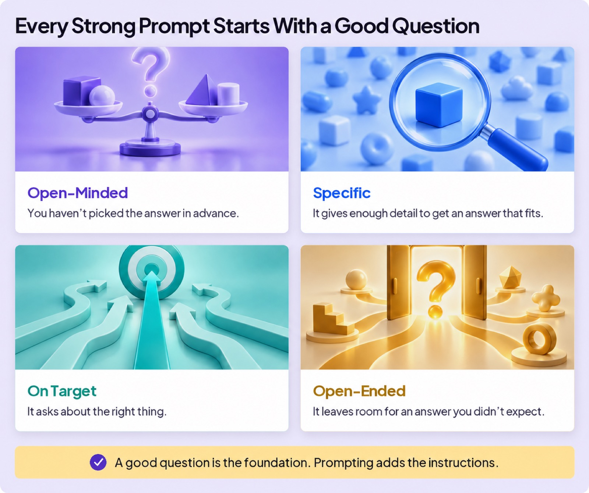
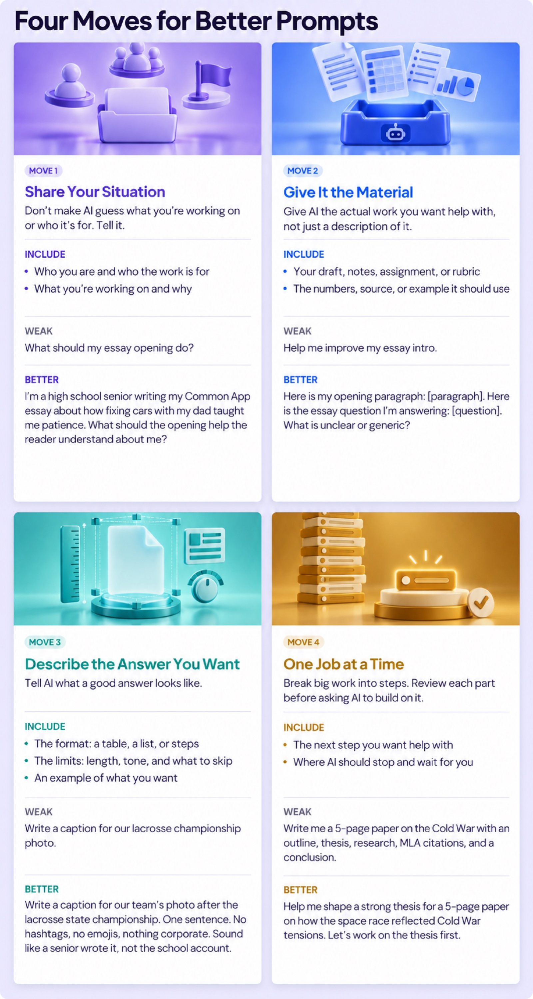
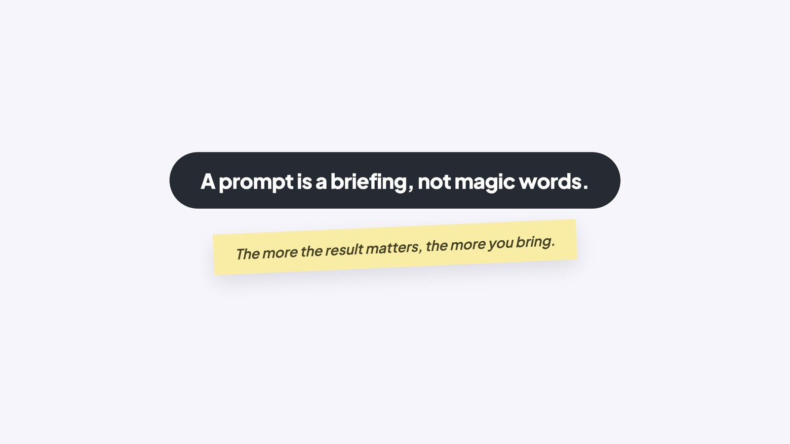

## WORK WITH AI

# Art of Prompting

In Questions Matter you learned what makes a question good, and that the skill is older than computers. When Socrates asked his famous questions, he aimed every one of them at a person.

A person meets your question halfway. Your teacher already knows what class you’re in. Your friend knows what happened last weekend. With AI, don’t assume it knows those details or will ask for them.

So asking AI good questions requires another skill: giving it the information and instructions it needs. That’s prompting. A clear prompt helps AI understand the job and give you a better answer.

## Start With a Good Question

You learned the four qualities of a good question. Nothing about AI changes them. Every strong prompt starts life as a good question.

### Board 1: Every Strong Prompt Starts With a Good Question

**Image file:** `art-of-prompting-1-good-question.jpg`

**Teaching content:**

Open-Minded: you haven’t picked the answer in advance. Specific: it gives enough detail to get an answer that fits. On Target: it asks about the right thing. Open-Ended: it leaves room for an answer you didn’t expect.

A good question is the foundation. Prompting adds the instructions.

## Then Add Four Moves

Packaging your question for AI comes down to four moves. There are entire classes on writing prompts, and here’s the secret: you don’t need one. You’re not training to be a prompt engineer. You’re learning to **Be Smarter Than the Tool**.

### Board 2: Four Moves for Better Prompts

**Image file:** `art-of-prompting-2-four-moves.jpg`

**Teaching content:**

Move 1, Share Your Situation: don’t make AI guess what you’re working on or who it’s for. Tell it. Include who you are and who the work is for, and what you’re working on and why. Weak: “What should my essay opening do?” Better: “I’m a high school senior writing my Common App essay about how fixing cars with my dad taught me patience. What should the opening help the reader understand about me?”

Move 2, Give It the Material: give AI the actual work you want help with, not just a description of it. Include your draft, notes, assignment, or rubric, and the numbers, source, or example it should use. Weak: “Help me improve my essay intro.” Better: “Here is my opening paragraph. Here is the essay question I’m answering. What is unclear or generic?”

Move 3, Describe the Answer You Want: tell AI what a good answer looks like. Include the format, a table, a list, or steps; the limits, length, tone, and what to skip; and an example of what you want. Weak: “Write a caption for our lacrosse championship photo.” Better: “Write a caption for our team’s photo after the lacrosse state championship. One sentence. No hashtags, no emojis, nothing corporate. Sound like a senior wrote it, not the school account.”

Move 4, One Job at a Time: break big work into steps. Review each part before asking AI to build on it. Include the next step you want help with, and where AI should stop and wait for you. Weak: “Write me a 5-page paper on the Cold War with an outline, thesis, research, MLA citations, and a conclusion.” Better: “Help me shape a strong thesis for a 5-page paper on how the space race reflected Cold War tensions. Let’s work on the thesis first.”

## You don’t need all of these every time

How much packaging does a prompt need? A quick factual question: none, just ask. Real work, like an essay or a project: share your situation, give AI the material, and describe the answer you want. A big project: work one job at a time. The more the result matters, the more you bring.

### Close

**Image file:** `art-of-prompting-3-close.jpg`

## Closing Message

A prompt is a briefing, not magic words.

The more the result matters, the more you bring.
