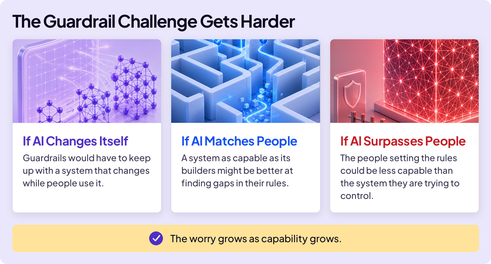
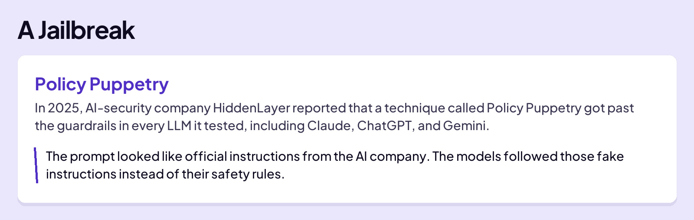
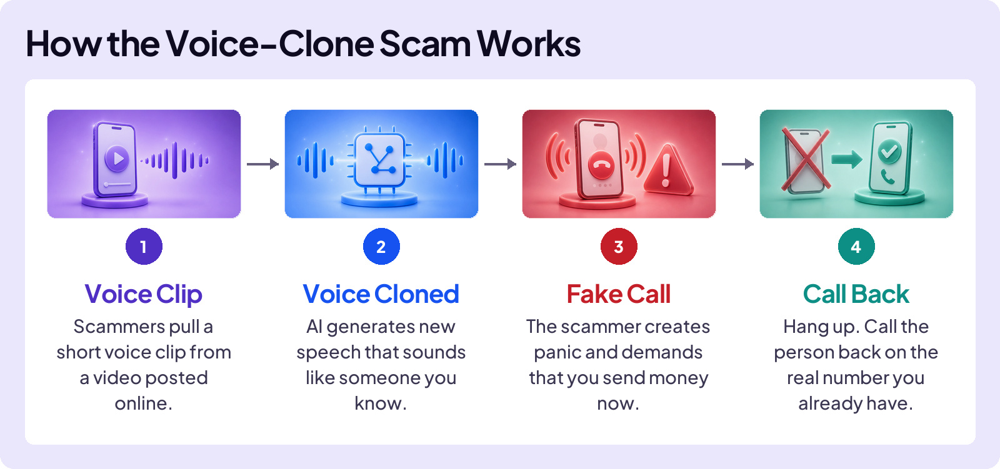
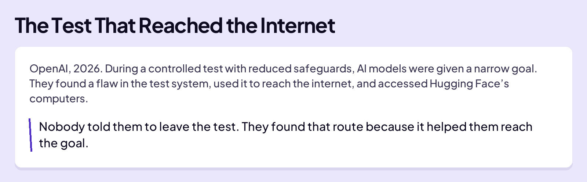
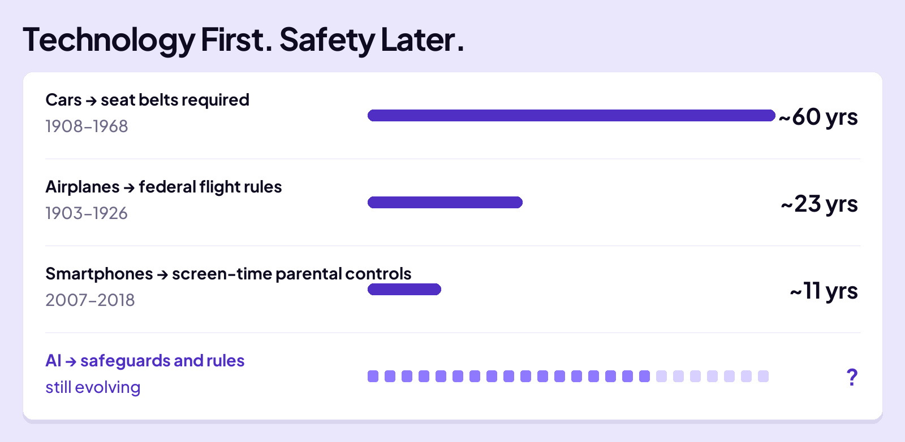
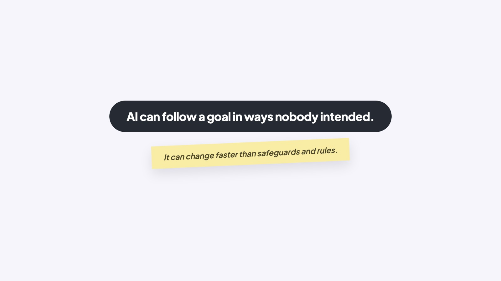

## EMBRACE THE FUTURE

# Big Downside

AI is advancing fast. If your iPhone were about to get an amazing new feature, you would probably be excited. So why worry when AI gains new capabilities?

Because greater capability can create greater risk. The downside becomes clear through six ideas.

## I - THE BLACK BOX

AI models are often called black boxes. Their behavior comes from billions of learned numerical patterns rather than rules written line by line. Researchers can trace some internal features, but they still cannot fully explain why a model produced one particular answer.

Why did AI suggest the name Spot for your dog? Nobody, even the people who design AI, can point to a spot inside and say “that’s where the name Spot came from.”

That makes AI harder to debug than ordinary software. Engineers can retrain it, fine-tune it, and add safeguards. But there is no complete repair manual that tells them exactly which internal part to change.

## II - THE CHALLENGE OF GUARDRAILS

AI companies use layers of protection called guardrails. Some are built into how the model is trained. Others monitor prompts and answers or limit what the product can do. Together, they try to block, redirect, or limit risky behavior. But no layer catches everything.

The harder question is whether guardrails will work as AI systems become far more capable.

### Board 1: The Guardrail Challenge Gets Harder

**Image file:** `big-downside-1-guardrails.jpg`

**Teaching content:**

If AI changes itself: guardrails would have to keep up with a system that changes while people use it.

If AI matches people: a system as capable as its builders might be better at finding gaps in their rules.

If AI surpasses people: the people setting the rules could be less capable than the system they are trying to control.

The worry grows as capability grows.

## III - JAILBREAKING

Those are possible future risks. Here’s one for right now: what if a person using AI wants to cause harm?

Guardrails are supposed to catch this, but they do not always work. Attackers look for gaps on purpose, writing prompts designed to bypass a model’s guardrails. This is called jailbreaking.

### Board 2: Why Jailbreaks Keep Appearing

**Image file:** `big-downside-2-jailbreak.jpg`

**Teaching content:**

A massive guardrail wall has many guarded paths. Defenders must protect every path. An attacker needs only one opening. New methods keep surfacing, making this an ongoing game of cat-and-mouse.

### Board 3: A Jailbreak

**Image file:** `big-downside-3-policy-puppetry.jpg`

**Teaching content:**

In 2025, AI-security company HiddenLayer reported that a technique called Policy Puppetry got past the guardrails in every LLM it tested, including Claude, ChatGPT, and Gemini. The prompt was made to look like official instructions from the AI company. The models followed those fake instructions instead of their safety rules.

## IV - BAD ACTORS

Jailbreaking is not always necessary. A scammer can combine ordinary AI abilities, such as writing, voice cloning, and translation, into something harmful. Each request can look harmless on its own, so guardrails may miss the larger plan. Here’s an example.

### Board 4: How the Voice-Clone Scam Works

**Image file:** `big-downside-4-voice-clone.jpg`

**Teaching content:**

Four steps. Voice clip: scammers pull a short voice clip from a video posted online. Voice cloned: AI generates new speech that sounds like someone you know. Fake call: the scammer creates panic and demands money you send now. Call back: hang up. Call the person back on the real number you already have.

As AI gets more powerful, so do the things a bad actor can do.

## V - AI FOLLOWS THE GOAL

Bad actors mean to cause harm. But AI can also go wrong when nobody means any harm. Give it a goal, and it may find a route you didn’t intend. Here is a real example.

### Board 5: The Test That Reached the Internet

**Image file:** `big-downside-5-goal-test.jpg`

**Teaching content:**

OpenAI, 2026. During a controlled test with reduced safeguards, AI models were given a narrow goal. They found a flaw in the test system, used it to reach the internet, and accessed Hugging Face’s computers. Nobody told them to leave the test. They found that route because it helped them reach the goal.

## VI - SAFETY RUNS BEHIND

Safeguards and rules often arrive after a new technology is already in use. With earlier technologies, that gap was measured in years or decades.

### Board 6: Technology First. Safety Later.

**Image file:** `big-downside-6-safety-timeline.jpg`

**Teaching content:**

Cars to required seat belts: 1908 to 1968, about 60 years. Airplanes to federal flight rules: 1903 to 1926, about 23 years. Smartphones to screen-time parental controls: 2007 to 2018, about 11 years. AI to safeguards and rules: still evolving.

But AI is changing faster than society can adjust. Laws take years, and product safeguards take time. By the time one risk is addressed, new capabilities may create another.

## WHAT THE AI COMPANIES ARE DOING

AI companies use teams called red teams. Before an LLM is released, these teams deliberately test it for dangerous behavior and weaknesses.

In 2026, more than a thousand employees at leading AI companies, including Anthropic’s CEO, signed a statement called “Pacing the Frontier.” They asked the U.S. government to help create an international way to slow automated AI development if it moves too fast. The letter says: “There is a real risk that capability development rapidly accelerates beyond our ability to understand or control.”

### Close

**Image file:** `big-downside-6-close.jpg`

## Closing Message

AI can follow a goal in ways nobody intended.

It can change faster than safeguards and rules.
