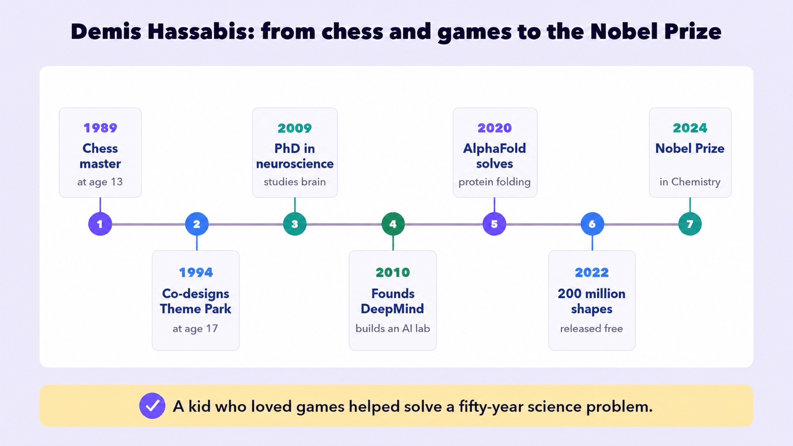
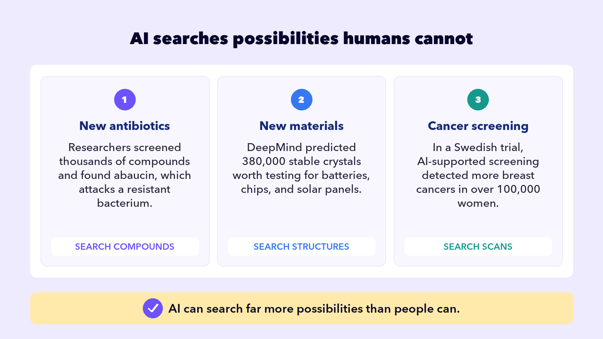
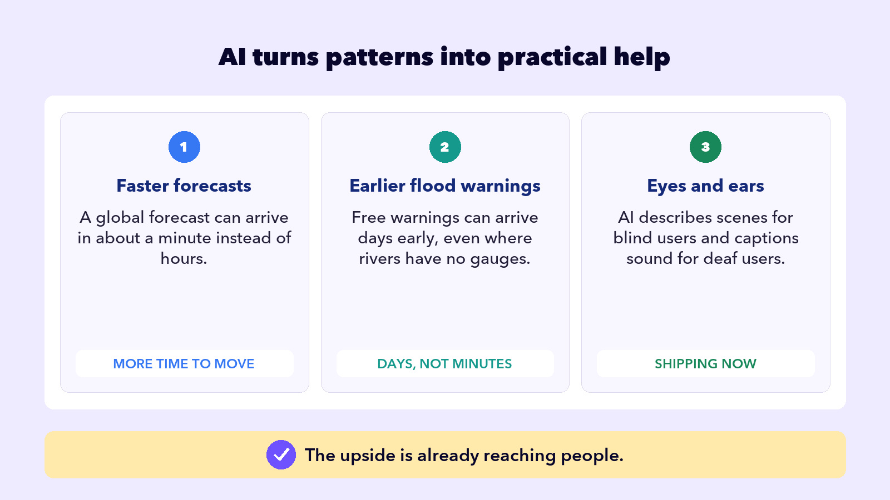

## EMBRACE THE FUTURE

# Big Upside

We’ve said it many times: AI is a giant calculator running math at a scale nobody can picture. But that calculator can do some amazing things. It solved a problem that had beaten biology for fifty years.

## The protein folding problem

Your body runs on proteins. Think of them as tiny machines. They digest your food, carry oxygen, fight off infections, and build muscle. Each one starts as a long string of chemical beads, and then that string folds itself into a specific 3D shape in a fraction of a second.

That’s the fifty-year problem in one picture. The shape is the whole thing: diseases are shapes gone wrong, and drugs are shapes that block them. But a medium protein can fold more ways than there are atoms in the universe, so predicting shapes was brutal. Fifty years of lab work solved about 200,000, out of hundreds of millions.

## THE GUY WHO SOLVED IT

DeepMind’s predictions came back about as accurate as real lab experiments.

**Then DeepMind did the part that actually mattered: they gave the answers away, free to everyone.**

More than two million users in 190 countries have pulled from that database. In 2024, Hassabis won the Nobel Prize in Chemistry for it.

“

I’ve dedicated my career to advancing AI because of its unparalleled potential to improve the lives of billions of people.

## Demis Hassabis

· On winning the 2024 Nobel Prize in Chemistry

## More of the big upside

You learned that AI is a pattern machine. Smart people are pointing AI at problems with too many possibilities for humans to search by hand. And, the results are saving lives.

Every one of those is true. So the next time someone asks, “What good does AI do for society?”, you have an answer ready: **“For starters, it’s saving lives.”**

One more thing about Demis. His story doesn’t start in a lab. It starts with a kid who loved chess and video games. The brilliance is rare. But the attitude is a choice that you can make starting today. Whatever you’re good at, point it at something that helps people. You might not win the Nobel Prize. But who are we to say you won’t?

The big upside is happening today.

AI is saving lives.
