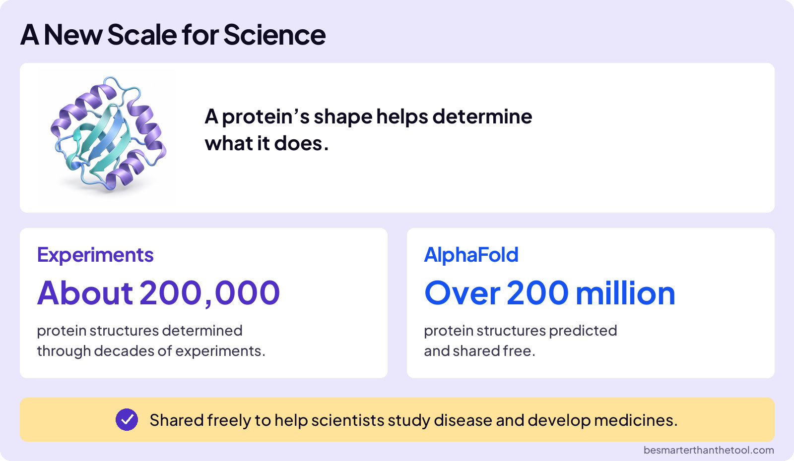
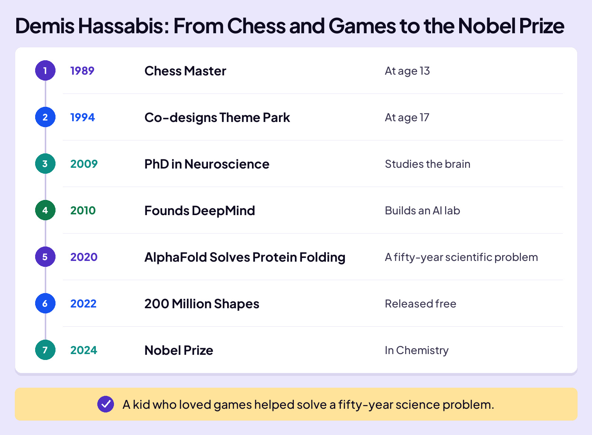
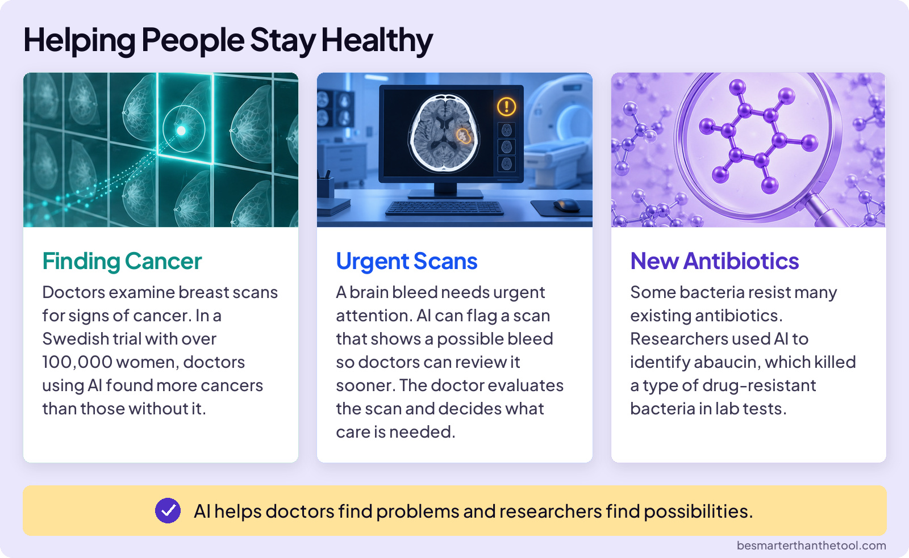
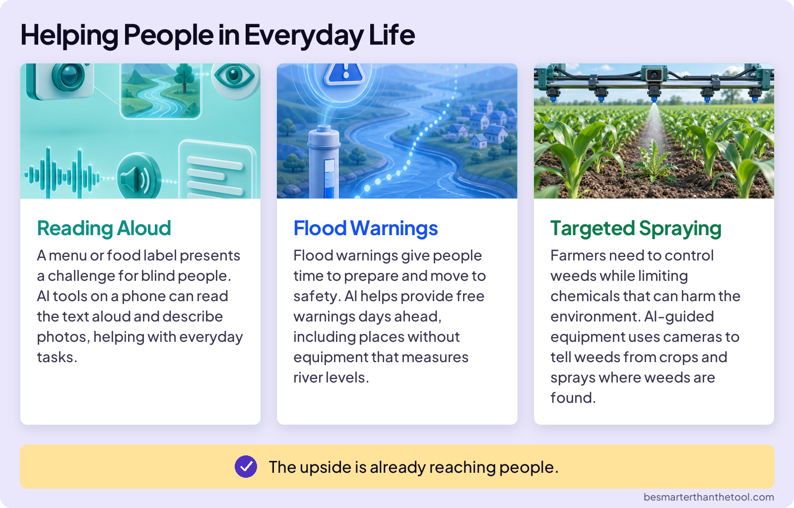
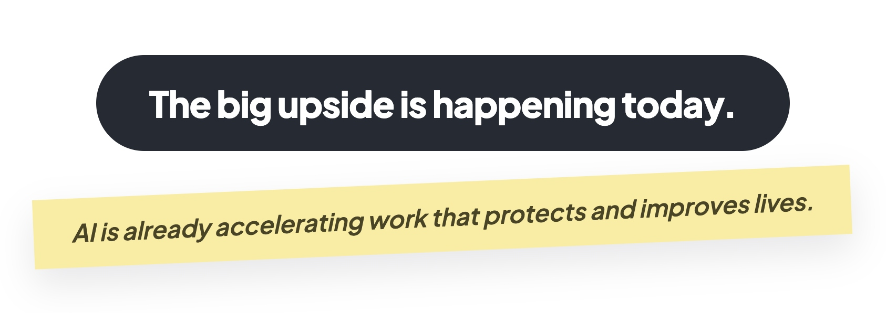

## EMBRACE THE FUTURE

# Big Upside

We’ve said it many times: AI is a giant calculator running math at a scale nobody can picture. But that calculator can do some amazing things. It solved a problem that had beaten biology for fifty years.

## THE PROTEIN FOLDING PROBLEM

Your body runs on proteins. Think of them as tiny machines. They digest your food, carry oxygen, fight off infections, and build muscle. Each one starts as a long string of chemical beads, and then that string folds itself into a specific 3D shape in a fraction of a second.

### Board 1: The Protein Folding Problem

**Image file:** `big-upside-protein.jpg`

**Teaching content:**

A protein’s shape determines what it does. Some diseases involve proteins folding or behaving incorrectly. Many drugs work by binding to proteins and changing what they do. But a medium protein can fold more ways than there are atoms in the universe, so predicting shapes was brutal. Scientists had experimentally determined about 200,000 protein structures. Hundreds of millions of protein sequences still had no known structure.

## FROM GAMES TO A NOBEL PRIZE

### Board 2: Demis Hassabis: From Chess and Games to the Nobel Prize

**Image file:** `big-upside-hassabis-timeline.jpg`

**Teaching content:**

In 1989, at 13, Demis Hassabis became a chess master. In 1994, at 17, he co-designed the video game Theme Park. He earned a PhD in neuroscience in 2009 and founded DeepMind in 2010.

In 2020, DeepMind’s AlphaFold solved the protein-structure prediction problem. For many proteins, AlphaFold predicted shapes with accuracy close to lab methods.

Then DeepMind did the part that actually mattered: in 2022, they released 200 million protein-shape predictions free to everyone.

More than three million people in over 190 countries have used AlphaFold. In 2024, Hassabis won the Nobel Prize in Chemistry for it. On winning it, he said: “I’ve dedicated my career to advancing AI because of its unparalleled potential to improve the lives of billions of people.”

## MORE OF THE BIG UPSIDE

You learned that AI is a pattern machine. Smart people are pointing AI at problems with too many possibilities for humans to search by hand. AI is already accelerating work that protects and improves lives.

### Board 3: AI Searches Possibilities Humans Cannot

**Image file:** `big-upside-scientific-discovery.jpg`

**Teaching content:**

New antibiotics: researchers screened thousands of compounds with AI and found abaucin, which attacks a resistant bacterium.

New materials: DeepMind predicted 380,000 stable crystals worth testing for batteries, chips, and solar panels.

Cancer screening: in a Swedish trial of more than 100,000 women, AI-supported screening detected more breast cancers.

AI can search far more possibilities than people can.

### Board 4: AI Turns Patterns into Practical Help

**Image file:** `big-upside-practical-help.jpg`

**Teaching content:**

Faster forecasts: a global forecast can arrive in about a minute instead of hours.

Flood warnings: free warnings can arrive days early, even where rivers have no gauges.

Eyes and ears: AI describes scenes for blind users and captions sound for deaf users.

The upside is already reaching people.

Every one of those is true. So the next time someone asks, “What good does AI do for society?”, you have an answer ready: “For starters, AI is accelerating work that protects and improves lives.”

One more thing about Demis. His story doesn’t start in a lab. It starts with a kid who loved chess and video games. The brilliance is rare. But the attitude is a choice that you can make starting today. Whatever you’re good at, point it at something that helps people. You might not win the Nobel Prize. But who are we to say you won’t?

### Close

**Image file:** `big-upside-close.jpg`

## Closing Message

The big upside is happening today.

AI is already accelerating work that protects and improves lives.
