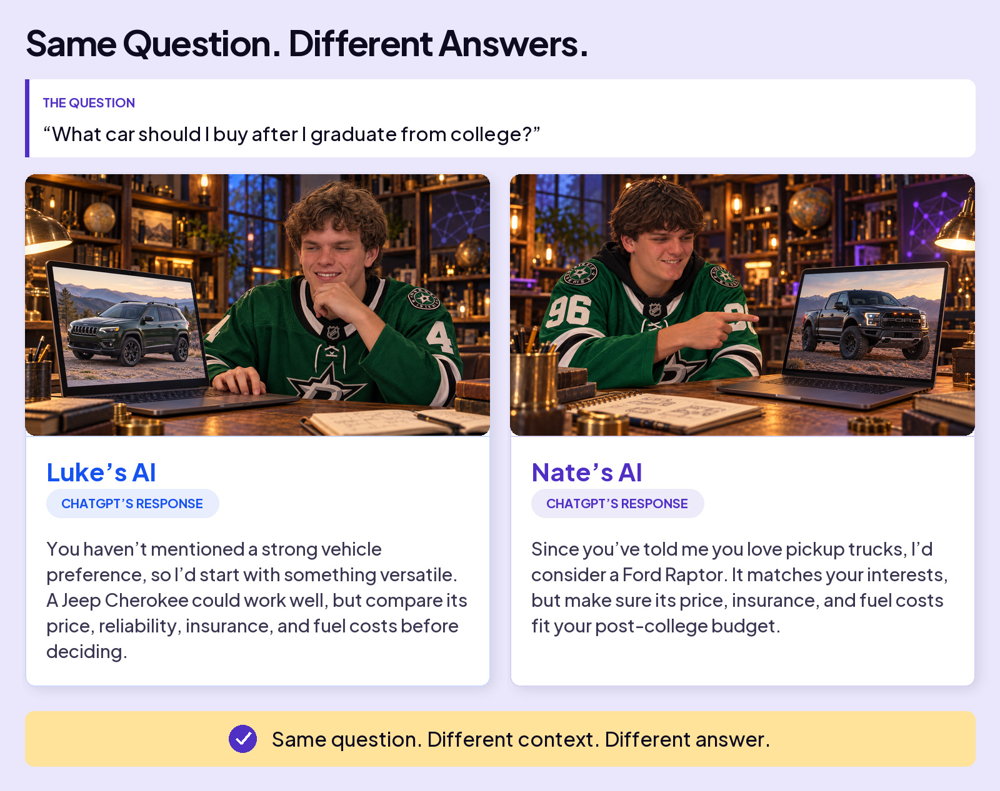
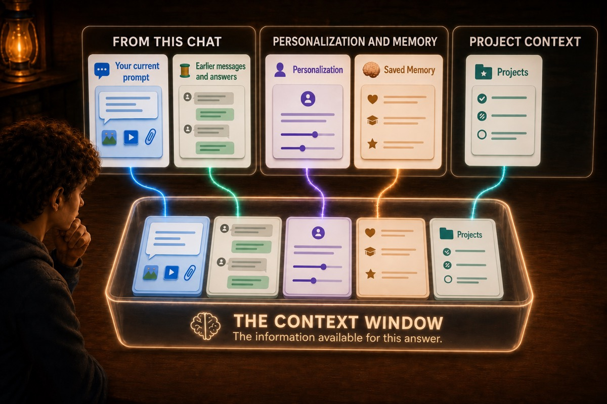
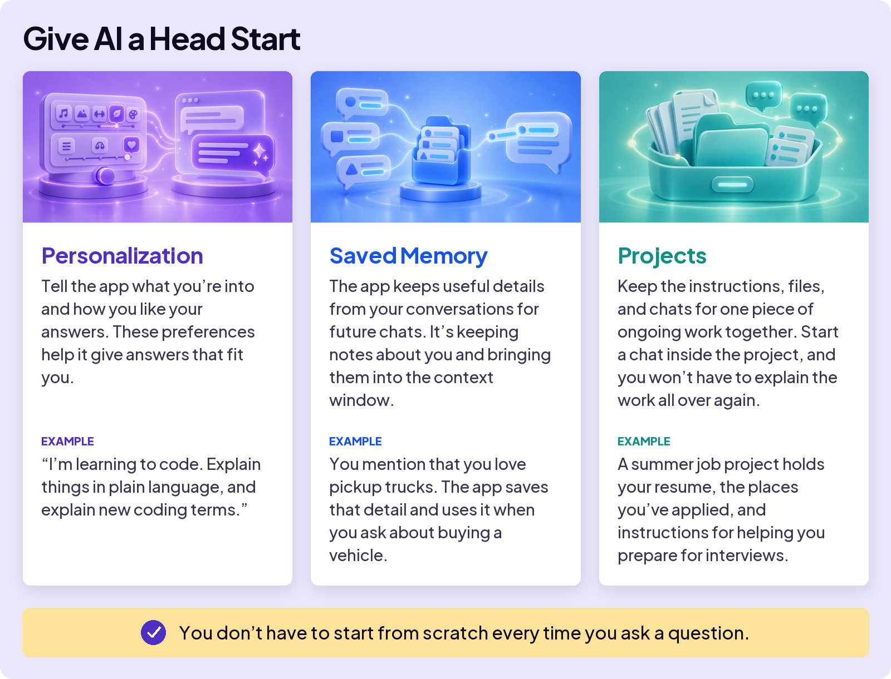
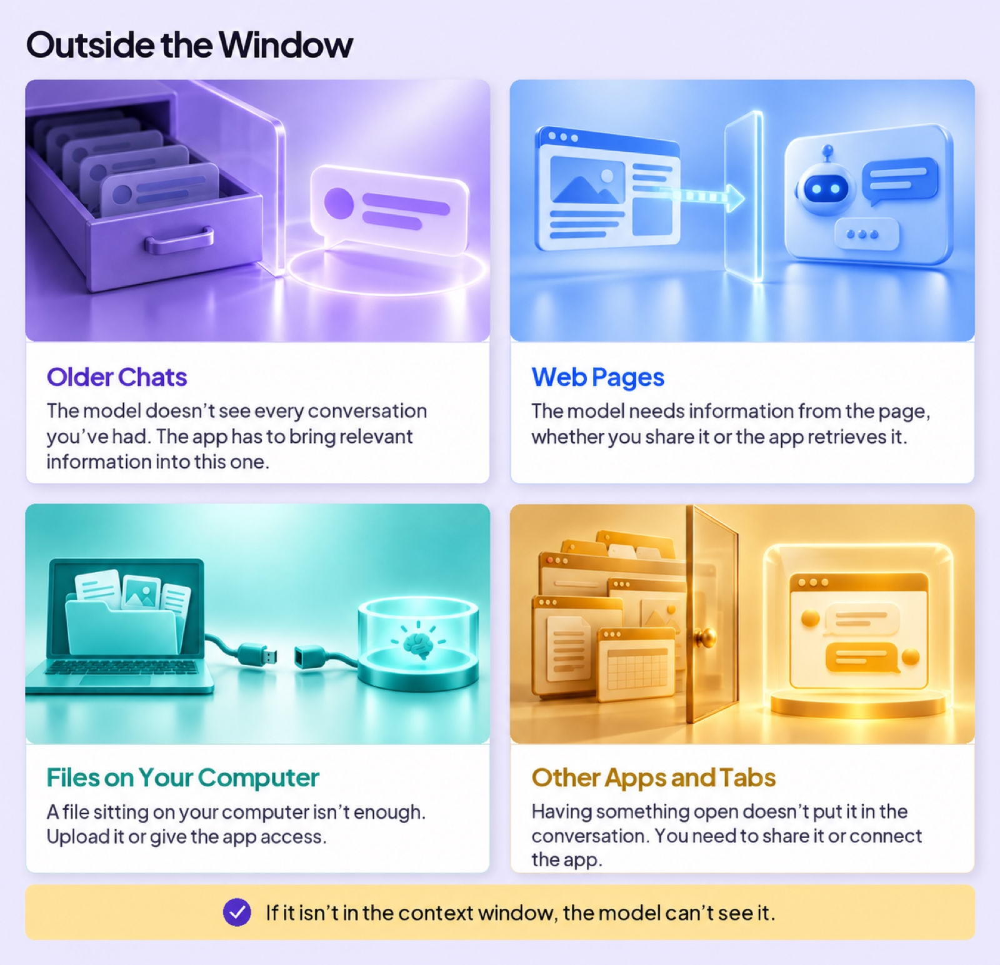
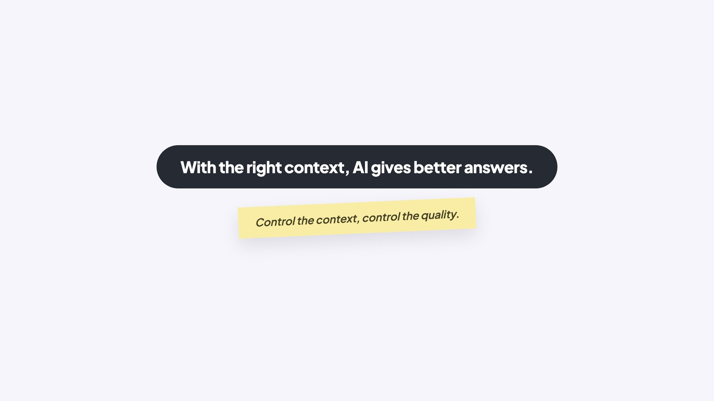

## WORK WITH AI

# Context Window

When you type 2 + 2 on the calculator on your phone, you always get 4. Same input, same answer, every time. AI doesn’t work that way. Consider the following: identical questions, asked to AI by two different people.

### Board 1: Same Question. Different Answers.

**Image file:** `context-window-1-same-question.jpg`

**Teaching content:**

The question: “What car should I buy after I graduate from college?”

Luke’s AI, ChatGPT’s response: “You haven’t mentioned a strong vehicle preference, so I’d start with something versatile. A Jeep Cherokee could work well, but compare its price, reliability, insurance, and fuel costs before deciding.”

Nate’s AI, ChatGPT’s response: “Since you’ve told me you love pickup trucks, I’d consider a Ford Raptor. It matches your interests, but make sure its price, insurance, and fuel costs fit your post-college budget.”

Same question. Different context. Different answer.

Wait a second. Luke and Nate typed the exact same prompt into the same app, and still got different answers!

Some people see different answers to the same question as a reason not to trust AI. But different doesn’t always mean wrong. AI’s answers can vary for several reasons. Here, it used different information about Luke and Nate to tailor its answers. That’s one of AI’s strengths.

That’s the big idea of this lesson: **with the right context, AI gives better answers.** The rest of this page is about where that context comes from, and how to take control of it.

## Why did this happen?

ChatGPT sees more than just the last message Luke and Nate typed. For example, earlier in his chat, Nate said he loves pickup trucks. When ChatGPT answers his question, it recognizes this and suggests the Ford Raptor.

What do you call everything the model can see when it answers your question? The context window. Think of it as working memory, with a limit to how much fits. Here are five places that information comes from.

### Board 2: The Context Window

**Image file:** `context-window-2-five-sources.jpg`

**Teaching content:**

Five cards feed the context window. From this chat: your current prompt, plus earlier messages and answers. Personalization and memory: Personalization, and Saved Memory. Project context: Projects. The context window is the information available for this answer.

The illustration includes three new concepts. Here’s an explanation.

### Board 3: Give AI a Head Start

**Image file:** `context-window-3-head-start.jpg`

**Teaching content:**

Personalization: tell the app what you’re into and how you like your answers. These preferences help it give answers that fit you. Example: “I’m learning to code. Explain things in plain language, and explain new coding terms.”

Saved Memory: the app keeps useful details from your conversations for future chats. It’s keeping notes about you and bringing them into the context window. Example: you mention that you love pickup trucks. The app saves that detail and uses it when you ask about buying a vehicle.

Projects: keep the instructions, files, and chats for one piece of ongoing work together. Start a chat inside the project, and you won’t have to explain the work all over again. Example: a summer job project holds your resume, the places you’ve applied, and instructions for helping you prepare for interviews.

You don’t have to start from scratch every time you ask a question.

That’s what gets in. Here’s what doesn’t get in automatically.

### Board 4: Outside the Window

**Image file:** `context-window-4-outside.jpg`

**Teaching content:**

Older chats: the model doesn’t see every conversation you’ve had. The app has to bring relevant information into this one.

Web pages: the model needs information from the page, whether you share it or the app retrieves it.

Files on your computer: a file sitting on your computer isn’t enough. Upload it or give the app access.

Other apps and tabs: having something open doesn’t put it in the conversation. You need to share it or connect the app.

If it isn’t in the context window, the model can’t see it.

## The Forgetting Problem

Ever been deep in a long chat, and AI seems to forget something you told it earlier? One reason is space. The context window has a limit. As the conversation grows, older parts can be shortened or left out. If an important detail gets lost, remind AI. And when you’re starting a different task, start a fresh chat.

### Close

**Image file:** `context-window-5-close.jpg`

## Closing Message

With the right context, AI gives better answers.

Control the context, control the quality.
