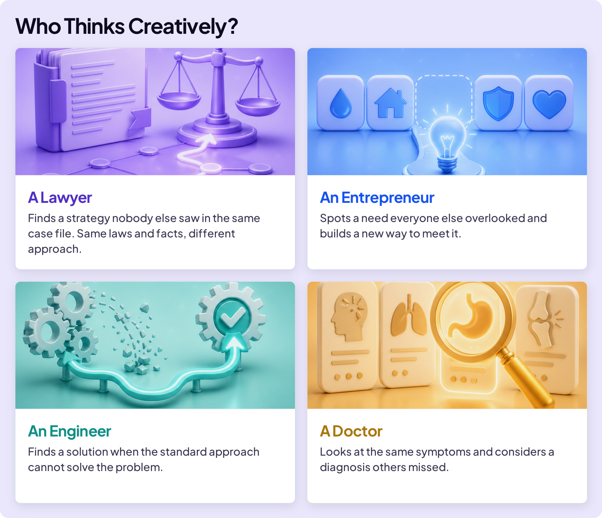
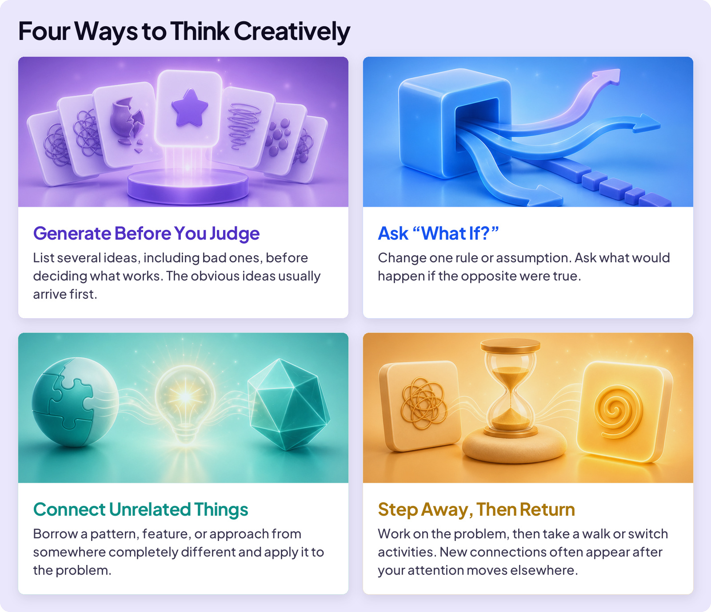
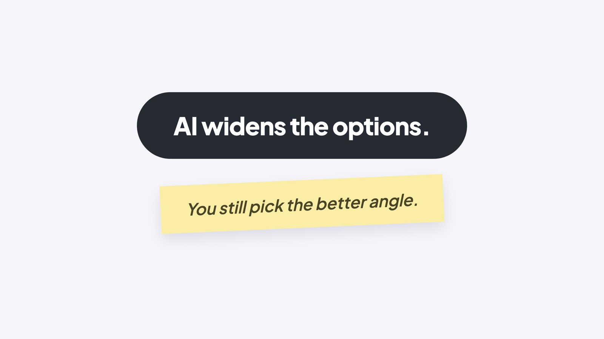

## BUILD YOUR SKILLS

# Creative Thinking

Think about the last time someone told you, “Good idea!” It feels good to hear those words.

Why did they say it to you? You probably saw something they missed, connected things in a new way, or found a better way to move forward. That is creative thinking. It’s the ability to see a problem differently, question the obvious approach, and find an angle other people missed.

## WHO THINKS CREATIVELY?

It’s not just “creative-type” people like artists, writers, and musicians. It’s anyone who solves problems or imagines a better way. Think Steve Jobs. He helped build Apple by seeing that computers could be simpler, more personal, and easier to use. He wasn’t an artist, writer or musician. He saw a possibility other people had missed.

### Board 1: Who Thinks Creatively?

**Image file:** `creative-thinking-1-professions.jpg`

**Teaching content:**

A lawyer finds a strategy nobody else saw in the same case file. Same laws and facts, different approach.

An entrepreneur spots a need everyone else overlooked and builds a new way to meet it.

An engineer finds a solution when the standard approach cannot solve the problem.

A doctor looks at the same symptoms and considers a diagnosis others missed.

Creativity is not a job title or a personality trait. It is a habit of thinking that runs underneath any job where the standard answer is not enough.

## WHY IT MATTERS

AI gives polished answers in seconds. And everyone, using the same AI, gets similar answers. The advantage moves to the person who can notice what is missing, connect ideas from different places, and choose the better direction. That’s creative thinking.

Creative thinking is not a gift some people receive. It’s a set of habits that you can improve.

### Board 2: Four Ways to Think Creatively

**Image file:** `creative-thinking-2-practice.jpg`

**Teaching content:**

Generate before you judge: list several ideas, including bad ones, before deciding what works. The obvious ideas usually arrive first.

Ask “what if?”: change one rule or assumption. Ask what would happen if the opposite were true.

Connect unrelated things: borrow a pattern, feature, or approach from somewhere completely different and apply it to the problem.

Step away, then return: work on the problem, then take a walk or switch activities. New connections often appear after your attention moves elsewhere.

These four habits widen your options. Then judgment picks the one that fits.

### Board 3: Close

**Image file:** `creative-thinking-3-close.jpg`

## Closing Message

AI widens the options.

You still pick the better angle.
