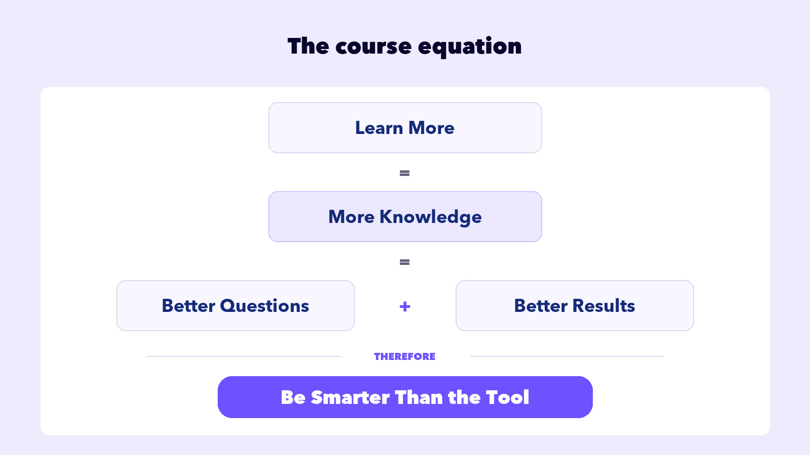
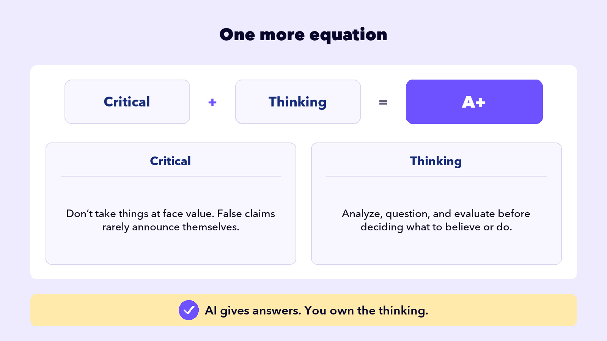
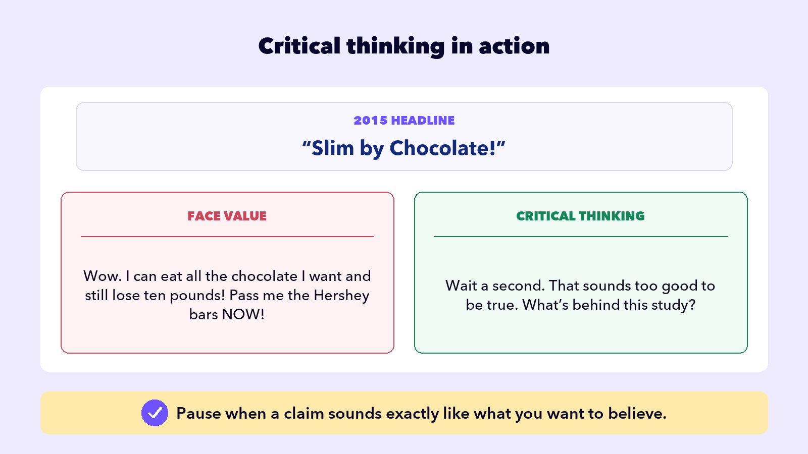

## WORK WITH AI

# Critical Thinking

Here’s the big takeaway from the first part of this course. And in the spirit of AI, let’s write it as a math equation.

That equation leaves out one skill: the one that raises every line of it. It matters enough that we could have called this lesson **How to Take Your AI Use from a B to an A+**.

It’s called **critical thinking**. And it will help you far beyond AI: in school, in work, in almost every part of your life.

There’s almost a direct line between this skill and the people who get the most out of AI. That’s why AI experts use the term constantly. But what does it actually mean? The answer fits in one more equation.

Put the words together and you have a process: actively analyzing, questioning, and evaluating information, regardless of where it comes from, before deciding what to believe or do.

It isn’t “don’t trust anything,” either. It’s the habit of asking what would have to be true for a claim to hold up.

## Critical Thinking in Action

In 2015, headlines around the world announced a delicious discovery: a new study showed that eating chocolate helps you lose weight. **Slim by Chocolate!** ran one front page.

Did your critical thinking just kick in? If that headline made you pause, you’re a natural, and it’s a trait worth keeping. But picture everyone who read it that morning: the reactions went two directions.

## The True Story

The study was real, but it was flimsy on purpose:

- There were only 15 participants, and the study measured 18 different things about them. Track that many things in a group that small, and luck alone guarantees something will look like a finding.
- The “research institute” behind it was just a website.
- The author was a journalist who designed the whole thing to prove a point: that a bad study with a great headline would fly around the world before anyone checked. It did.
That’s a big part of critical thinking: the ability to read between the lines, especially when the claim is something you’d love to believe.

There are five habits you can build to sharpen your critical thinking. Each one is a question you ask.

1

❓

Is it actually right?

Don’t take it at face value. Ask what would have to be true for the claim to hold up.

2

🧐

Do I know enough to judge?

The further a claim sits from what you know, the more carefully you have to check. Evaluate the Results made this the first dig question: could you actually validate it? Unfamiliar territory is exactly where everything sounds authoritative.

3

🧩

What’s missing?

You’re seeing what got included, not what got left out. Look for context, exceptions, other perspectives, and the counterargument nobody mentioned.

4

🪞

Why am I convinced?

Polish and confidence aren’t evidence. The smoother something sounds, the more your guard drops. That pull is the thing to catch.

5

🔨

What’s my call?

You decide what to keep, change, or toss. Anyone can hand you options. The thinking, the decision, and the consequences are yours.

The five questions work on anything you read or hear. They matter most on AI, where answers arrive smooth, confident, and instant. The model doesn’t fix your thinking. It scales it.

AI amplifies whatever you bring to it.

Good thinking in, sharper output.
