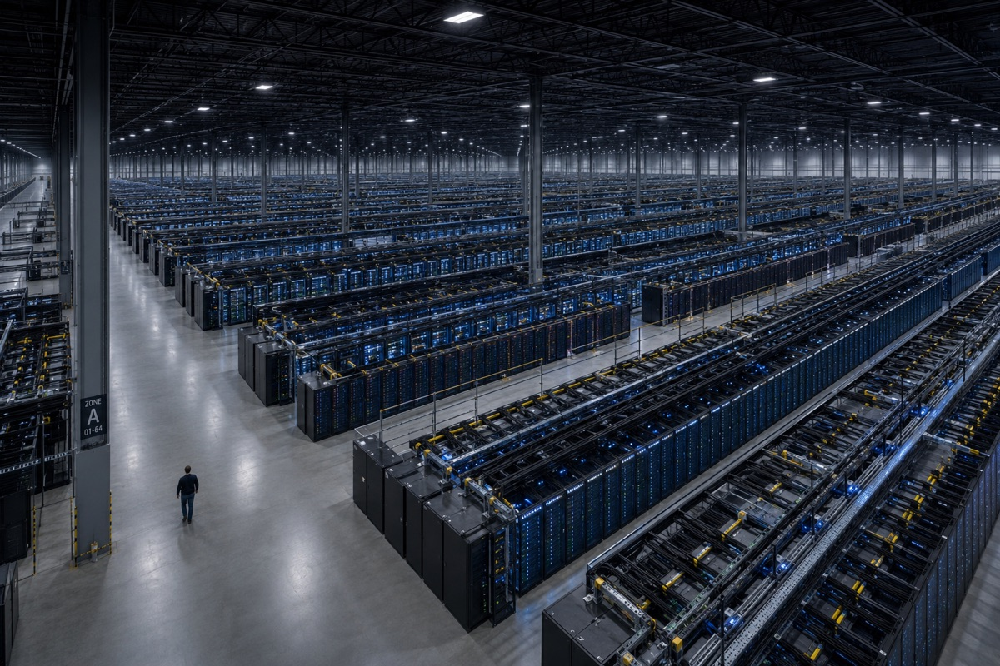
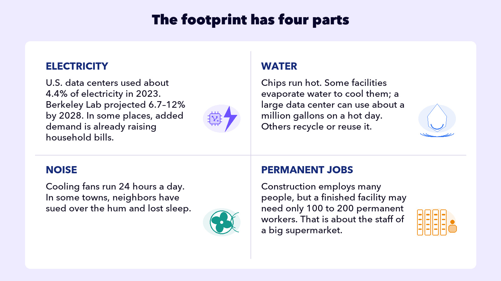
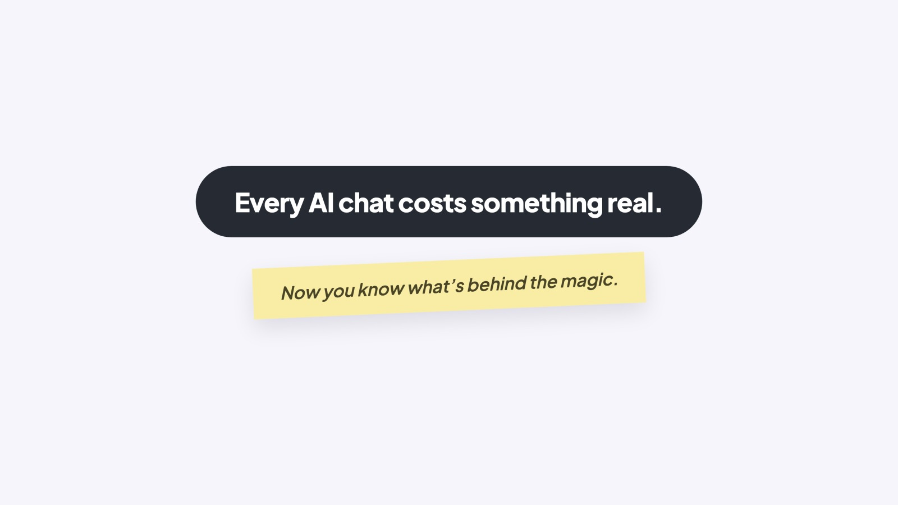

## EMBRACE THE FUTURE

# Data Centers

The scale of the math behind AI is almost impossible to grasp. A 2,000-word chat between you and AI runs to about 2 quadrillion individual math calculations. And that’s just for one chat!

And to train a new model? It takes about 100 septillion individual math calculations. That’s the number 1 followed by twenty-six zeroes.

That’s why there’s so much in the news about data centers. It’s about one thing: the ability to run the math, which AI companies call compute. And they are racing to get more of it.

## WHAT IS A DATA CENTER

Think of a big warehouse packed with thousands of specialized chips, called GPUs, running around the clock.

### Board 1: Inside a Data Center

**Image file:** `data-centers-1-data-center.jpg`

**Teaching content:**

Inside a vast AI data center: rows of server racks stretching to the far wall of a warehouse-sized hall, glowing with blue status lights. A single person walking the main aisle, dwarfed by the racks, is the only human in sight.

The scale is hard to overstate. A big AI data center covers the ground of several football fields and uses as much electricity as a small city. The companies racing to build them are spending hundreds of billions of dollars a year, so it’s one of the largest construction projects happening anywhere in the world. When you hit send in ChatGPT, a data center answers.

Somebody pays for all that arithmetic.

### Board 2: The Footprint Has Four Parts

**Image file:** `data-centers-2-footprint.jpg`

**Teaching content:**

Electricity: U.S. data centers used about 4.4 percent of the country’s electricity in 2023, and Berkeley Lab projects 6.7 to 12 percent by 2028. In some places, added demand is already raising household bills.

Water: chips run hot. Some facilities evaporate water to cool them, and a large data center can use about a million gallons on a hot day. Others recycle or reuse it.

Noise: cooling fans run 24 hours a day. In some towns, neighbors have sued over the hum and lost sleep.

Permanent jobs: construction employs many people, but a finished facility may need only 100 to 200 permanent workers. That is about the staff of a big supermarket.

The electricity figures cover all data centers, not AI alone.

## SHRINKING THE BILL

AI companies know all of this, and the race to shrink the bill is real. Microsoft signed a long-term agreement for electricity from a planned restart of a reactor at Three Mile Island to support its data centers. Other companies are betting on new kinds of small reactors. Some cooling systems reuse water in closed loops, reducing how much new water they need. And custom computer chips are being built to squeeze more math out of every watt.

## THE FOOTPRINT, HONESTLY

Every big technology has a footprint, from streaming video to the cars outside. AI’s footprint is real, it’s growing, and somebody pays it: the company in dollars, the grid in watts, the neighborhood in water and quiet.

None of this is a reason to feel guilty hitting send. It’s a reason to be one of the few people who actually understands the machine you’re using.

### Close

**Image file:** `data-centers-3-close.jpg`

## Closing Message

Every AI chat costs something real.

Now you know what’s behind the magic.
