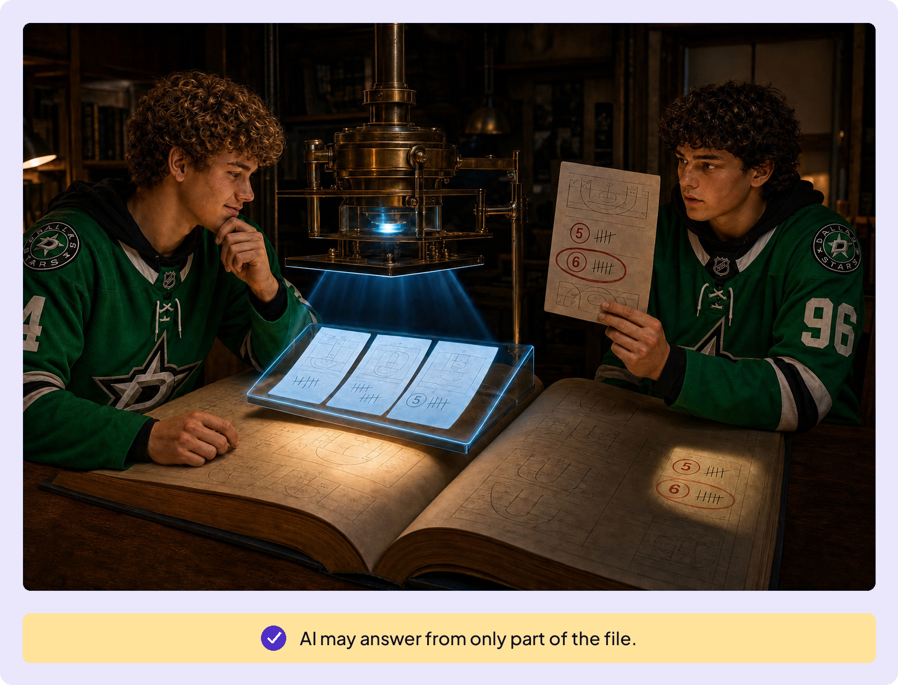
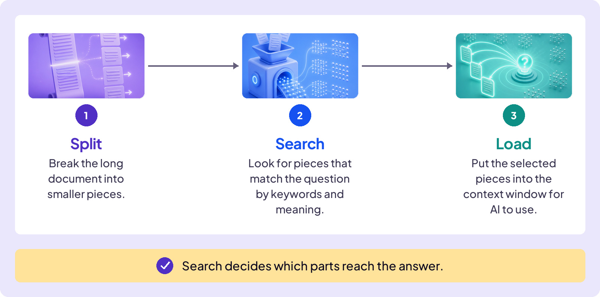

## AVOID TRAPS

# Document Trap

Your season-end basketball tournament starts next week, so you want to brush up on the rules. You upload your league’s 200-page rulebook and ask: “How many fouls until I’m out of the game?”

ChatGPT answers: “Five fouls and you foul out.”

Wait a second. In last year’s tournament, you remember a player picking up five fouls and staying in the game. So you dig through the rulebook yourself. Regular season: five fouls, exactly what ChatGPT said. But near the end there’s a special section for tournaments, and in those games players get six.

The AI pulled the standard limit and missed the exception. The answer wasn’t made up. It was incomplete. **Document Trap is thinking ‘uploaded’ means ‘fully read.’**

## Uploaded Doesn’t Mean Fully Read

## How AI Searches a Long Document

AI can only answer from the document text that reaches its context window. A short file may fit there in full. With a long file, the system may search for the parts that seem most relevant and add those passages instead.

One common process looks like this:

This is how the rulebook mistake can happen. The search finds the regular-season foul rule but misses the tournament exception. Only the selected pieces reach the context window. The answer can sound complete even when an important passage was left out.

## Retrieval

There’s a name for what happened: Retrieval-Augmented Generation, or RAG. Here, AI searched your basketball rulebook and added the selected passages to its context window. The same process can pull information from the web or a database.

When retrieval finds the right passages, AI can answer a specific question in seconds. When retrieval misses something important, AI may miss it too.

## Four Moves for Better Retrieval

This trap doesn’t stay in basketball. Apartment leases, employment contracts, insurance policies, and financial-aid letters can all contain conditions or exceptions that change the answer.

Uploading a document and asking AI for help is a good starting point.

**A missing passage can change the answer.**

Ask for the passage. Then check it.
