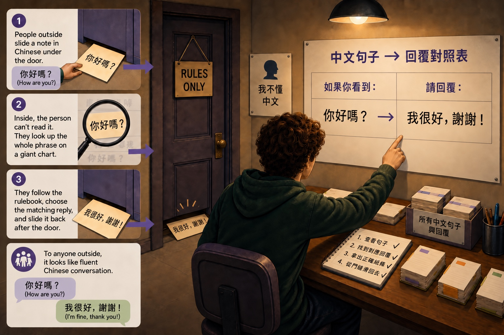

## START SMARTER

# Does AI Think?

You type a question and AI types back like a person. It explains, it jokes, it says sorry when it slips up. After a while it’s hard not to feel like someone is in there. So here’s the big question: **Does AI actually think?** Is it alive? Is it smart? Does it feel anything?

Short answer: no, not the way you do.

## IT’S IN THE NAME

**We call it Artificial Intelligence, not Artificial Thinking.** That was picked on purpose. Something can act intelligent, finish your sentence, explain a poem, without understanding a single thing it just said.

There’s a famous way to picture this, sometimes called the Chinese Room. Imagine someone locked in a room who doesn’t know a word of Chinese. Notes in Chinese come in under the door. The person can’t read any of it, but they have a giant rulebook telling them which symbols to send back. So they match symbols and slide back an answer that looks perfect to the people outside.

## The Chinese Room

**A convincing answer doesn’t prove understanding.**

The Chinese Room illustrates a distinction: producing an answer and understanding it aren’t necessarily the same thing. An LLM doesn’t follow a literal rulebook. It uses patterns learned during training to predict its response. A fluent answer alone doesn’t tell you whether it understands.

![When You Think. What AI Does. Meaning: You connect words to what they mean in your life; AI uses learned patterns and the context you provide. Experience: You draw on things you have lived through; AI works with patterns learned from text, images, audio, and other data. Word choice: You choose words to express what you want to say; AI predicts the next token, then repeats. Beauty: You have a personal response to art or music; AI can describe beauty using learned patterns. Uncertainty: You can notice when you are unsure; AI can sound certain even when it is wrong. Similar-looking answers can come from very different processes.](../illustrations/does-ai-think-side-by-side-v2.jpg)

None of this means AI is dumb or useless. A pattern machine this good is genuinely powerful. It just means it’s not thinking.

A pattern machine, not a thinker.

Once you see that, its weird moments make sense.
