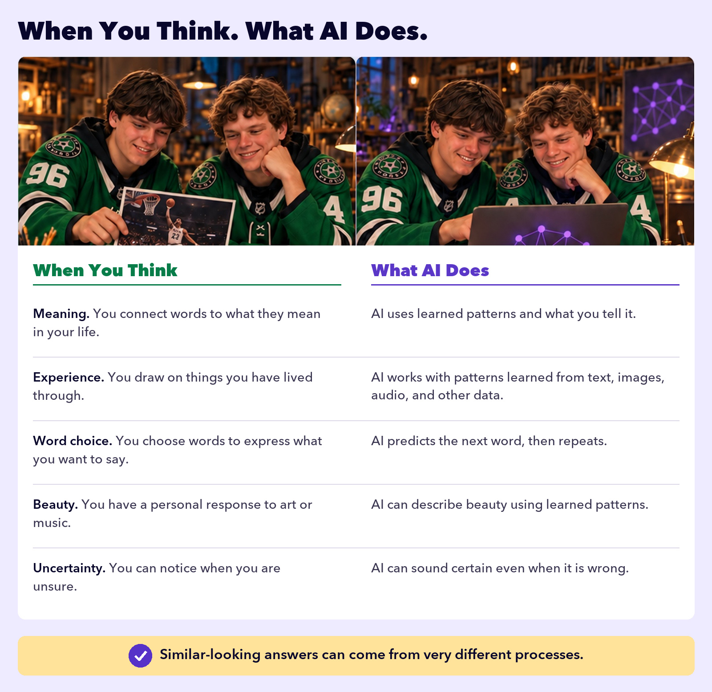
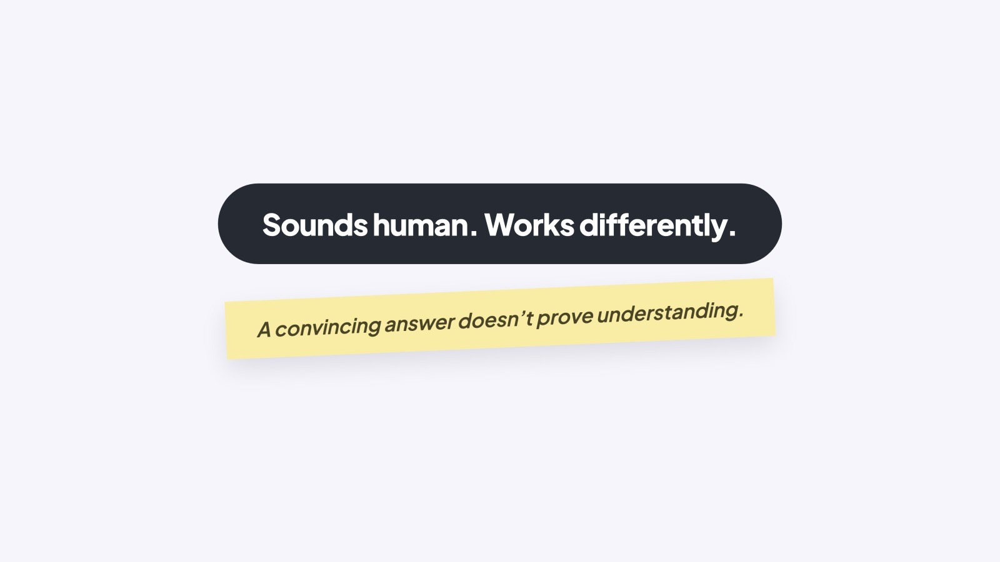

## START SMARTER

# Does AI Think?

You type a question and AI types back like a person. It explains, it jokes, it says sorry when it slips up. After a while it’s hard not to feel like someone is in there. So here’s the big question: does AI actually think? When it answers like a person, is it understanding things the way you do?

## SOUNDING HUMAN

AI can finish your sentence, explain a poem, and carry on a conversation. But sounding like a person doesn’t tell you whether it understands things the way a person does.

There’s a famous way to picture this, sometimes called the Chinese Room. Imagine someone locked in a room who doesn’t know a word of Chinese. Notes in Chinese come in under the door. The person can’t read any of it, but they have a giant rulebook telling them which symbols to send back. So they match symbols and slide back an answer that looks perfect to the people outside.

### Board 1: The Chinese Room

**Image file:** `does-ai-think-1-chinese-room.jpg`

**Teaching content:**

Step 1: people outside slide a note in Chinese under the door. It asks, “How are you?” Step 2: inside, the person can’t read it. They look up the whole phrase on a giant chart. Step 3: they follow the rulebook, choose the matching reply, “I’m fine, thank you!”, and slide it back under the door. To anyone outside, it looks like fluent Chinese conversation.

A convincing answer doesn’t prove understanding.

The Chinese Room illustrates a distinction: producing an answer and understanding it aren’t necessarily the same thing. An LLM doesn’t follow a literal rulebook. It uses patterns learned during training to predict its response. A fluent answer alone doesn’t tell you whether it understands.

### Board 2: When You Think. What AI Does.

**Image file:** `does-ai-think-2-side-by-side.jpg`

**Teaching content:**

Five comparisons. Meaning: you connect words to what they mean in your life; AI uses learned patterns and what you tell it. Experience: you draw on things you have lived through; AI works with patterns learned from text, images, audio, and other data. Word choice: you choose words to express what you want to say; AI predicts the next word, then repeats. Beauty: you have a personal response to art or music; AI can describe beauty using learned patterns. Uncertainty: you can notice when you are unsure; AI can sound certain even when it is wrong.

Similar-looking answers can come from very different processes.

None of this means AI is dumb or useless. It can do impressive work. But an answer that sounds human is not enough to show that it understands the way you do.

### Close

**Image file:** `does-ai-think-3-close.jpg`

## Closing Message

Sounds human. Works differently.

A convincing answer doesn’t prove understanding.
