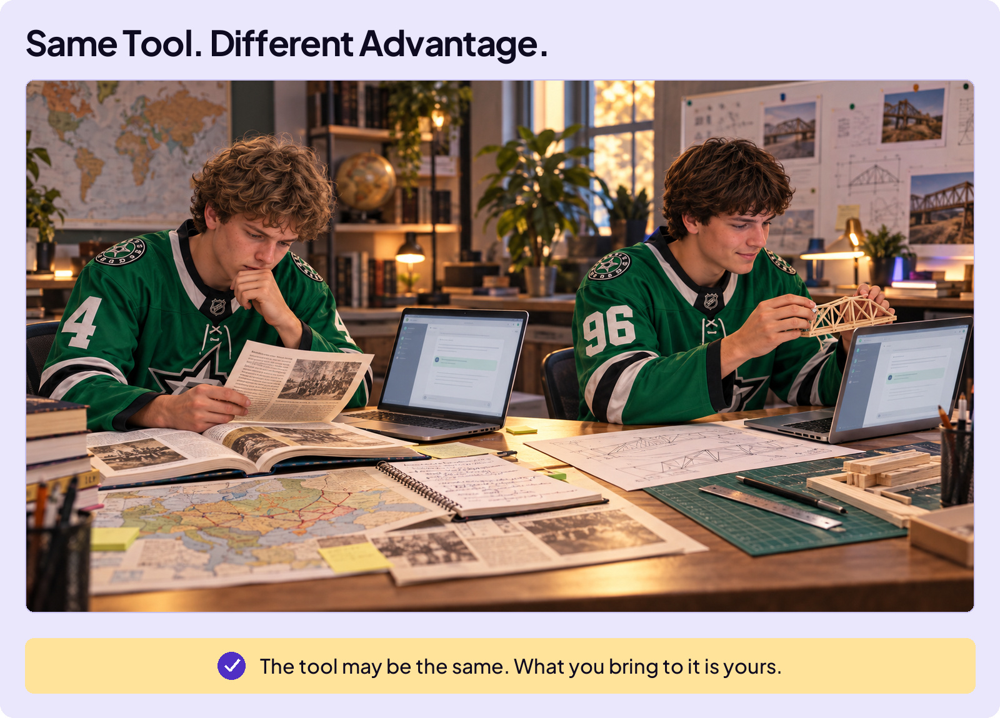

## START SMARTER

# Does School Matter?

A lot of people your age are quietly asking the same thing. If AI can answer anything, do you even need school anymore? Why sit through years of classes when the tool spits out the answer in seconds?

Think about it this way.

Fast forward a few years. You’ve landed your dream job, and AI sits right next to you all day, cranking out drafts, code, and plans. Your coworker at the next desk is doing the same. You each have the same job, using the same AI.

Here’s the catch: During training, AI learned patterns from enormous amounts of existing work. Give it ordinary instructions, and it often produces a polished version of what is common or expected. That may be a useful starting point. But when that level of work is available to everyone, it becomes the new average.

That leads to a question worth considering: In your AI future, what takes you beyond the new average? What makes you more valuable?

## WHAT SETS YOU APART

Your secret sauce is the knowledge and skills you build. And where do you build them? You know where this is going: school.

In the AI era, the knowledge and skills you build in school matter more than ever. This seems counterintuitive, but it’s true. This inspired the name of this course, **Be Smarter Than the Tool.** Whatever college and career you choose, the more you learn, the more successful you’ll be.

The opportunity to learn is already in front of you.

Use it to build the knowledge and skills that take you beyond the new average.
