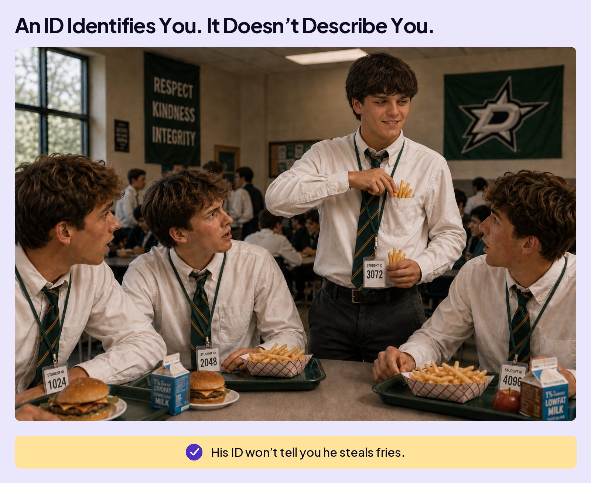
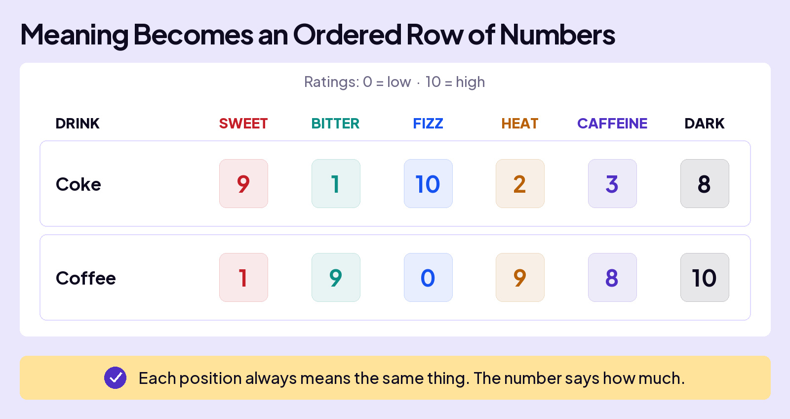

## UNDERSTAND AI

# Embeddings

You’ve learned that text is converted to tokens, and each has a unique identifier called a token ID. But that’s just a number. It doesn’t say anything about what it means.

It’s the same as the number assigned to your Student ID. It might let you in the building, but it doesn’t tell anyone whether you are funny, into hockey, or the person who steals fries at lunch.

## How Numbers Can Represent Meaning

Imagine you and your friends rate Coke and coffee on six characteristics: Sweet, Bitter, Fizz, Heat, Caffeine, and Dark. Each score runs from 0 to 10. A higher number means more of that characteristic.

If someone asked you, “Which drink scores 9 for Sweet, 1 for Bitter, and 10 for Fizz?” you’d immediately answer Coke.

You’ve turned each drink’s characteristics into a row of numbers that describes it.

The whole row of numbers is a **vector**. Each position in the row is a **dimension**, such as Sweet or Bitter. The number in that position is its **value**.

## When You Need Another Dimension

Now add a third drink to the taste test: Pepsi. Score it on the same six dimensions and a problem shows up. Pepsi scores the same as Coke. On these six numbers alone, you cannot tell them apart.

To tell them apart, you add a seventh dimension, **Citrus**. In your ratings, Pepsi scores 10 and Coke scores 1. Their numerical profiles now capture a difference the first six dimensions missed.

## How AI Uses This Idea

AI also uses numbers to represent meaning. Just as each drink has a numerical profile, each token has its own row of numbers. That row is called an **embedding**.

![From Taste Ratings to AI Embeddings. Your taste test: three drinks; six, then seven dimensions per row; you choose the ratings (0 to 10); named traits like Sweet and Fizz; you name the dimensions. AI: every token in the model’s vocabulary; typically thousands of dimensions per row; AI learns the values during training (positive and negative numbers, including decimals); patterns in how a token is used; no dimension labels, with values working together to represent meaning. Both use a row of numbers to describe something.](embeddings-taste-test-to-ai-editorial.jpg)

## Putting the Pieces Together

What happens when you type “cat” into AI? Follow its token ID to the matching row in the embedding table.

## Even Pieces of Words Get Embeddings

“Unbelievable” can be split into three tokens: “un”, “belie”, and “vable”. Each piece gets its own embedding, a row of learned numbers.

AI uses numbers to work with meaning.

Those numbers help AI recognize similarities and differences.
