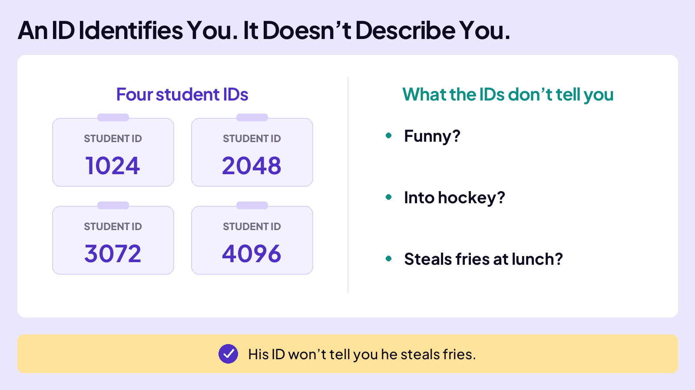
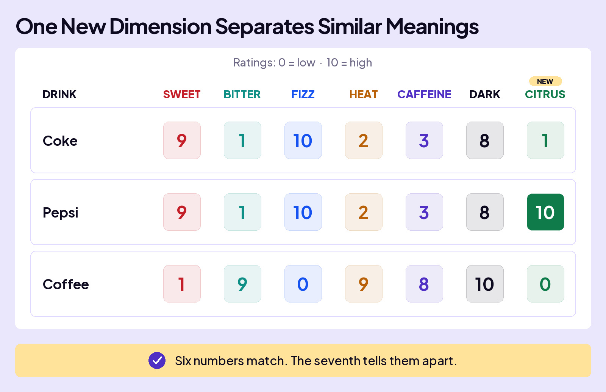
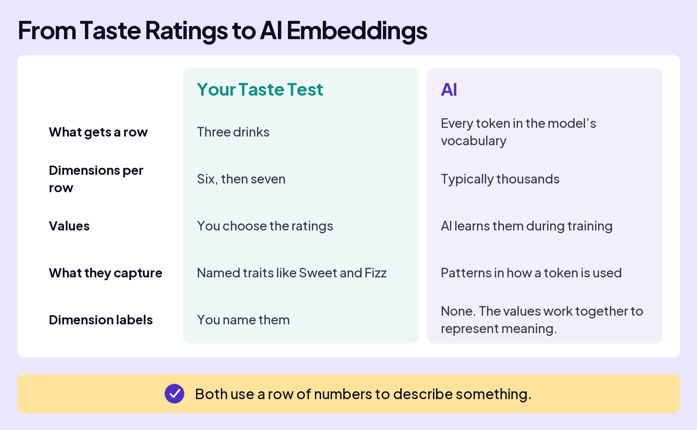
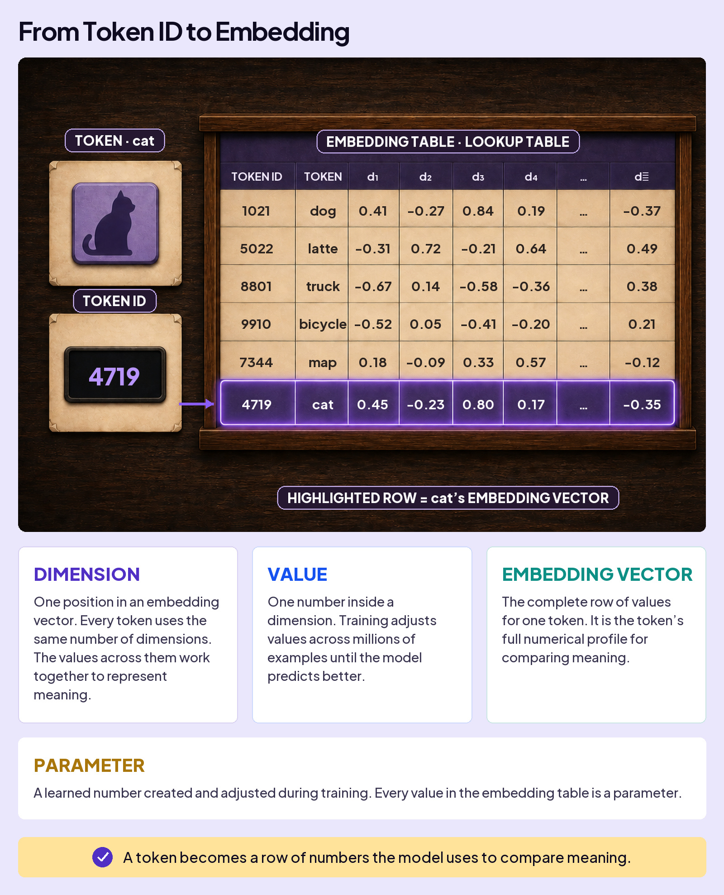

## UNDERSTAND AI

# Embeddings

You’ve learned that text is converted to tokens, and each has a unique identifier called a token ID. But that’s just a number. It doesn’t say anything about what it means.

It’s the same as the number assigned to your Student ID. It might let you in the building, but it doesn’t tell anyone whether you are funny, into hockey, or the person who steals fries at lunch.

### Board 1: An ID Identifies You. It Doesn’t Describe You.

**Image file:** `embeddings-student-id-notebook.jpg`

**Teaching content:**

Four student ID cards show the numbers 1024, 2048, 3072, and 4096. The numbers identify the students, but do not describe their characteristics. An ID doesn’t tell you whether a student is funny, into hockey, or steals fries at lunch.

**Takeaway:** His ID won’t tell you he steals fries.

## How Numbers Can Represent Meaning

Imagine you and your friends rate Coke and coffee on six characteristics: Sweet, Bitter, Fizz, Heat, Caffeine, and Dark. Each score runs from 0 to 10. A higher number means more of that characteristic.

### Board 2: Meaning Becomes an Ordered Row of Numbers

**Image file:** `embeddings-meaning-row-editorial.jpg`

**Teaching content:**

Ratings: **0 = low, 10 = high**. Compare Coke and coffee using the same six characteristics in the same order.

| Drink | Sweet | Bitter | Fizz | Heat | Caffeine | Dark |
| --- | --- | --- | --- | --- | --- | --- |
| Coke | 9 | 1 | 10 | 2 | 3 | 8 |
| Coffee | 1 | 9 | 0 | 9 | 8 | 10 |

The scores describe the drinks: Coke is sweet and fizzy; coffee has higher Bitter, Heat, and Caffeine ratings in this taste test.

**Takeaway:** Each position always means the same thing. The number says how much.

If someone asked you, “Which drink scores 9 for Sweet, 1 for Bitter, and 10 for Fizz?” you’d immediately answer Coke.

You’ve turned each drink’s characteristics into a row of numbers that describes it.

The whole row of numbers is a **vector**. Each position in the row is a **dimension**, such as Sweet or Bitter. The number in that position is its **value**.

## When You Need Another Dimension

Now add a third drink to the taste test: Pepsi. Score it on the same six dimensions and a problem shows up. Pepsi scores the same as Coke. On these six numbers alone, you cannot tell them apart.

To tell them apart, you add a seventh dimension, **Citrus**. In your ratings, Pepsi scores 10 and Coke scores 1. Their numerical profiles now capture a difference the first six dimensions missed.

### Board 3: One New Dimension Separates Similar Meanings

**Image file:** `embeddings-new-dimension-editorial.jpg`

**Teaching content:**

Ratings run from **0 to 10**. Coke and Pepsi match on the original six dimensions. **Citrus** is the new seventh dimension.

| Drink | Sweet | Bitter | Fizz | Heat | Caffeine | Dark | Citrus |
| --- | --- | --- | --- | --- | --- | --- | --- |
| Coke | 9 | 1 | 10 | 2 | 3 | 8 | 1 |
| Pepsi | 9 | 1 | 10 | 2 | 3 | 8 | 10 |
| Coffee | 1 | 9 | 0 | 9 | 8 | 10 | 0 |

Coke scores 1 for Citrus; Pepsi scores 10. The new dimension lets the profiles capture a difference between them.

**Takeaway:** Six numbers match. The seventh tells them apart.

## How AI Uses This Idea

AI also uses numbers to represent meaning. Just as each drink has a numerical profile, each token has its own row of numbers. That row is called an **embedding**.

### Board 4: From Taste Ratings to AI Embeddings

**Image file:** `embeddings-taste-test-to-ai-editorial.jpg`

**Teaching content:**

| Comparison | Your Taste Test | AI |
| --- | --- | --- |
| What gets a row | Three drinks | Every token in the model’s vocabulary |
| Dimensions per row | Six, then seven | Typically thousands |
| Values | You choose the ratings (0 to 10) | AI learns them during training (positive and negative numbers, including decimals) |
| What they capture | Named traits like Sweet and Fizz | Patterns in how a token is used |
| Dimension labels | You name them | None. The values work together to represent meaning. |

**Takeaway:** Both use a row of numbers to describe something.

## Putting the Pieces Together

What happens when you type “cat” into AI? Follow its token ID to the matching row in the embedding table.

### Board 5: Inside a Real Model

**Image file:** `embeddings-inside-real-model-editorial.jpg`

**Teaching content:**

Follow **cat → token ID 4719 → its row in the embedding table**.

The selected row contains **[0.45, −0.23, 0.80, 0.17, …, −0.35]**.

- **Token:** The piece of text, here **cat**.
- **Token ID:** The identifier used to look up its row, here **4719**.
- **Embedding table:** Stores one embedding for every token.
- **Dimensions:** The columns labeled **d1, d2, d3, d4, …, dn**. Each column is one position in the embedding.
- **Value:** One learned number, such as the circled **0.45**, also called a **parameter**.
- **Embedding:** The complete row of numbers for one token.

## Even Pieces of Words Get Embeddings

“Unbelievable” can be split into three tokens: “un”, “belie”, and “vable”. Each piece gets its own embedding, a row of learned numbers.

## Closing Message

AI uses numbers to work with meaning.

Those numbers help AI recognize similarities and differences.
