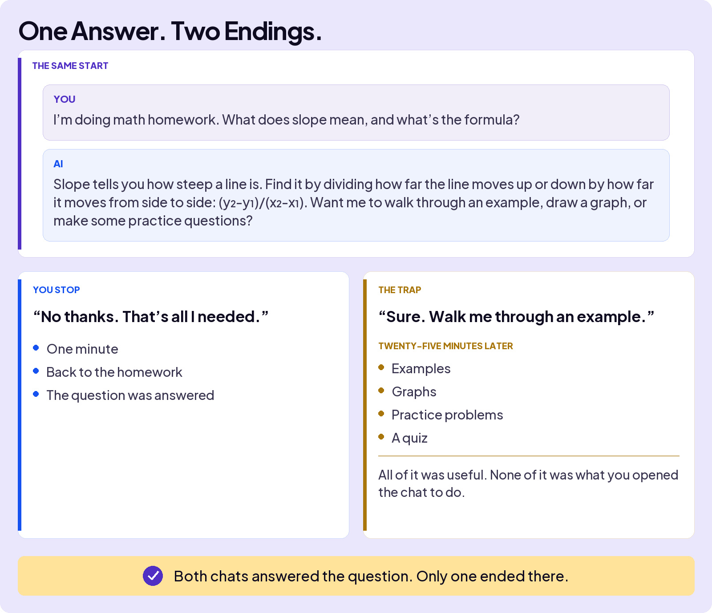
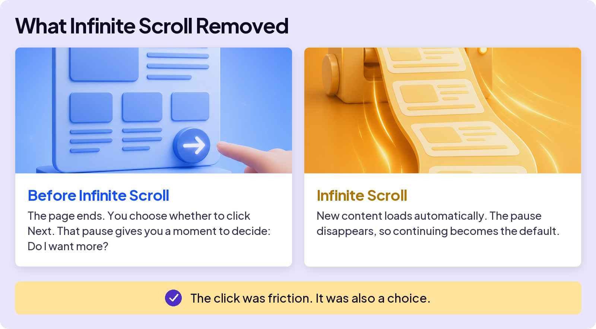
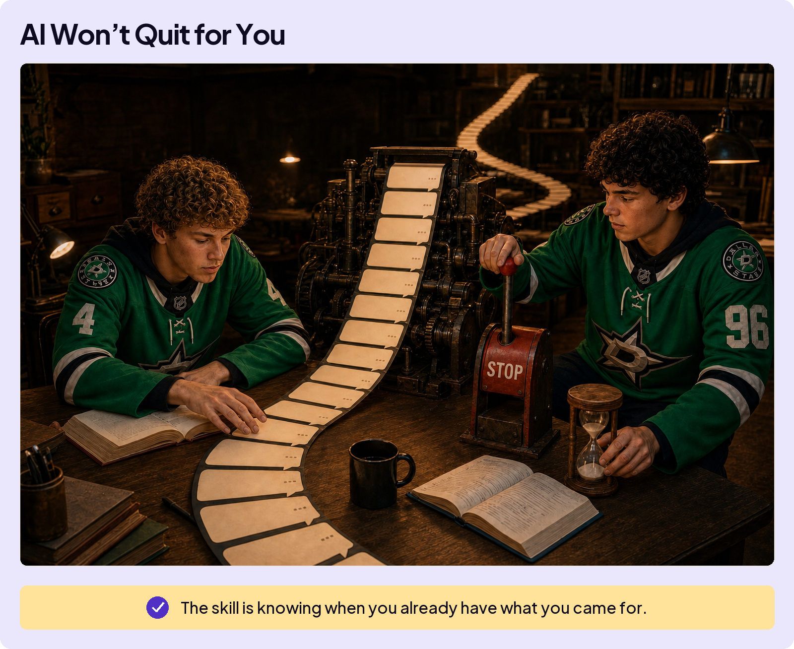

## AVOID TRAPS

# Engagement Trap

The Engagement Trap does not feel like something going wrong. It feels like a helpful conversation that keeps going.

You ask AI a quick question. You get a clear answer. Then, casually attached at the end: *“Want me to expand on this? Should I add examples? Want me to format it as a study guide?”* You weren’t going to ask any of that. You were done. The reply doesn’t seem to be.

The extra help may be useful. That is what makes it easy to accept. The trap is not continuing. It is continuing without deciding.

**The Engagement Trap is spending time you never decided to spend.**

## The Missing Decision Point

In 2006, designer Aza Raskin built an early version of infinite scroll. He saw the click at the bottom of a page as friction and removed it.

Raskin later regretted what the design became. By his estimate, infinite scroll now consumes half a million human lifetimes each month.

Once you see it, you see it everywhere: autoplay counting down to the next episode, streaks that punish a day off, games built for one more round.

AI chat has its own version of the missing page break. The answer ends, but the conversation does not. A helpful follow-up puts the next task in front of you before you stop to decide whether you wanted one.

## Why Tech Companies Want Engagement

Engagement is not an accident. Tech companies track how often people return, how long they stay, and what keeps them using a product. More engagement can mean more ads, purchases, or subscriptions. It can also turn occasional use into a habit.

AI companies make money in different ways, but they all benefit when AI becomes part of your routine. Helpful follow-up offers make that easy. Every answer can become the beginning of another task.

That does not make every offer a trick. It means you need to decide whether the next step serves your goal or the app’s goal.

**Know what you came for.**

When you have it, choose what happens next.
