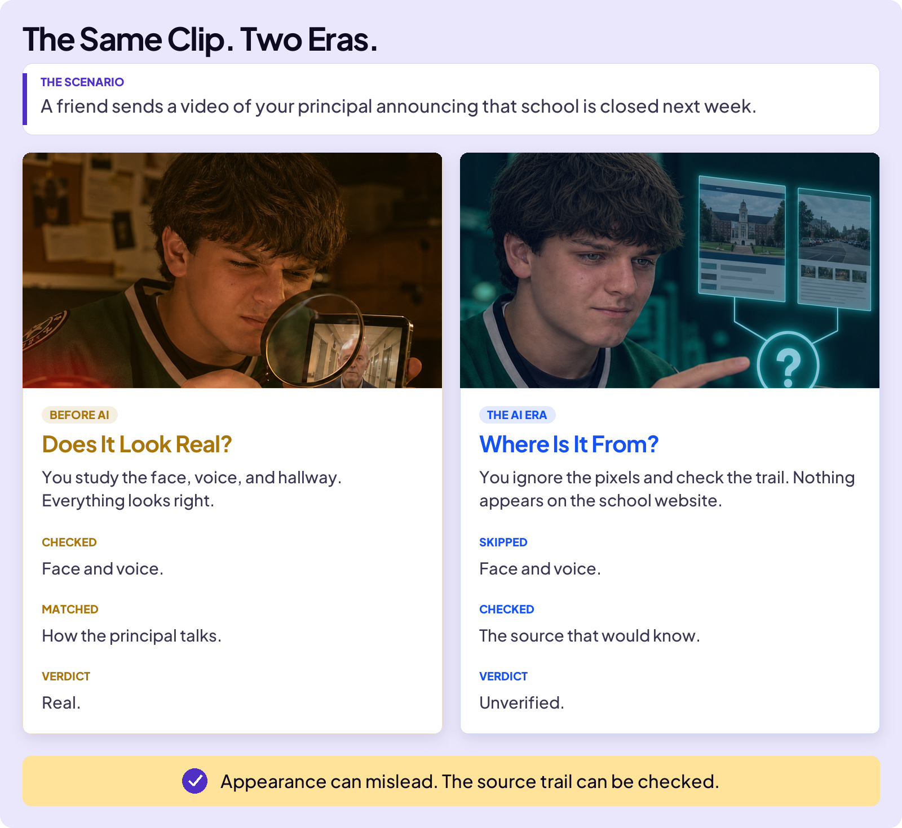
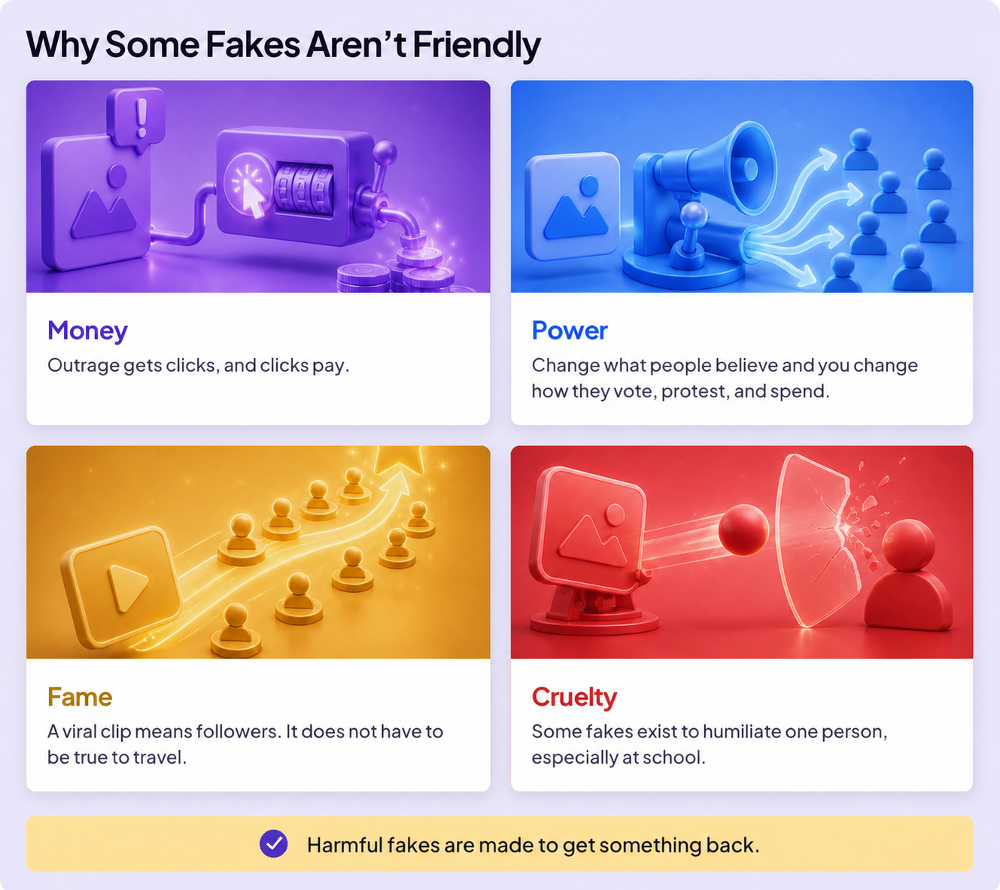
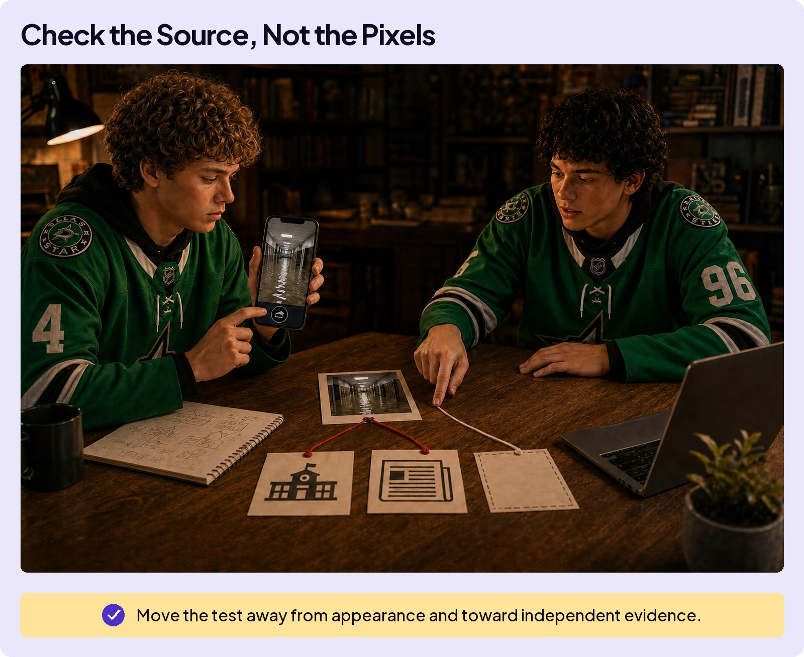
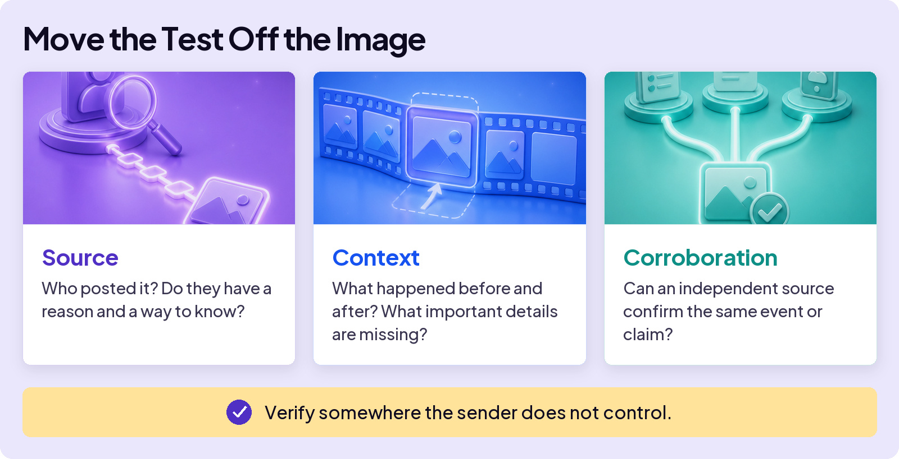

## AVOID TRAPS

# Fake Trap

Here’s the strange thing about this trap: you already know it. AI can fake a voice, a face, a video, a screenshot, cheaply and convincingly, and it’s only getting better. So why do smart people still get fooled?

Because knowing fakes exist isn’t a skill. It doesn’t tell you what to do in the ten seconds after a clip hits your feed. AI has changed the playing field. See this play out:

**The Fake Trap is believing it because it looks real.** And it has a second jaw: dismissing the truth because it could be a fake.

## Sometimes it’s just fun

A friend fakes a picture of your hockey buddies hoisting the Stanley Cup. Everyone knows it is fake, and everyone is in on the joke. No harm. The trap begins when someone is meant to believe it.

## But some fakes aren’t friendly

Harmful fakes are usually made to get something back. The goal often comes down to four things:

## The detector dead end

If you suspect a fake, the next move many people reach for is a detector: a site where you upload the clip or photo and it claims to tell you whether AI made it.

Don’t let a detector make the decision for you. It looks for patterns that may suggest AI was involved, but different tools can produce different answers. Treat its verdict as a clue, never a ruling. Then check the source, context, and corroboration.

## So what do you do?

The test moves off the image and onto the source, no matter how the fake was made.

Fakes can travel quickly when they spike your emotions: outrage, fear, excitement, or hope. A strong feeling is your cue to stop and run three checks before you react, share, or believe.

## One rule under all three checks

Verify somewhere the sender doesn’t control. A voicemail asks for something urgent: call back on the number you already have. A clip is blowing up: look for the original source or a source that would know. For something important, look for independent confirmation too. Until the trail checks out, “unverified” is your answer.

Your eyes still work fine for reading, judging, and enjoying what you know is made up. They just stopped working as a lie detector.

## If the fake is about you

If a photo, clip, or account uses your name, don’t handle it alone. Save the username, link, date, and messages when it is safe to do so. Then bring in an adult that day: a parent, a counselor, or someone at school.

If someone makes or shares a fake private image of a person under 18, do not screenshot, download, or pass it around. Tell a trusted adult and report it through the platform. [NCMEC’s Take It Down](https://takeitdown.ncmec.org/) and [CyberTipline](https://report.cybertip.org/) can also help.

You did nothing wrong by being targeted.

**Seeing or hearing isn’t proof anymore.**

Check the source, not the pixels.
