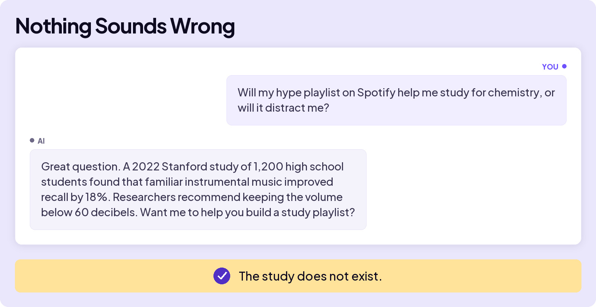
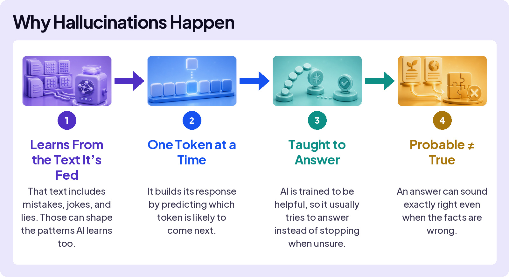
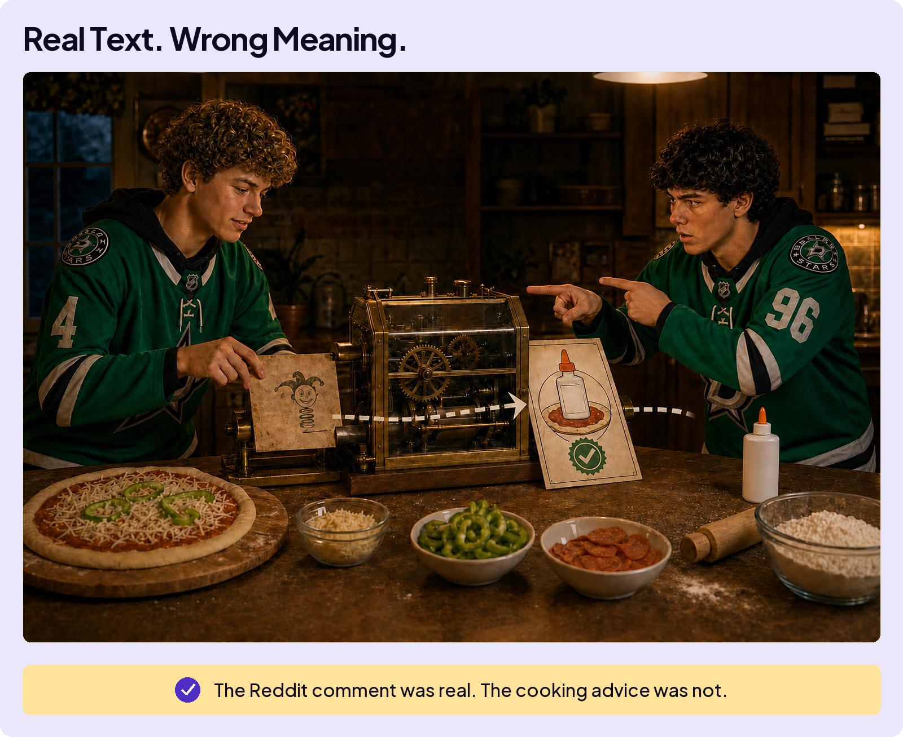

## AVOID TRAPS

# Hallucination

Stanford is real. The sample size sounds credible. The percentage sounds measured. Even the volume recommendation sounds careful. Every detail makes the answer easier to trust, but there is no study, no paper, and no source to open.

**A hallucination is a factual claim AI makes up that sounds true but isn’t.**

A hallucination does not have to make up the whole answer. It can attach one invented detail to facts that are real. This makes hallucinations harder to spot.

The fake study did not come from nowhere. AI knows what a research finding sounds like, even when it does not have a real finding to report.

## Not Every AI Error Is a Hallucination

Hallucination is the term people often use whenever AI gets something wrong. But AI can produce a false answer without inventing anything.

This actually happened. When searchers asked Google “how do I keep cheese from sliding off my pizza,” the AI suggested mixing about one-eighth of a cup of non-toxic glue into the sauce.

That bizarre answer did not come from nowhere. It traced back to an old joke on Reddit that was written like sincere advice. Google’s AI found real text, but it missed what the text meant.

This was not a hallucination. It was a different kind of AI error: real text, interpreted incorrectly.

Hallucinations do not sound different from everything else AI says. You will not catch every one, and the answer is not to question every sentence. The skill is noticing when something does not add up.

**Hallucinations sound like every other AI answer.**

When something doesn’t add up, trace the claim to its source.
