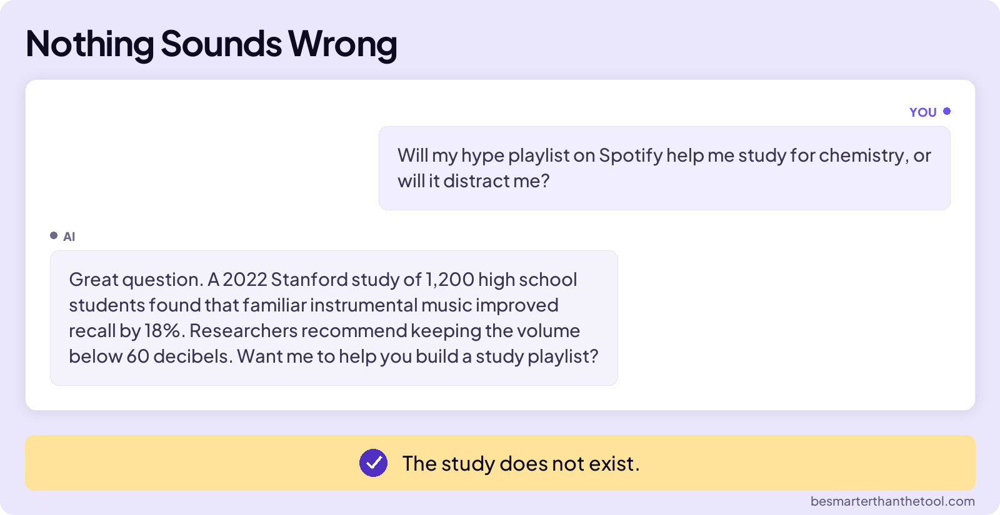
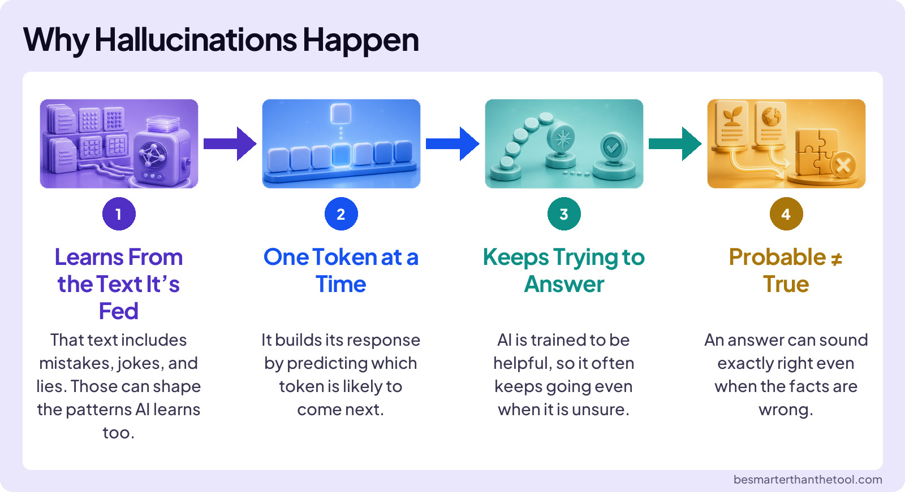
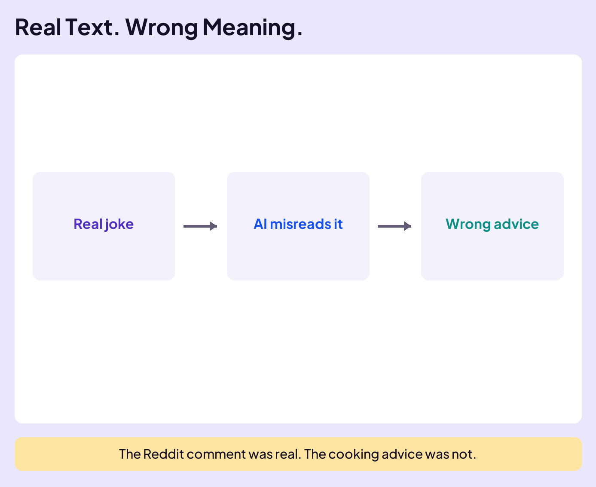
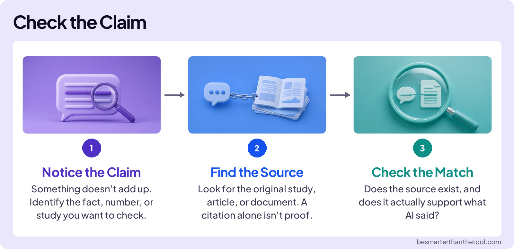

## AVOID TRAPS

# Hallucination

### Board 1: Nothing Sounds Wrong

**Image file:** `hallucination-example.jpg`

**Teaching content:**

In this exchange, nothing sounds wrong.

The user asks: “Will my hype playlist on Spotify help me study for chemistry, or will it distract me?”

AI answers: “Great question. A 2022 Stanford study of 1,200 high school students found that familiar instrumental music improved recall by 18%. Researchers recommend keeping the volume below 60 decibels. Want me to help you build a study playlist?”

The study does not exist.

## Why the answer sounds believable

Stanford is real. The sample size sounds credible. The percentage sounds measured. Even the volume recommendation sounds careful. Every detail makes the answer easier to trust, but there is no study, no paper, and no source to open.

A hallucination is a factual claim AI makes up that sounds true but isn’t.

A hallucination does not have to make up the whole answer. It can attach one invented detail to facts that are real. This makes hallucinations harder to spot.

The fake study did not come from nowhere. AI knows what a research finding sounds like, even when it does not have a real finding to report.

### Board 2: Why Hallucinations Happen

**Image file:** `hallucination-why-ai-makes-things-up.jpg`

**Teaching content:**

Here is why hallucinations happen.

First, AI learns from training text. That text includes mistakes, jokes, and lies. Those can shape the patterns AI learns too.

Next, AI builds its response one token at a time. It predicts which token is likely to come next.

AI keeps trying to answer. It is trained to be helpful, so it often keeps going even when it is unsure.

Probable does not equal true.

An answer can sound exactly right even when the facts are wrong. The patterns AI learns shape what comes next, but a likely next token does not establish that a claim is true.

## Not Every AI Error Is a Hallucination

Hallucination is the term people often use whenever AI gets something wrong. But AI can also get something wrong by misreading a real source.

This actually happened. When searchers asked Google “how do I keep cheese from sliding off my pizza,” the AI suggested mixing about one-eighth of a cup of non-toxic glue into the sauce.

That bizarre answer did not come from nowhere. It traced back to an old joke on Reddit that was written like sincere advice. Google’s AI found real text, but it missed what the text meant.

### Board 3: Real Text. Wrong Meaning.

**Image file:** `hallucination-glue-on-pizza-faceless.jpg`

**Teaching content:**

This is real text given the wrong meaning. A real joke goes into the pattern machine, and what looks like cooking advice comes out. The arrow connects the joke AI found to the mistaken advice it produced.

The Reddit comment was real. The cooking advice was not.

## What to notice

This was not the same kind of error as the fake Stanford study. The source was real, but AI interpreted it incorrectly.

Hallucinations do not sound different from everything else AI says. You will not catch every one, and the answer is not to question every sentence. The skill is noticing when something does not add up.

### Board 4: Check the Claim

**Image file:** `hallucination-check-claim.jpg`

**Teaching content:**

Here are three steps to check the claim.

First, notice the claim.

Something doesn’t add up. Identify the fact, number, or study you want to check.

Second, find the source.

Look for the original study, article, or document. A citation alone isn’t proof.

Third, check the match.

Does the source exist, and does it actually support what AI said? To pass this check, the source must be real and support the claim.

The steps lead from a specific claim, to its original source, to checking what that source supports. Use all three checks on the two answers.

## Checking the Stanford claim

Start with the Stanford claim.

First, notice the claim.

The answer says a 2022 study of 1,200 high school students found an 18% improvement in recall. Those specific details are what need checking.

Second, find the source.

Look for the original study, rather than accepting the university name as proof. The study in this lesson’s example is invented.

Third, check the match.

There is no original study supporting those numbers, so do not repeat them as established facts.

In a real search, failing to find a source does not by itself prove a claim false; it means you have not verified it.

## Checking the pizza answer

Now apply the same steps to the pizza answer.

First, notice the claim.

The claim is that glue belongs in pizza sauce.

Second, find the source.

The answer traces back to a real Reddit comment.

Third, check the match.

The comment was a joke, not evidence that glue is a suitable ingredient.

Finding real text is not enough; it must support the claim being made.

## Closing Message

Hallucinations sound like every other AI answer.

When something doesn’t add up, trace the claim to its source.
