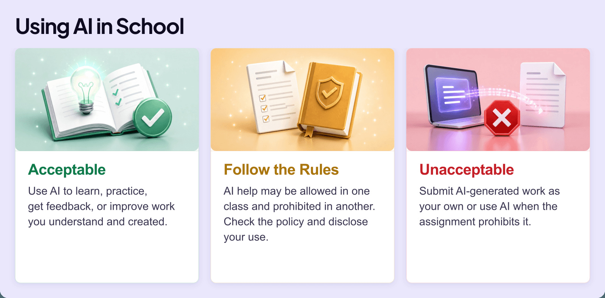
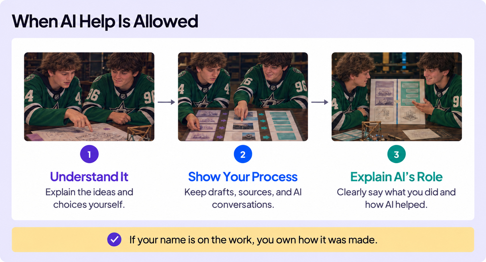
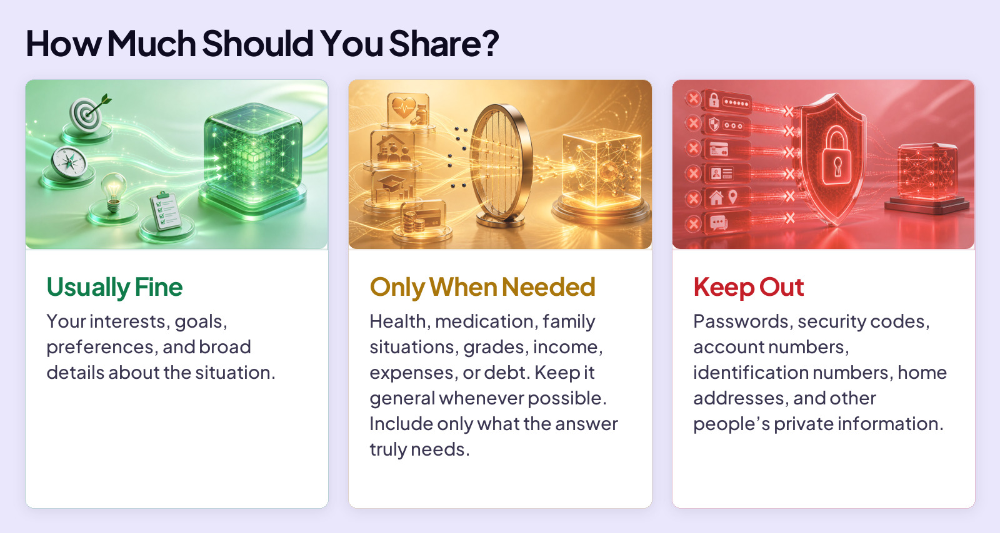
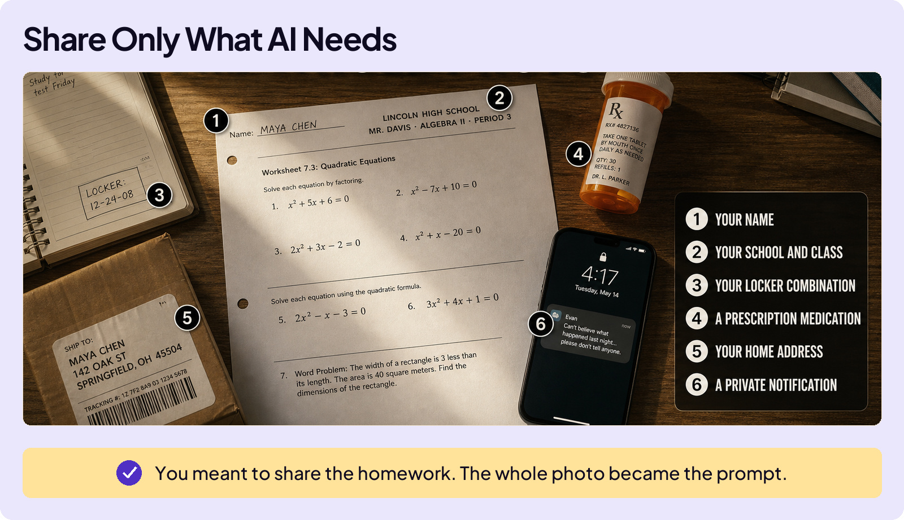
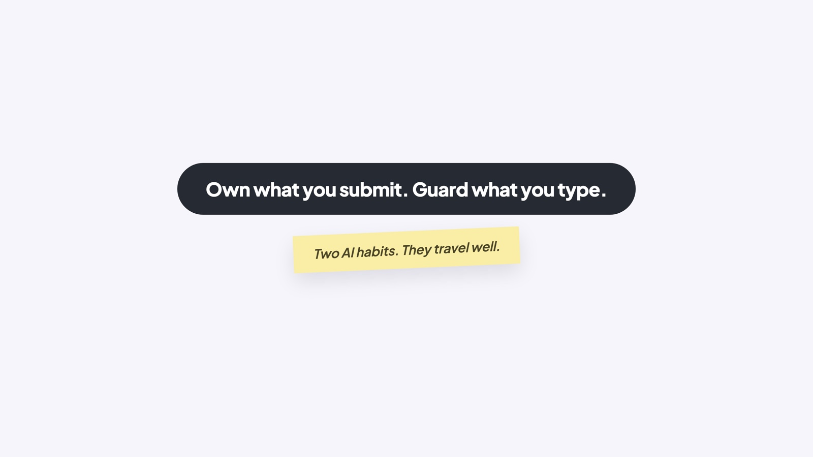

## BUILD YOUR SKILLS

# Honesty & Privacy

You send a friend a draft of your college essay and ask for feedback. Instead, they copy your opening into their own essay and claim they wrote it. Obviously, your friend wasn’t honest. They put their name on work they didn’t create.

AI does not change the honesty question. If your name goes on the work, be truthful about what you created, how AI helped, and whether you followed the rules.

## HONESTY

AI is an incredibly powerful tool for learning. But there’s a difference between using AI to learn and using AI to skip learning. The line isn’t always obvious, so let’s make it clear.

### Board 1: Using AI in School

**Image file:** `honesty-and-privacy-1-school.jpg`

**Teaching content:**

Acceptable: use AI to learn, practice, get feedback, or improve work you understand and created.

Follow the rules: AI help may be allowed in one class and prohibited in another. Check the policy and disclose your use.

Unacceptable: submit AI-generated work as your own, or use AI when the assignment prohibits it.

When it’s okay to use AI in class, there are a few smart guidelines to follow.

### Board 2: When AI Help Is Allowed

**Image file:** `honesty-and-privacy-2-best-practices.jpg`

**Teaching content:**

There are three steps. Step 1, understand it: explain the ideas and choices yourself. Step 2, show your process: keep drafts, sources, and AI conversations. Step 3, explain AI’s role: clearly say what you did and how AI helped.

If your name is on the work, you own how it was made.

Honesty is about what you claim. Privacy is about what you reveal. Both require you to pause before you submit or send.

## PRIVACY

You start a new chat and ask ChatGPT, “Help me improve my percentage.” You probably know that AI can’t help much because you didn’t share enough information. Do you want to improve your free throw percentage, your grade in physics, or what?

Giving AI useful context can improve its answer. But this makes privacy difficult. The rule of thumb: give AI only the information it needs to help.

### Board 3: How Much Should You Share?

**Image file:** `honesty-and-privacy-3-privacy.jpg`

**Teaching content:**

Usually fine: your interests, goals, preferences, and broad details about the situation.

Only when needed: health, medication, family situations, grades, income, expenses, or debt. Keep it general whenever possible. Include only what the answer truly needs.

Keep out: passwords, security codes, account numbers, identification numbers, home addresses, and other people’s private information.

It’s not just about what you type in a prompt. The same judgment applies to images, screenshots, PDFs, audio, and video.

Picture this. You snap a quick photo of your math homework so AI can help with one of the problems. But, look at the photo. It includes personal information that AI doesn’t need to help you with the homework.

### Board 4: Share Only What AI Needs

**Image file:** `honesty-and-privacy-4-share-only.jpg`

**Teaching content:**

A photo of a math worksheet also reveals the student’s name, school and class, locker combination, prescription medication, home address, and a private phone notification.

You meant to share the homework. The whole photo became the prompt.

## WHY THIS MATTERS

An AI chat may feel private, but it is still a record sent to an outside system. It may stay in your account, be read by people at the AI company, be handed over if the law requires it, or be seen by someone who gets into your device or account.

## IF YOU ALREADY SHARED IT

Delete the chat from your history. That removes it from the app’s visible history, so someone using your device or account can’t see it. But a copy may remain in the AI company’s systems for a period of time. Each app has its own policy for deleting chat records.

If you shared a password or security code, deleting the chat isn’t enough. Go change any passwords or security codes you shared with AI.

### Board 5: Close

**Image file:** `honesty-and-privacy-5-close.jpg`

## Closing Message

Own what you submit. Guard what you type.

Two AI habits. They travel well.
