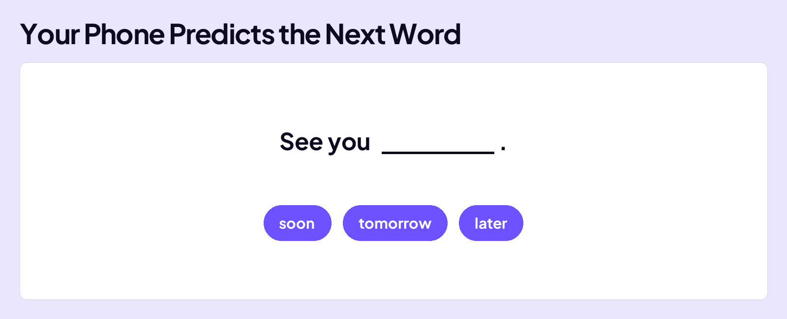
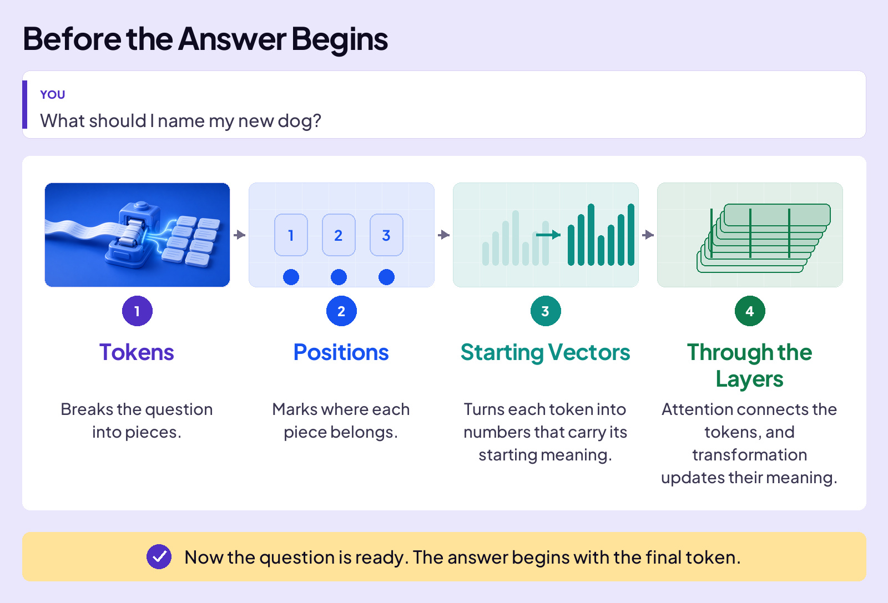
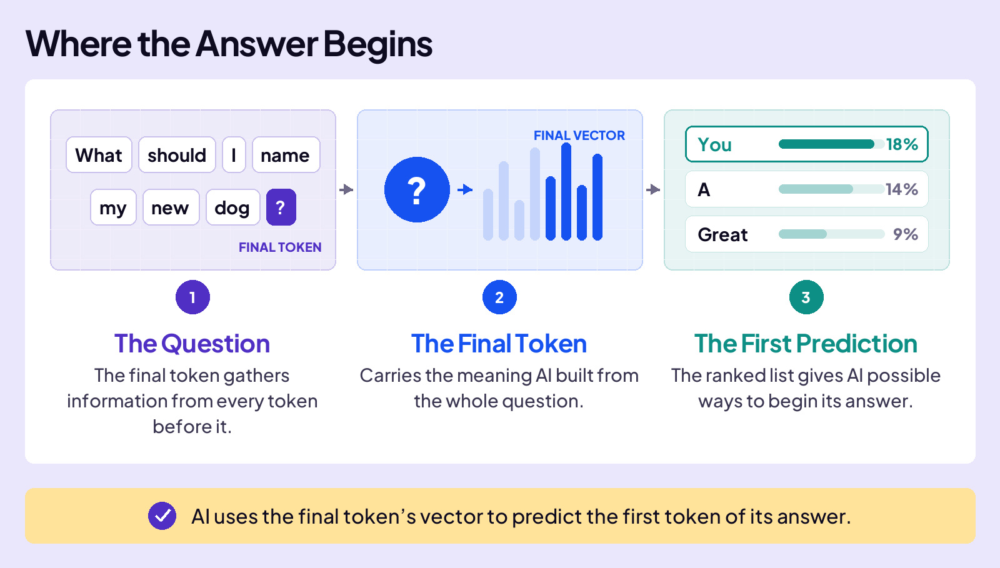
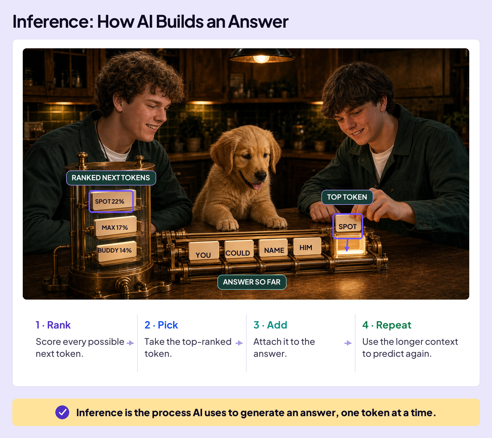

## UNDERSTAND AI

# How AI Answers

When you ask AI a question, it first works out what your words mean together. Then it faces a new problem: how does it begin an answer?

Start with your phone. As you type a text, it suggests what might come next based on what you’ve typed so far.

AI does the same basic thing, but on a much larger scale. Let’s give it a simple question and watch how it predicts the first token of its answer.

## Before the Answer Begins

## Where the Answer Begins

The final token in the question is the question mark. As the question passes through the layers, that token gathers information from every token before it. By the final layer, its vector carries the meaning AI has built from the whole question.

## How the List Appears

The final vector does not point straight to one answer. A final math step gives every token in the model’s vocabulary a score based on how well it fits. Those scores create a ranked list of possible next tokens.

To keep this walkthrough simple, we’ll choose the highest-scoring token each time. Real AI does not always do that. The next lesson explains why.

## The Answer, Token by Token

Now watch the loop. Each row shows the reply so far, the neighborhood that fits next, and the highest-scoring tokens. The selected token joins the reply and becomes the new final token. Then AI runs the same process again. Each selection is a **prediction**.

What should I name my new dog?

### Prediction 1

- **Reply so far:** The reply has not started
- **Final token:** ?
- **Neighborhood:** Reply starters
- **Top predictions:** You 18%, A 14%, Great 9%
- **Selected:** You

### Prediction 2

- **Reply so far:** You
- **Final token:** You
- **Neighborhood:** Ways to suggest
- **Top predictions:** could 24%, can 12%, should 10%
- **Selected:** could

### Prediction 3

- **Reply so far:** You could
- **Final token:** could
- **Neighborhood:** Naming verbs
- **Top predictions:** name 31%, call 19%, try 7%
- **Selected:** name

### Prediction 4

- **Reply so far:** You could name
- **Final token:** name
- **Neighborhood:** Who gets named
- **Top predictions:** him 45%, your 21%, the 8%
- **Selected:** him

### Prediction 5

- **Reply so far:** You could name him
- **Final token:** him
- **Neighborhood:** Dog names
- **Top predictions:** Spot 22%, Max 17%, Buddy 14%
- **Selected:** Spot

**You could name him Spot.**

You asked for a dog name, but AI did not begin with one. It began with You, a likely first token of a reply. Watch the neighborhoods narrow: reply starters, ways to suggest, naming verbs, who gets named, then dog names. Spot appears only after the sentence creates a place where a name fits. Five predictions. One repeated move.

Every answer is built one token at a time.

The whole run is called inference.
