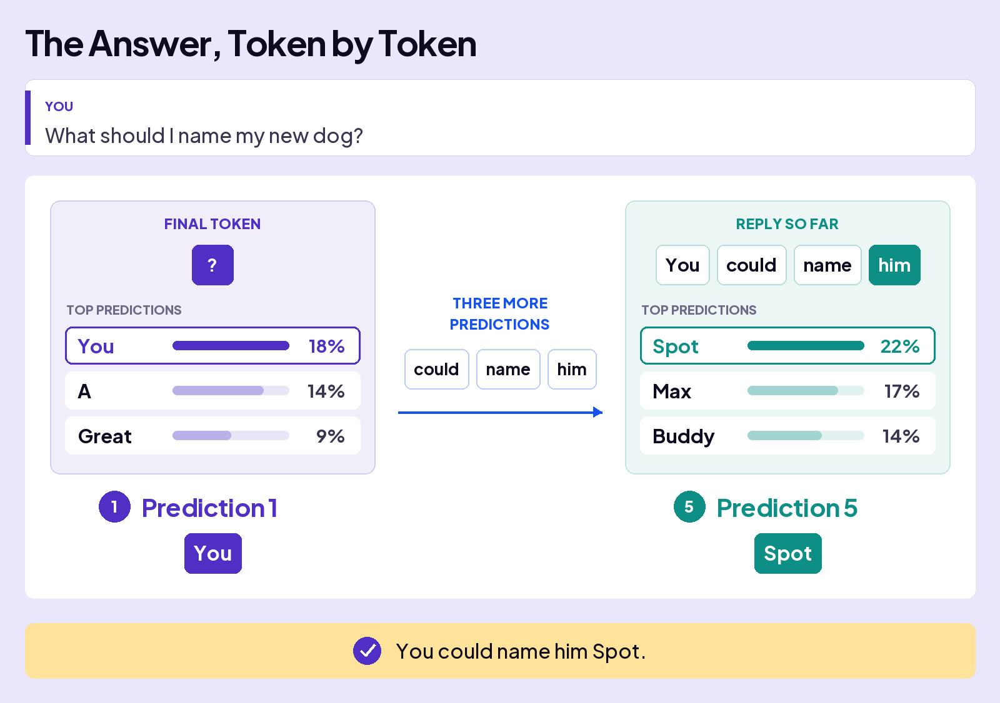
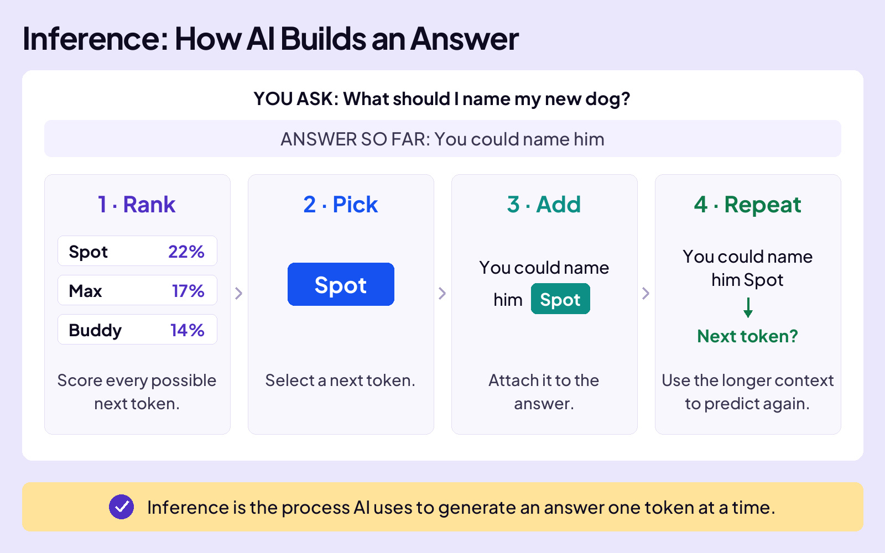

## UNDERSTAND AI

# How AI Answers

When you ask AI a question, it first works out what your words mean together. Then it faces a new problem: how does it begin an answer?

Let’s give AI a simple question and watch how it builds an answer, one token at a time. We’ll show words as single tokens to make the example easier to follow.

### Board 1: Before the Answer Begins

**Image file:** `how-ai-answers-before-answer-begins-v2.jpg`

**Teaching content:**

**You ask:** “What should I name my new dog?”

1. **Tokens:** Break the question into small pieces.
2. **Positions:** Mark where each piece belongs.
3. **Starting Vectors:** Represent each token’s starting meaning with numbers.
4. **Through Layers:** Attention and transformation update those numbers using information from the message.

**Takeaway:** AI uses the final token’s updated numbers to predict what comes next.

### Board 2: Why the Final Token Matters

**Image file:** `how-ai-answers-where-answer-begins-v2.jpg`

**Teaching content:**

**You ask:** “What should I name my new dog?”

- **The Question:** As it passes through the layers, the final token gathers information from the tokens before it.
- **The Final Token:** Its updated numbers help AI predict a reply that fits the question. In this example, the question mark is the final token.

**Takeaway:** AI uses the final token’s vector to predict the first token of its answer.

## Starting the Answer

AI is ready to answer your question. It uses the final token’s updated numbers to calculate a probability for every token in its vocabulary.

## The Answer, Token by Token

Now watch the loop. AI selects a token, adds it to the reply, and uses the growing context to predict again.

### Board 3: The Answer, Token by Token

**Image file:** `how-ai-answers-token-by-token.jpg`

**Teaching content:**

**You ask:** “What should I name my new dog?”

**Prediction 1:** The final token is the question mark. Possible next tokens include:

| Token | Probability |
| --- | --- |
| You | 18% |
| A | 14% |
| Great | 9% |

AI picks **You** in this example. Three more predictions add **could**, **name**, and **him**.

**Prediction 5:** The final token is now **him**. With the answer so far reading **You could name him**, possible next tokens include:

| Token | Probability |
| --- | --- |
| Spot | 22% |
| Max | 17% |
| Buddy | 14% |

AI picks **Spot** in this example. Each prediction uses the growing context.

**Completed answer:** “You could name him Spot.”

You asked for a dog name, but AI began with **You**, a possible start to a reply. Each added token changes what can fit next. After **You could name him**, a dog name becomes a likely continuation.

AI keeps predicting tokens until it produces a special token that signals the answer is finished.

### Board 4: Inference: How AI Builds an Answer

**Image file:** `how-ai-answers-inference-notebook.jpg`

**Teaching content:**

Follow the repeating process as AI builds the dog-name answer:

1. **Rank:** Give possible next tokens scores for how well they fit.
2. **Pick:** Select a next token.
3. **Add:** Add that token to the answer.
4. **Repeat:** Use the longer context to predict again.

**Takeaway:** Inference is the process AI uses to generate an answer one token at a time.

## Closing Message

Every answer is built one token at a time.

The whole run is called inference.
