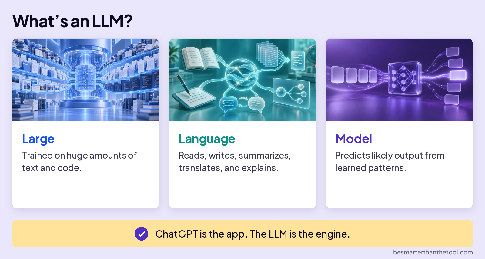
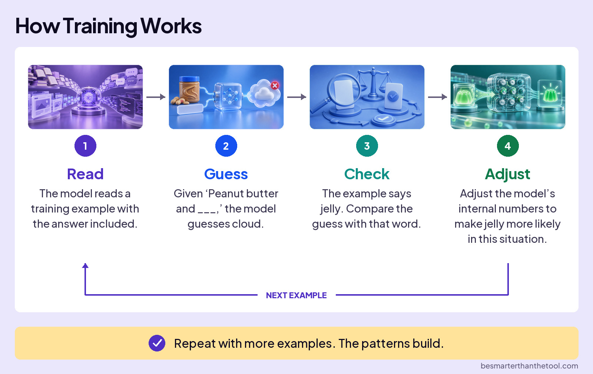
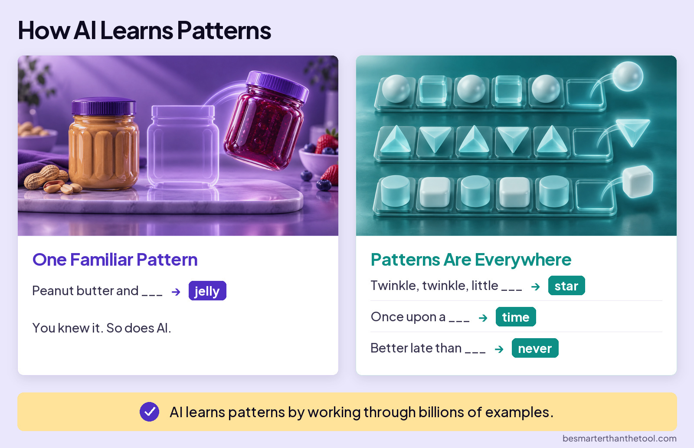

# How an LLM Works: How the Model Learns

## The app and the model

**Board:** What's an LLM?
**Image file:** `how-an-llm-works-llm.jpg`

How does an AI model learn that “jelly” fits after “peanut butter and”? It learns from examples before you ever ask it a question. Let's follow that example to see what learning means.

If you've used ChatGPT, Claude, or Gemini, you've used an app. Under the hood, a Large Language Model, or LLM for short, does the language work. ChatGPT is the app. The LLM is the engine.

Large models are trained on huge amounts of text and code. Language means they work with language: reading, writing, summarizing, translating, and explaining. A model uses learned numerical patterns to predict likely output. To see where those patterns come from, we'll start with training.

## Learning from a mistake

**Board:** How Training Works
**Image file:** `how-an-llm-works-training.jpg`

Imagine a training example that says “peanut butter and jelly.” The example already contains the answer. The model's job is to predict that answer from the words before it.

First, read: the training process takes an example with the answer included. Next, guess: given “peanut butter and,” the model guesses “cloud.” In this example, that's the wrong next word.

Then, check: compare the guess with the word that actually appears in the example. That word is “jelly.” Finally, adjust: change the model's internal numbers so that “jelly” becomes more likely in this situation.

The model then moves to another example and repeats the process: read, guess, check, adjust. One correction doesn't teach it everything. Across billions of examples, many adjustments build up learned patterns.

That's what training means here. The model learns before you use it by practicing predictions and adjusting its internal numbers.

## What the model has learned

**Board:** How AI Learns Patterns
**Image file:** `how-an-llm-works-patterns.jpg`

What comes out of all that training? Learned patterns, including familiar connections between words.

After “peanut butter and,” “jelly” is a familiar continuation. You recognize that pattern, too. After “twinkle, twinkle, little,” the familiar word is “star.” “Once upon a” leads to “time.” “Better late than” leads to “never.”

Those simple phrases make the idea easy to see, but the learning goes much further. The examples also contain patterns in how people explain ideas, ask questions, solve problems, and even misspell words.

Training is how the model learns. Patterns are what it learns. They aren't two separate steps: the patterns develop during training as the internal numbers change.

## Handoff

Training has built patterns into the model's internal numbers. Now let's see how the model uses those patterns to build an answer.
