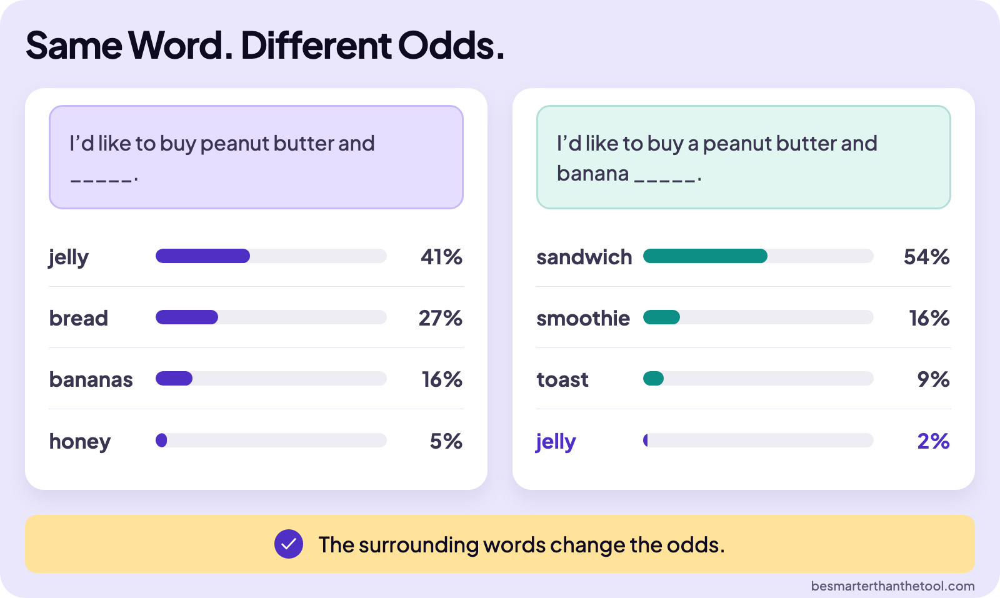
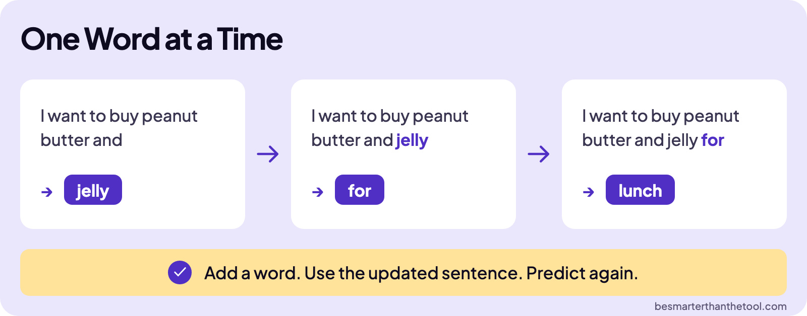
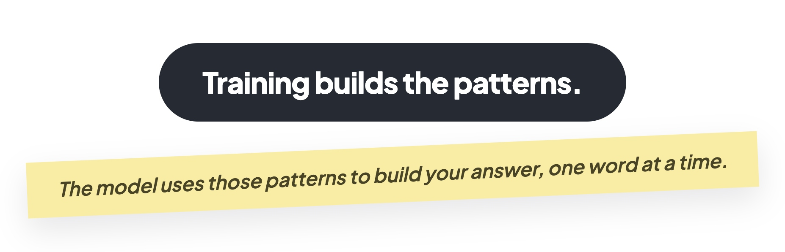

# How an LLM Works: How the Model Answers

## Using the learned patterns

Suppose you type “I'd like to buy peanut butter and.” The model uses the patterns it learned during training to calculate what might come next.

It doesn't need a complete answer written out in advance. It builds the answer a piece at a time. We'll use whole words to make the example easy to follow; models actually generate tokens, which can be words or pieces of words.

There are two connected actions to watch: calculate the chances of possible next words, then choose one and continue.

## The surrounding words change the odds

**Board:** Same Word. Different Odds.
**Image file:** `how-an-llm-works-same-word-different-odds.jpg`

Let's start with “I'd like to buy peanut butter and.” In this illustrated example, the model gives “jelly” a 41 percent chance, “bread” 27 percent, “bananas” 16 percent, and “honey” 5 percent. Other possible words account for the remaining probability. These numbers illustrate the idea; they aren't fixed values for every model.

“Jelly” has the highest probability among those choices, but it isn't the only possible continuation. The model is calculating possibilities from the words so far.

Now change the sentence to “I'd like to buy a peanut butter and banana.” The next word has to fit that whole context. In this example, “sandwich” gets 54 percent, “smoothie” 16 percent, “toast” 9 percent, and “jelly” only 2 percent.

Why did the odds change? The surrounding words changed. We're now talking about something made with peanut butter and banana. “Sandwich” fits that context better than it did before. In this comparison, adding “banana” drops “jelly” from 41 percent to 2 percent.

That's probability: using the learned patterns and the current text to work out how likely each possible next word is.

## Choosing a word and continuing

**Board:** One Word at a Time
**Image file:** `how-an-llm-works-one-word-at-a-time.jpg`

Those probabilities guide the model's choice of the next word. Choosing a word doesn't finish the job. The model adds it to the text, then calculates again using the updated text.

Your phone does something similar when you write a message: it suggests a word, you tap it, and it suggests the next. The language model keeps that process going to build an answer.

Watch the sentence grow. Start with “I want to buy peanut butter and.” The model adds “jelly.” Now the text says “I want to buy peanut butter and jelly,” and the model adds “for.” With “I want to buy peanut butter and jelly for” as the new context, it adds “lunch.”

Each chosen word becomes part of the input for the next prediction. Add a word. Use the updated sentence. Predict again. A full paragraph runs this loop many times, fast enough to look like thought.

The connection is the whole lesson: training changes the internal numbers to learn patterns; answering uses those learned patterns to calculate and choose what comes next.

## Closing message

**Board:** Close
**Image file:** `how-an-llm-works-close.jpg`

Training builds the patterns.

The model uses those patterns to build your answer, one word at a time.
