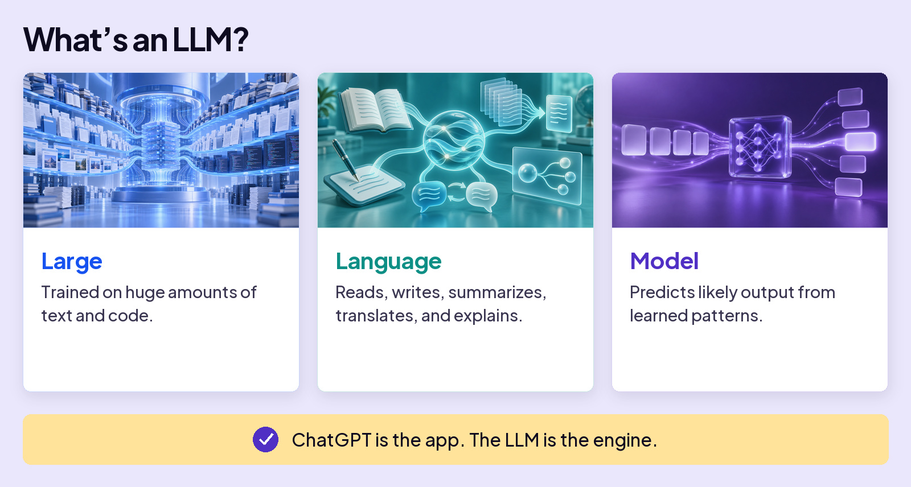
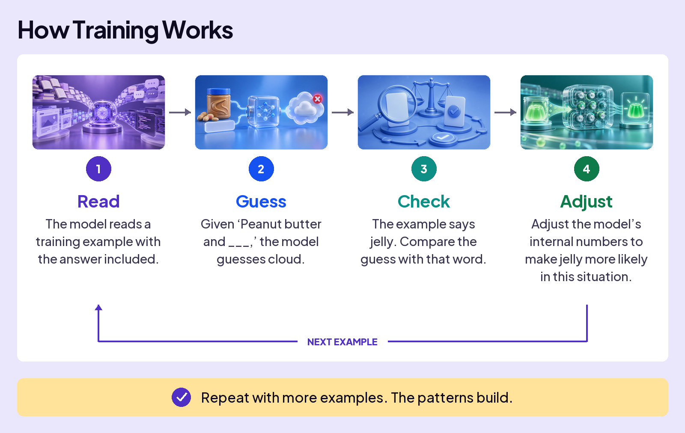
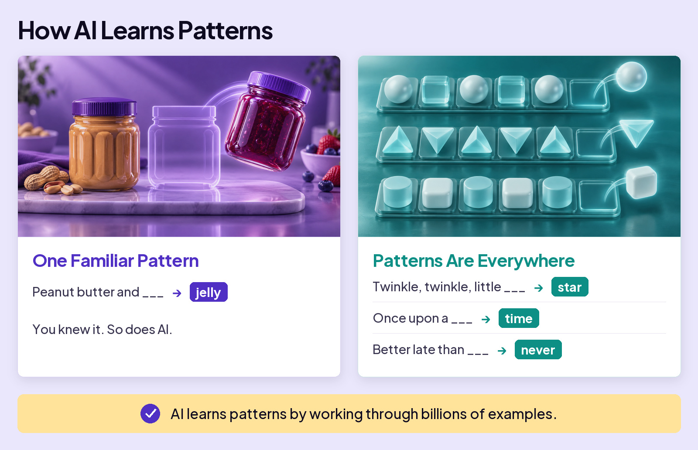
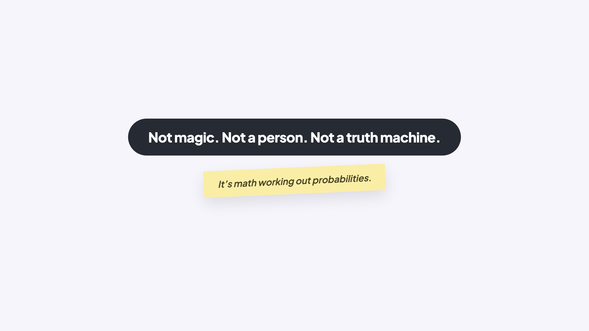

## START SMARTER

# How an LLM Works

If you’ve used AI, you’ve probably used an app like ChatGPT, Claude, or Gemini. The app is what you use. Under the hood, a Large Language Model, or LLM for short, does the work.

### Board 1: What’s an LLM?

**Image file:** `how-an-llm-works-1-llm.jpg`

**Teaching content:**

Large: trained on huge amounts of text and code. Language: it reads, writes, summarizes, translates, and explains. Model: it predicts likely output from learned patterns. ChatGPT is the app. The LLM is the engine.

So how does an LLM actually turn your words into an answer?

When ChatGPT or Claude write a sentence, they’re running math to predict the likely next words. They aren’t looking up what your words mean; they’re working out which words tend to follow which.

How do they do it? In two phases. First the model learns, once, by soaking up patterns from mountains of text. Then, every time you chat, it uses those patterns to build your answer one word at a time.

### Board 2: Learn Once. Answer Every Word.

**Image file:** `how-an-llm-works-2-learn-once.jpg`

**Teaching content:**

Learn once. Step 01, training: the model learns from enormous amounts of data once, before you use it. Step 02, patterns: training turns examples into learned numerical patterns.

Patterns power every answer.

Answer every word. Step 03, probability: for every next word, the model scores what is most likely. Step 04, prediction: it chooses one likely next word, then runs the process again.

Learn once. Use the patterns for every answer.

Four ideas carry it. Below, we follow one example, peanut butter, through all four.

## 01 TRAINING

The model teaches itself: guess the next word, check, and nudge its numbers toward the right word.

### Board 3: How Training Works

**Image file:** `how-an-llm-works-3-training.jpg`

**Teaching content:**

Four steps that repeat. Read: the model reads a training example with the answer included. Guess: given “Peanut butter and blank,” the model guesses cloud. Check: the example says jelly. Compare the guess with that word. Adjust: adjust the model’s internal numbers to make jelly more likely in this situation. Then the next example.

Repeat with more examples. The patterns build.

## 02 PATTERNS

So what is it actually learning? Patterns. Here’s one you picked up as a child. Which word comes next? Peanut butter and blank. Jelly. You knew it. So does AI.

### Board 4: How AI Learns Patterns

**Image file:** `how-an-llm-works-4-patterns.jpg`

**Teaching content:**

One familiar pattern: peanut butter and blank leads to jelly. You knew it. So does AI.

Patterns are everywhere: twinkle, twinkle, little blank leads to star. Once upon a blank leads to time. Better late than blank leads to never.

AI learns patterns by working through billions of examples.

These are easy patterns you already know. AI also learns patterns in places you might not expect: how people explain ideas, ask questions, solve problems, and even misspell words.

## 03 PROBABILITY

AI doesn’t make one guess. It scores every possible next word: a ranked list with a probability on each, and those numbers shift with the surrounding text.

Same word, different odds. For “I’d like to buy peanut butter and blank,” the model scores jelly at 41 percent, bread at 27 percent, bananas at 16 percent, and honey at 5 percent. For “I’d like to buy a peanut butter and banana blank,” it scores sandwich at 54 percent, smoothie at 16 percent, toast at 9 percent, and jelly at only 2 percent.

The surrounding words change the odds. In this example, adding “banana” drops the probability of “jelly” from 41 percent to 2 percent.

## 04 PREDICTION

Probability handled one word. But your answer is hundreds of words long, so the model just repeats the move. Your phone does this when you write a text: it suggests a word, you tap it, it suggests the next.

One word at a time. “I want to buy peanut butter and” leads to jelly. “I want to buy peanut butter and jelly” leads to for. “I want to buy peanut butter and jelly for” leads to lunch. Add a word. Use the updated sentence. Predict again.

A full paragraph runs this loop many times, fast enough to look like thought.

### Close

**Image file:** `how-an-llm-works-5-close.jpg`

## Closing Message

Training builds the patterns.

The model uses those patterns to build your answer, one word at a time.
