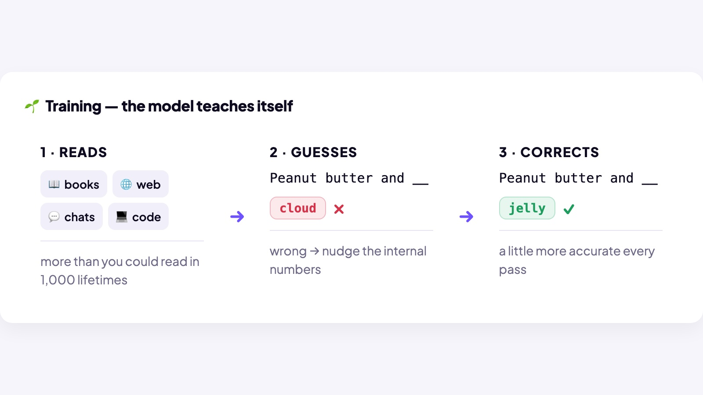
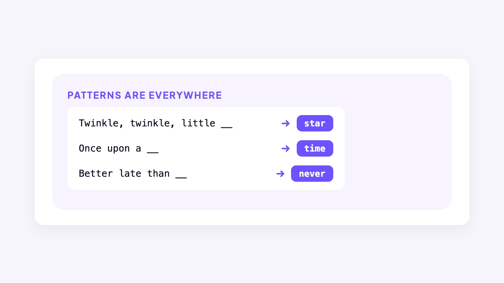

## START SMARTER

# How an LLM Works

If you’ve used AI, you’ve probably used an app like ChatGPT, Claude, or Gemini. The app is what you use. Under the hood, a Large Language Model, or LLM for short, does the work.

### Board 1: What’s an LLM?

**Image file:** `how-an-llm-works-llm.jpg`

**Teaching content:**

Large: trained on huge amounts of text and code. Language: it reads, writes, summarizes, translates, and explains. Model: it predicts likely output from learned patterns. ChatGPT is the app. The LLM is the engine.

So how does an LLM actually turn your words into an answer?

When ChatGPT or Claude write a sentence, they’re running math to predict the likely next words. They aren’t looking up what your words mean; they’re working out which words tend to follow which.

Two ideas explain how an LLM works: learning patterns and using them to build an answer. Before you use it, the model learns patterns during training. When you ask a question, it uses those patterns to build an answer, one word at a time.

### Board 2: Two Ideas Behind Every Answer

**Image file:** `how-an-llm-works-learn-once.jpg`

**Teaching content:**

Learn First has two connected concepts. Training explains how the model learns: it learns from enormous amounts of data before you use it. Patterns explains what the model learns: training turns examples into learned numerical patterns. Patterns are learned during training, not in a separate step afterward.

Patterns power every answer.

Answer One Word at a Time has two connected concepts. Probability explains how the model scores possible next words: it uses the words so far to work out how likely each next word is. Prediction explains how it chooses and repeats: it chooses a likely next word, adds it, and runs the process again.

Learn patterns first. Use them to build every answer.

Let’s follow one example, peanut butter, to see how the model learns a pattern and uses it to build an answer.

## LEARN FIRST: TRAINING

Let’s start with Learn First. Training is how the model learns. It guesses the next word, checks the example, and adjusts its internal numbers to make the right word more likely.

### Board 3: How Training Works

**Image file:** `how-an-llm-works-training.jpg`

**Teaching content:**

Four steps that repeat. Read: the model reads a training example with the answer included. Guess: given “Peanut butter and blank,” the model guesses cloud. Check: the example says jelly. Compare the guess with that word. Adjust: adjust the model’s internal numbers to make jelly more likely in this situation. Then the next example.

Repeat with more examples. The patterns build.

## LEARN FIRST: PATTERNS

We’re still looking at Learn First. Training is how it learns. Patterns are what it learns. Here’s one you picked up as a child. Which word comes next? Peanut butter and blank. Jelly. You knew it. So does AI.

### Board 4: How AI Learns Patterns

**Image file:** `how-an-llm-works-patterns.jpg`

**Teaching content:**

One familiar pattern: peanut butter and blank leads to jelly. You knew it. So does AI.

Patterns are everywhere: twinkle, twinkle, little blank leads to star. Once upon a blank leads to time. Better late than blank leads to never.

AI learns patterns by working through billions of examples.

These are easy patterns you already know. AI also learns patterns in places you might not expect: how people explain ideas, ask questions, solve problems, and even misspell words.

## ANSWER ONE WORD AT A TIME: PROBABILITY

Now we move to Answer One Word at a Time. The model uses its learned patterns to work out the probabilities for the next word. Those probabilities change with the surrounding text.

### Board 5: Same Word. Different Odds.

**Image file:** `how-an-llm-works-same-word-different-odds.jpg`

**Teaching content:**

Same word, different odds. For “I’d like to buy peanut butter and blank,” the model scores jelly at 41 percent, bread at 27 percent, bananas at 16 percent, and honey at 5 percent. For “I’d like to buy a peanut butter and banana blank,” it scores sandwich at 54 percent, smoothie at 16 percent, toast at 9 percent, and jelly at only 2 percent.

The surrounding words change the odds. In this example, adding “banana” drops the probability of “jelly” from 41 percent to 2 percent.

## ANSWER ONE WORD AT A TIME: PREDICTION

The other part of Answer One Word at a Time is prediction. Those probabilities guide its choice of the next word. Then it repeats. Your phone does something similar when you write a text: it suggests a word, you tap it, and it suggests the next.

### Board 6: One Word at a Time

**Image file:** `how-an-llm-works-one-word-at-a-time.jpg`

**Teaching content:**

One word at a time. “I want to buy peanut butter and” leads to jelly. “I want to buy peanut butter and jelly” leads to for. “I want to buy peanut butter and jelly for” leads to lunch. Add a word. Use the updated sentence. Predict again.

A full paragraph runs this loop many times, fast enough to look like thought.

### Close

**Image file:** `how-an-llm-works-close.jpg`

## Closing Message

Training builds the patterns.

The model uses those patterns to build your answer, one word at a time.
