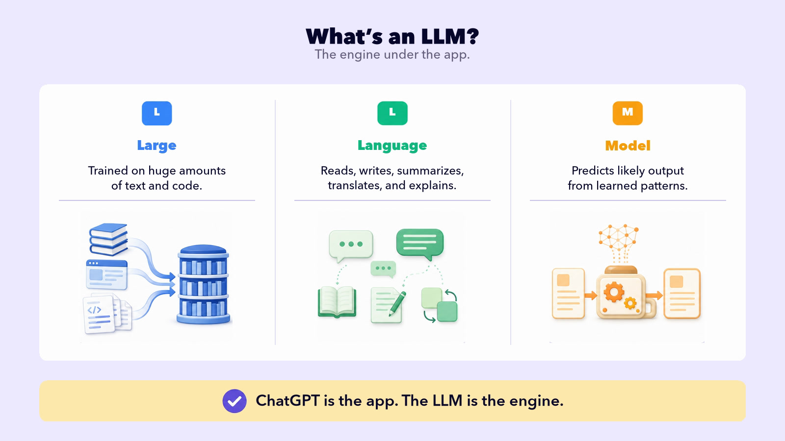

## START SMARTER

# How an LLM Works

If you’ve used AI, you’ve probably used an app like ChatGPT, Claude, or Gemini. The app is what you use. Under the hood, a **Large Language Model**, or **LLM** for short, does the work.

So how does an LLM actually turn your words into an answer?

When ChatGPT or Claude write a sentence, they're running math to predict the likely next words. They aren't looking up what your words mean; they're working out which words tend to follow which.

How do they do it? In two phases. First the model learns, once, by soaking up patterns from mountains of text. Then, every time you chat, it uses those patterns to build your answer one word at a time.

Four ideas carry it. Below, we follow one example, peanut butter, through all four.

## 01 Training

The model **teaches itself**: guess the next word, check, and nudge its numbers toward the right word.

## 02 Patterns

So what is it actually learning? **Patterns**. Here's one you picked up as a child. Which word comes next?

These are easy patterns you already know. AI also learns patterns in places you might not expect: how people explain ideas, ask questions, solve problems, and even misspell words.

## 03 Probability

AI doesn't make one guess. It scores **every** possible next word: a ranked list with a probability on each, and those numbers shift with the surrounding text.

  <h1>Same Word. Different Odds.</h1>
  

    <section class="odds-panel purple" aria-label="Probabilities after I'd like to buy peanut butter and blank">
      
I’d like to buy peanut butter and _____.

      

        

jelly

41%

        

bread

27%

        

bananas

16%

        

honey

5%

      

    </section>
    <section class="odds-panel teal" aria-label="Probabilities after I'd like to buy a peanut butter and banana blank">
      
I’d like to buy a peanut butter and banana _____.

      

        

sandwich

54%

        

smoothie

16%

        

toast

9%

        

jelly

2%

      

    </section>
  

  
<svg viewBox="0 0 32 32"><path d="M5 16L12 23L27 7" fill="none" stroke="currentColor" stroke-width="3" stroke-linecap="round" stroke-linejoin="round"/></svg>The surrounding words change the odds.

In this example, adding “banana” drops the probability of “jelly” from 41% to 2%.

## 04 Prediction

Probability handled one word. But your answer is hundreds of words long, so the model just repeats the move. Your phone does this when you write a text: it suggests a word, you tap it, it suggests the next.

<section id="prediction-board" aria-label="Prediction: One Word at a Time">
  <h2>One Word at a Time</h2>
  

    

I want to buy peanut butter and

→jelly

    <svg class="flow-arrow" viewBox="0 0 26 32" aria-label="Use the updated sentence"><path d="M2 16H23 M15 8L23 16L15 24" fill="none" stroke="currentColor" stroke-width="2.5" stroke-linecap="round" stroke-linejoin="round"/></svg>
    

I want to buy peanut butter and jelly

→for

    <svg class="flow-arrow" viewBox="0 0 26 32" aria-label="Use the updated sentence"><path d="M2 16H23 M15 8L23 16L15 24" fill="none" stroke="currentColor" stroke-width="2.5" stroke-linecap="round" stroke-linejoin="round"/></svg>
    

I want to buy peanut butter and jelly for

→lunch

  

  
<svg viewBox="0 0 32 32"><path d="M5 16L12 23L27 7" fill="none" stroke="currentColor" stroke-width="3" stroke-linecap="round" stroke-linejoin="round"/></svg>Add a word. Use the updated sentence. Predict again.

</section>

A full paragraph runs this loop many times, fast enough to look like thought.

Training builds the patterns.

The model uses those patterns to build your answer, one word at a time.
