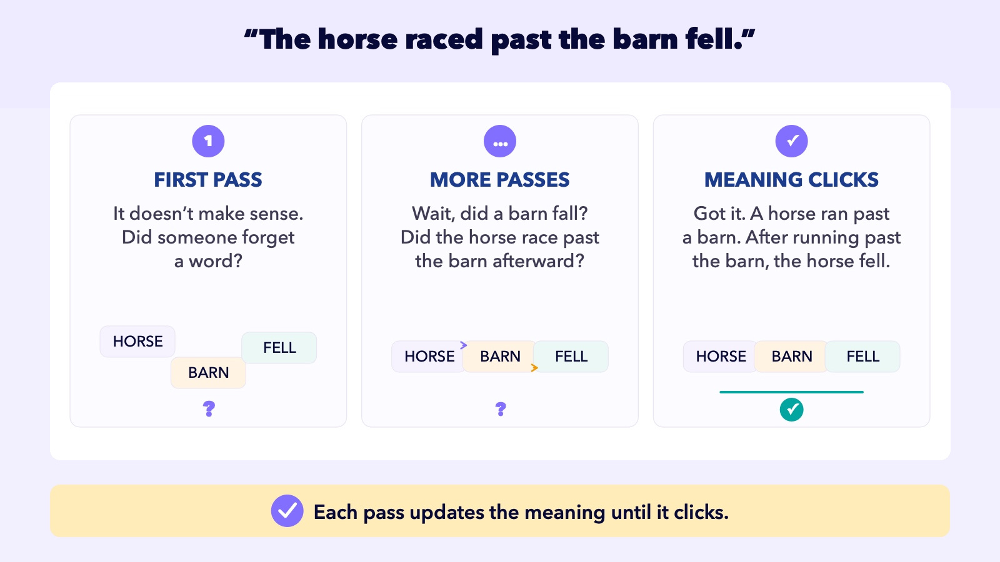
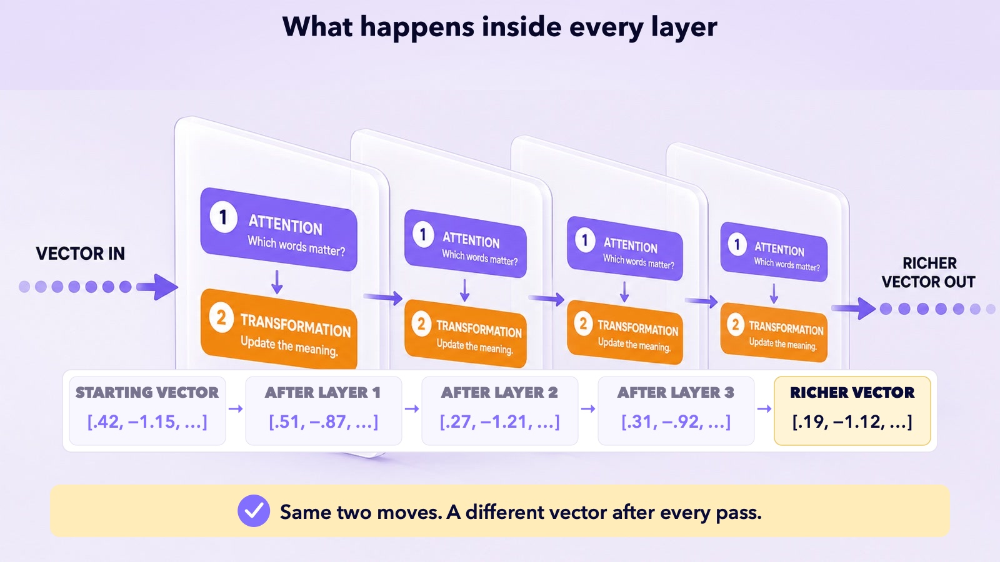

## UNDERSTAND AI

# Layers

Read the following sentence.

## AI does the same thing

It reads your message over and over, establishing the meaning a little more with each pass. And because language is full of nuance, it takes dozens of passes to pin the meaning down.

Each pass is called a **layer**, and at every layer AI runs the two moves you just met: **attention** (which words matter) and **transformation** (update the meaning).

And AI does it with math. At each layer, it adjusts the tokens’ numbers, each pass moving them a little closer to what the tokens mean.

## The mechanics

You saw this sentence in the Transformer lesson. Here’s how the numbers adjust for one word: **IT**. Notice the last box is blank. That box gets filled in the next lesson.

The

cat

sat

on

the

mat

during

the

May

rainstorm

because

it

was

tired

## Ambiguous “it”

On its own, **IT** is just a pronoun. Its vector could mean almost anything, and certainly not **CAT**.

→

## Through the layers

Each layer reads the surrounding words and shifts the numbers for **IT**. Layer by layer, the model works out what **IT** refers to.

→

What does this look like inside the model? Like this.

## Why are there dozens of layers?

Because some meaning is many steps deep.

## Neural networks

The whole stack of layers is called a **neural network**. The design is loosely borrowed from biology, simple units passing signals forward the way neurons do. But that’s where the resemblance ends. It isn’t a brain and it isn’t thinking: it’s the same arithmetic, repeated billions of times, fast.

Meaning builds up, layer by layer.

Attention, then transformation. Dozens of times.
