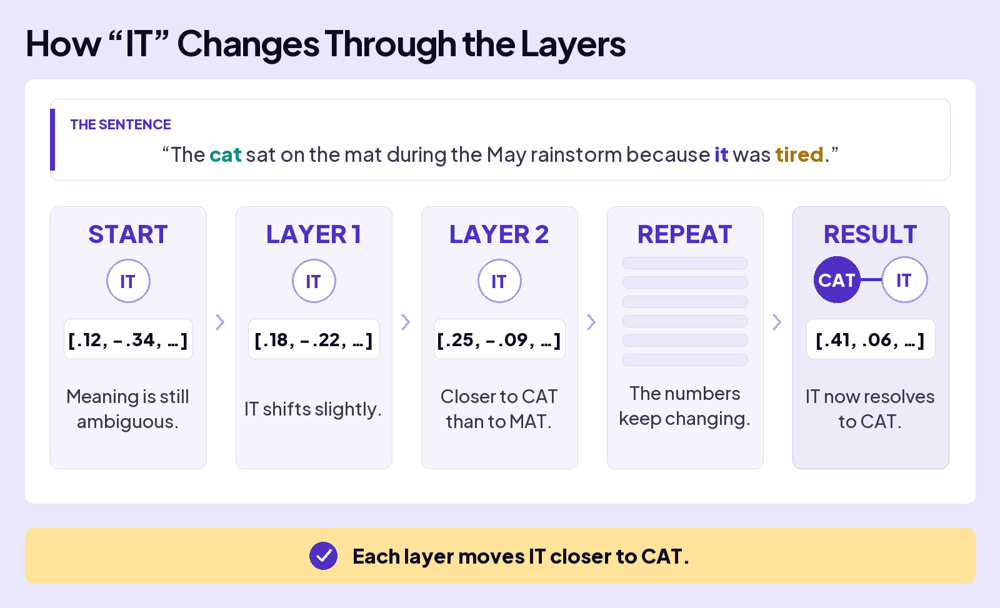
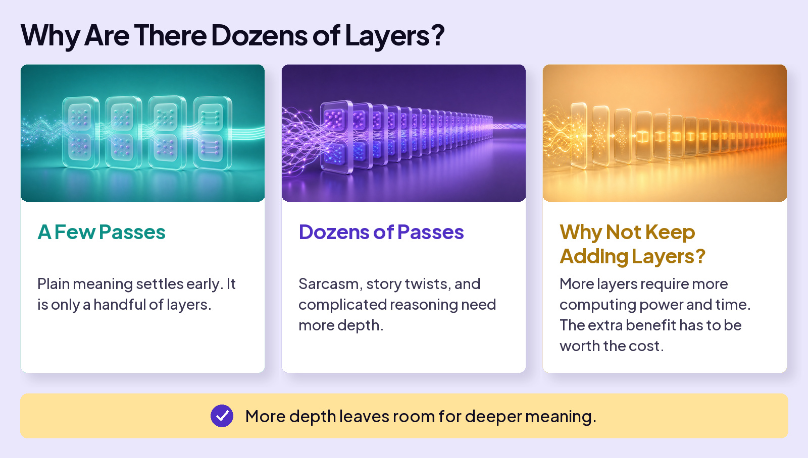

## UNDERSTAND AI

# Layers

Read the following sentence.

## AI does the same thing

It reads your message over and over, establishing the meaning a little more with each pass. And because language is full of nuance, it takes dozens of passes to pin the meaning down.

Each pass is called a **layer**, and at every layer AI runs the two moves you just met: **attention** (which words matter) and **transformation** (update the meaning).

And AI does it with math. At each layer, it adjusts the tokens’ numbers, each pass moving them a little closer to what the tokens mean.

## The mechanics

You saw this sentence in the Transformer lesson. Now follow one word, **IT**, as its numbers change from layer to layer.

## Why are there dozens of layers?

Because some meaning is many steps deep.

## Neural networks

The whole stack of layers is called a **neural network**. The design is loosely borrowed from biology, simple units passing signals forward the way neurons do. But that’s where the resemblance ends. It isn’t a brain and it isn’t thinking: it’s the same arithmetic, repeated billions of times, fast.

Meaning builds up, layer by layer.

Attention, then transformation. Dozens of times.
