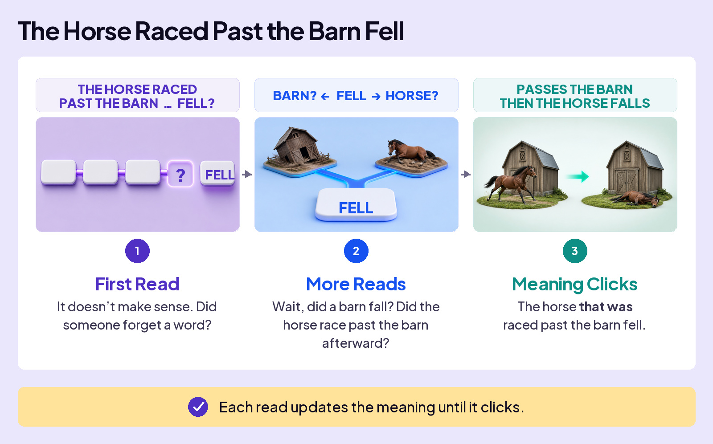
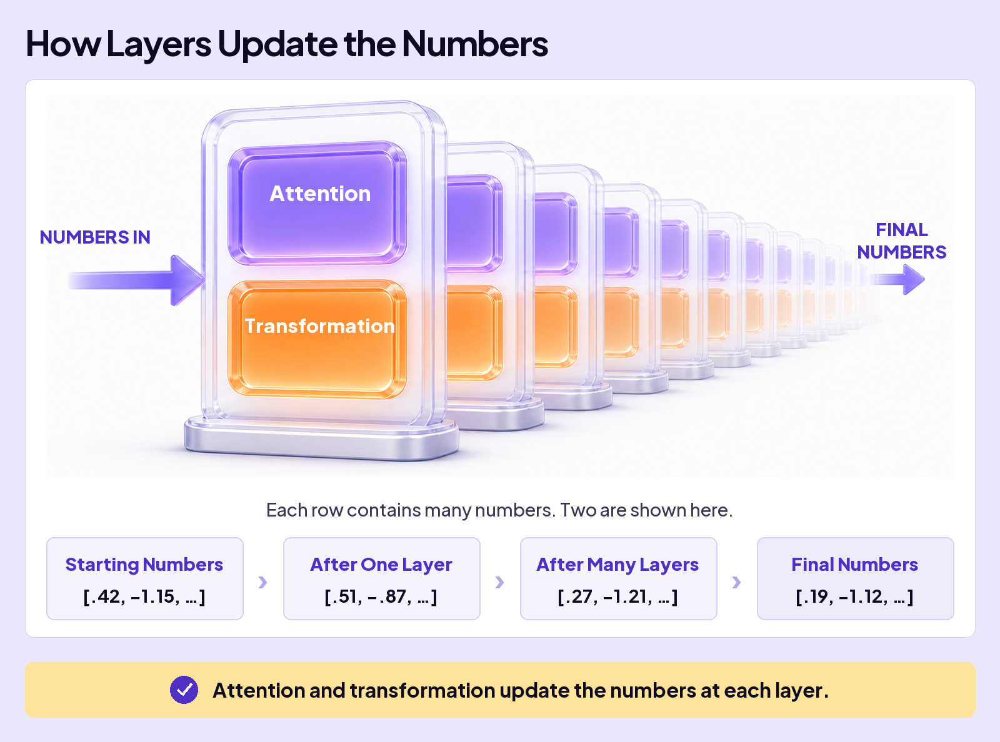

## UNDERSTAND AI

# Layers

Have you ever read a passage in English class that only made sense after a few reads? Try the sentence below. You might need to read it more than once before the meaning clicks.

### Board 1: “The Horse Raced Past the Barn Fell”

**Image file:** `layers-horse-three-reads-editorial.jpg`

**Teaching content:**

1. **First Read:** The sentence does not seem to make sense. Is a word missing?
2. **More Reads:** You try possible interpretations. Did the barn fall? Did the horse race past it afterward?
3. **Meaning Clicks:** Someone raced a horse past a barn. Then the horse fell.

**Takeaway:** Each read updates the meaning until it clicks.

## AI Does Something Similar

AI doesn’t read your message the way you do. It processes your text through a series of **layers**. Within each layer, **attention** and **transformation** work together to update the numbers, helping AI work out what your words mean together. Those updated numbers pass to the next layer. Like rereading a difficult sentence, the process builds on what came before.

The whole stack of layers is called a **neural network**.

### Board 2: How Layers Update the Numbers

**Image file:** `layers-inside-layer-editorial.jpg`

**Teaching content:**

The starting row of numbers passes through many layers. Each layer uses attention and transformation, then passes its updated numbers onward.

Two values from the much longer row are shown at four points:

| Stage | Numbers |
| --- | --- |
| Starting Numbers | [0.42, −1.15, …] |
| After One Layer | [0.51, −0.87, …] |
| After Many Layers | [0.27, −1.21, …] |
| Final Numbers | [0.19, −1.12, …] |

**Takeaway:** Attention and transformation update the numbers at each layer.

## Following One Word Through the Layers

Now follow one word, **IT**, as its numbers change from layer to layer.

### Board 3: How AI Connects ‘IT’ to ‘CAT’

**Image file:** `layers-3-resolves-it.jpg`

**Teaching content:**

**The sentence:** “The **CAT** sat on the mat during the May rainstorm because **IT** was tired.”

Follow IT through the five stages:

| Stage | Numbers shown | What changes |
| --- | --- | --- |
| Start | [0.12, −0.34, …] | IT could refer to different things. The starting numbers don’t tell us which one. |
| Layer 1 | [0.18, −0.22, …] | The numbers begin to capture IT’s connection to CAT. |
| Layer 2 | [0.25, −0.09, …] | The updated numbers carry more information about that connection. |
| Repeat | The row continues through more layers. | Each layer builds on the previous layer’s numbers. |
| Result | [0.41, 0.06, …] | AI works out that IT refers to CAT. |

## How Many Layers Are There?

AI companies don’t always share how many layers their models use. But published designs give us an idea of the scale: dozens of layers, and sometimes more than a hundred.

The horse sentence took a few reads to untangle. Sarcasm, story twists, and complicated reasoning can take even more work. AI’s layers give it more steps to work through those relationships and build meaning.

Why not keep adding layers? More layers require more computing power and time. The extra benefit has to be worth the cost.

## Closing Message

Meaning builds up, layer by layer.

Attention and transformation. Dozens of times.
