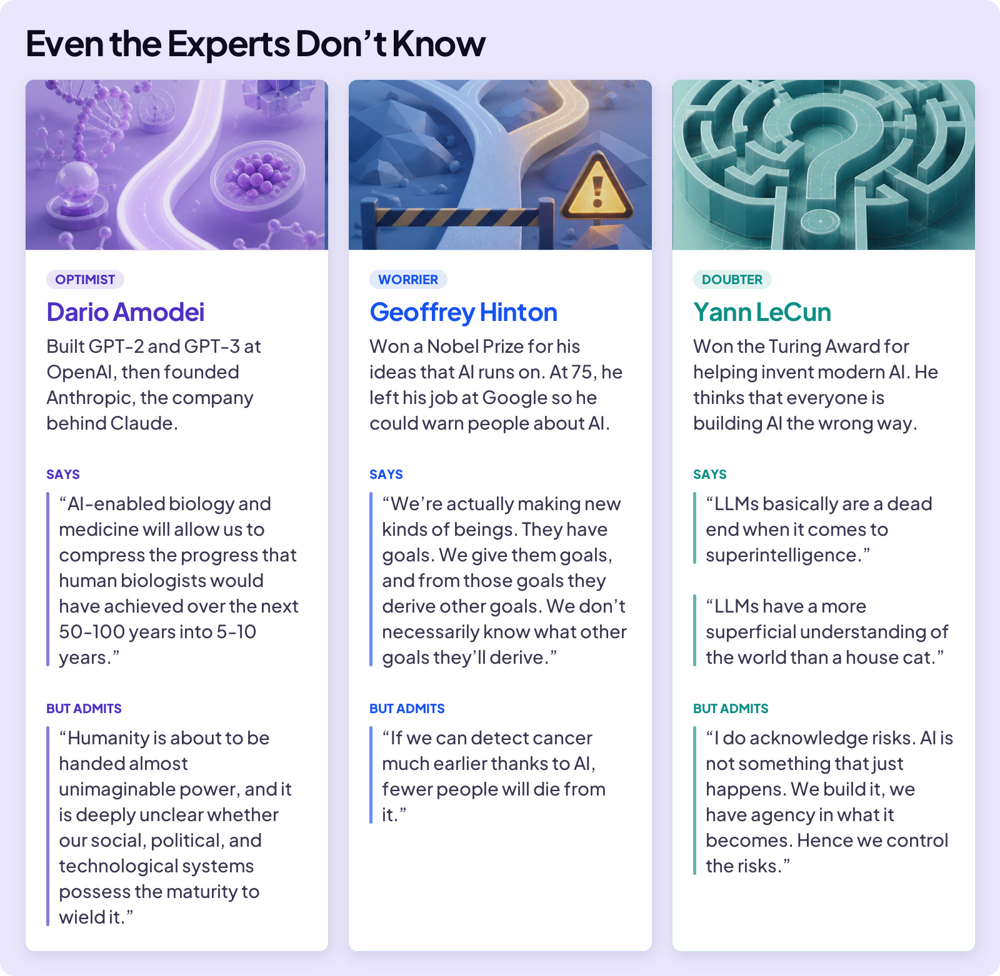
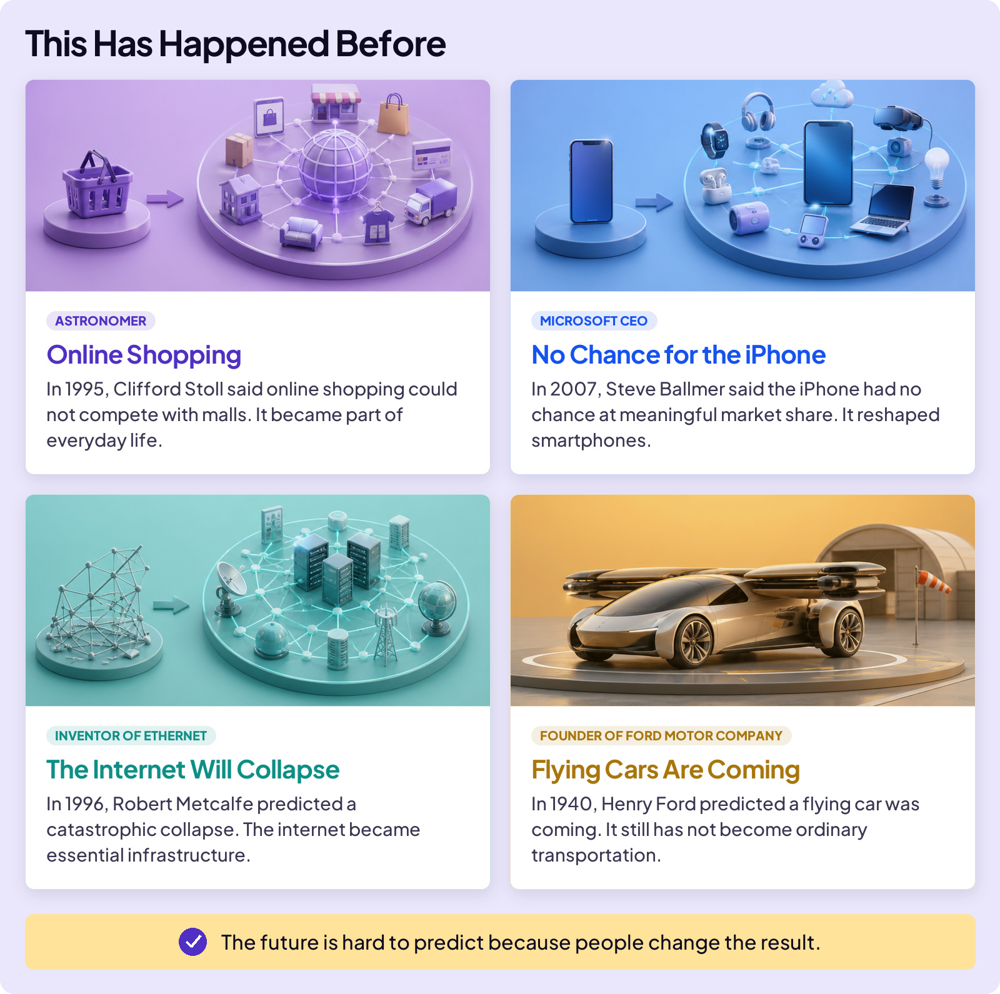
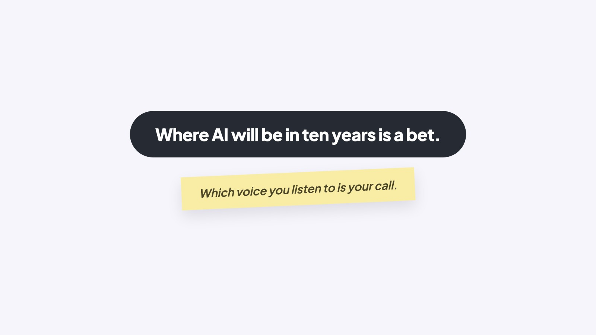

## EMBRACE THE FUTURE

# Loudest Voices

There are almost as many opinions about AI as calculations in an LLM. OK. Just kidding. There aren’t two quadrillion opinions, although it feels that way. You see them on YouTube, TikTok, the news, your family, and friends. Who do you believe?

How about this? Let’s ask the people who make AI for a living. Same field. Same evidence. Very different bets.

### Board 1: Even the Experts Don’t Know

**Image file:** `loudest-voices-1-experts.jpg`

**Teaching content:**

Three experts, three bets.

The Optimist is Dario Amodei. He built GPT-2 and GPT-3 at OpenAI, then founded Anthropic, the company behind Claude. He says: “AI-enabled biology and medicine will allow us to compress the progress that human biologists would have achieved over the next 50 to 100 years into 5 to 10 years.” But he admits: “Humanity is about to be handed almost unimaginable power, and it is deeply unclear whether our social, political, and technological systems possess the maturity to wield it.”

The Worrier is Geoffrey Hinton. He won a Nobel Prize for the ideas that AI runs on. At 75, he left his job at Google so he could warn people about AI. He says: “We’re actually making new kinds of beings. They have goals. We give them goals, and from those goals they derive other goals. We don’t necessarily know what other goals they’ll derive.” But he admits: “If we can detect cancer much earlier thanks to AI, fewer people will die from it.”

The Doubter is Yann LeCun. He won the Turing Award for helping invent modern AI. He thinks everyone is building AI the wrong way. He says: “LLMs basically are a dead end when it comes to superintelligence,” and “LLMs have a more superficial understanding of the world than a house cat.” But he admits: “I do acknowledge risks. AI is not something that just happens. We build it, we have agency in what it becomes. Hence we control the risks.”

Sources: Amodei, Machines of Loving Grace (2024) and The Adolescence of Technology (2026); Hinton, Ai4 conference (August 2025) and Gitex Europe (2025); LeCun, Financial Times (January 2026) and his own posts (2023).

None of them has a simple, one-sided view. The Optimist sees danger. The Worrier sees benefits. The Doubter acknowledges risks. That’s the tell: the people who know AI best still don’t know where it’s going. Where AI will be in ten years is a bet.

## THIS HAS HAPPENED BEFORE

Every big technology arrives with confident predictions from the smartest people around, and those predictions miss in both directions.

### Board 2: This Has Happened Before

**Image file:** `loudest-voices-2-missed-predictions.jpg`

**Teaching content:**

Four confident predictions that missed.

Online shopping. In 1995, astronomer Clifford Stoll said online shopping could not compete with malls. It became part of everyday life.

No chance for the iPhone. In 2007, Microsoft CEO Steve Ballmer said the iPhone had no chance at meaningful market share. It reshaped smartphones.

The internet will collapse. In 1996, Robert Metcalfe, who invented Ethernet, predicted a catastrophic collapse. The internet became essential infrastructure.

Flying cars are coming. In 1940, Ford Motor Company founder Henry Ford predicted a flying car was coming. It still has not become ordinary transportation.

The future is hard to predict because people change the result.

## WHY WERE THEY WRONG?

Because the future is hard to predict. A technology becomes the future only when people change their habits around it. Machines improve fast. Habits change at human speed.

### Close

**Image file:** `loudest-voices-3-close.jpg`

## Closing Message

Where AI will be in ten years is a bet.

Which voice you listen to is your call.
