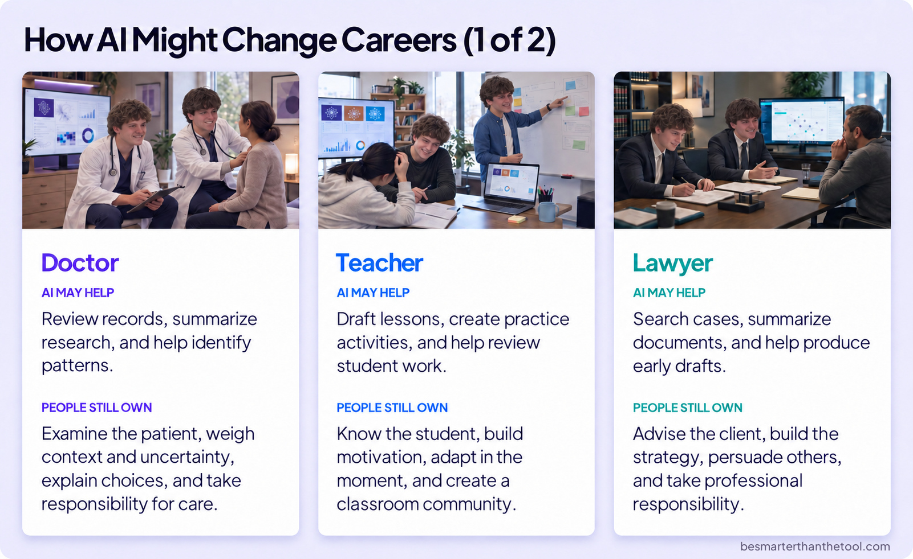
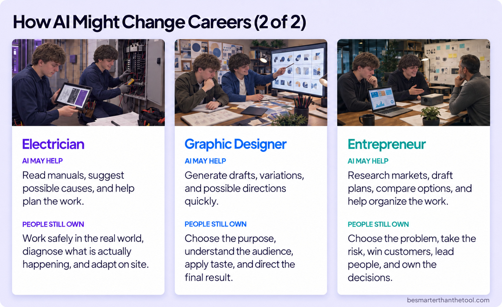
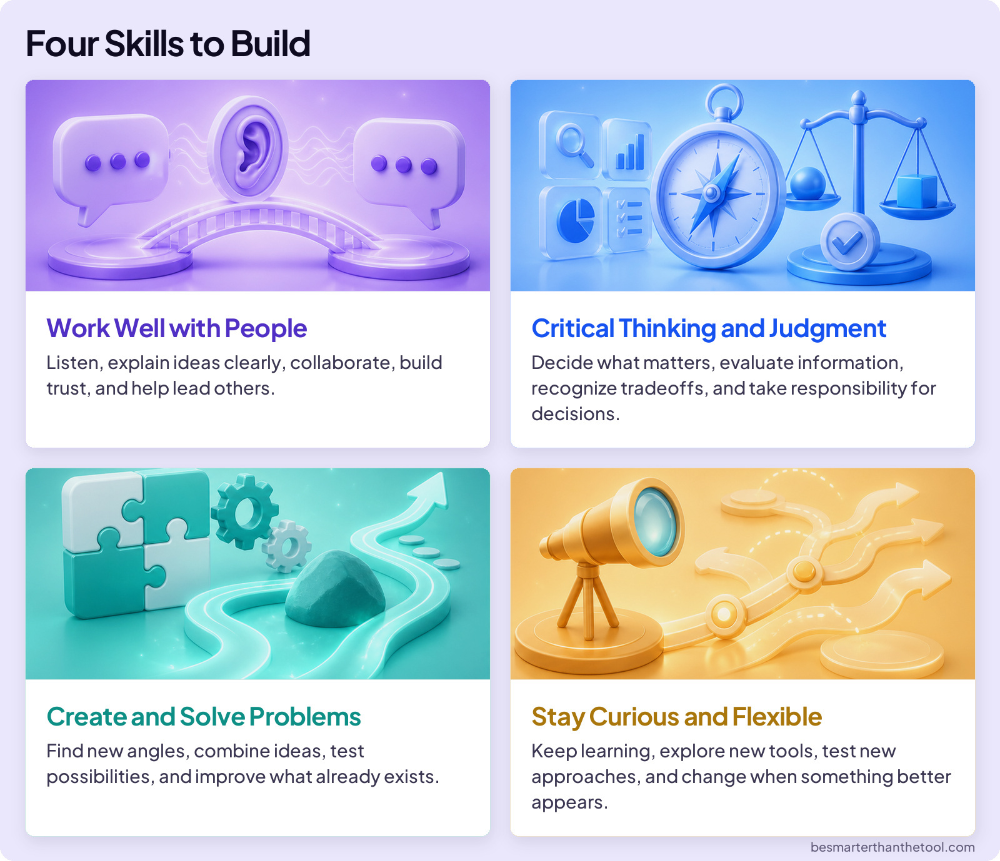
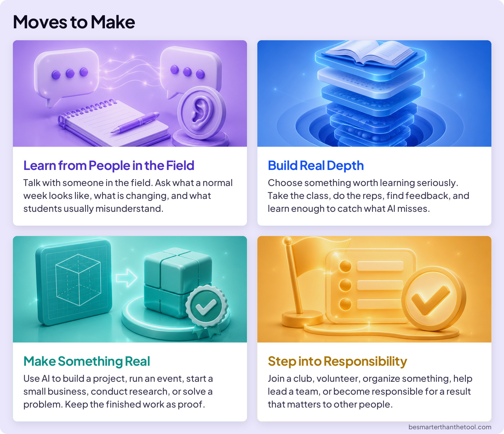
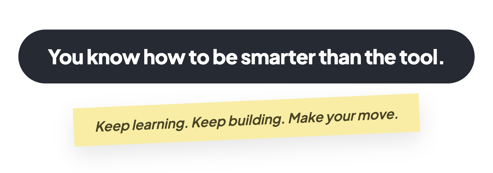

## BUILD YOUR SKILLS

# Make Your Move

Imagine you started a basketball team with friends. You learned the fundamentals, practiced regularly, and became better players. Then someone asks, “What’s next? Are we joining a league? Are we actually going to play?”

That is where you are now with AI. You have learned the fundamentals and built important skills. Now it is time to decide what you will do with them.

## AI AND YOUR FUTURE CAREER

If you’re thinking about how AI might change careers, you’re not alone. But remember: jobs are made up of many different tasks, and AI will not affect every task in the same way.

### Board 1a: How AI Might Change Careers (1 of 2)

**Image file:** `make-your-move-doctors-teachers-lawyers.jpg`

**Teaching content:**

Doctor. AI may help review records, summarize research, and help identify patterns. People still own examining the patient, weighing context and uncertainty, explaining choices, and taking responsibility for care.

Teacher. AI may help draft lessons, create practice activities, and help review student work. People still own knowing the student, building motivation, adapting in the moment, and creating a classroom community.

Lawyer. AI may help search cases, summarize documents, and help produce early drafts. People still own advising the client, building the strategy, persuading others, and taking professional responsibility.

### Board 1b: How AI Might Change Careers (2 of 2)

**Image file:** `make-your-move-electricians-designers-entrepreneurs.jpg`

**Teaching content:**

Electrician. AI may help read manuals, suggest possible causes, and help plan the work. People still own working safely in the real world, diagnosing what is actually happening, and adapting on site.

Graphic designer. AI may help generate drafts, variations, and possible directions quickly. People still own choosing the purpose, understanding the audience, applying taste, and directing the final result.

Entrepreneur. AI may help research markets, draft plans, compare options, and help organize the work. People still own choosing the problem, taking the risk, winning customers, leading people, and owning the decisions.

## SKILLS THAT TRAVEL

In every example above, AI may take on more tasks, but people are responsible for the most important work. That points to a practical move: build skills you can carry into almost any career.

### Board 2: Four Skills to Build

**Image file:** `make-your-move-skills.jpg`

**Teaching content:**

Work well with people: listen, explain ideas clearly, collaborate, build trust, and help lead others.

Critical thinking and judgment: decide what matters, evaluate information, recognize tradeoffs, and take responsibility for decisions.

Create and solve problems: find new angles, combine ideas, test possibilities, and improve what already exists.

Stay curious and flexible: keep learning, explore new tools, test new approaches, and change when something better appears.

## FOUR MOVES TO MAKE

You do not need to choose your entire future today. These four moves work whether you already have a career in mind or are still exploring.

### Board 3: Moves to Make

**Image file:** `make-your-move-actions.jpg`

**Teaching content:**

Learn from people in the field: talk with someone in the field. Ask what a normal week looks like, what is changing, and what students usually misunderstand.

Build real depth: choose something worth learning seriously. Take the class, do the reps, find feedback, and learn enough to catch what AI misses.

Make something real: use AI to build a project, run an event, start a small business, conduct research, or solve a problem. Keep the finished work as proof.

Step into responsibility: join a club, volunteer, organize something, help lead a team, or become responsible for a result that matters to other people.

### Board 4: Close

**Image file:** `make-your-move-close.jpg`

## Closing Message

You know how to be smarter than the tool.

Keep learning. Keep building. Make your move.
