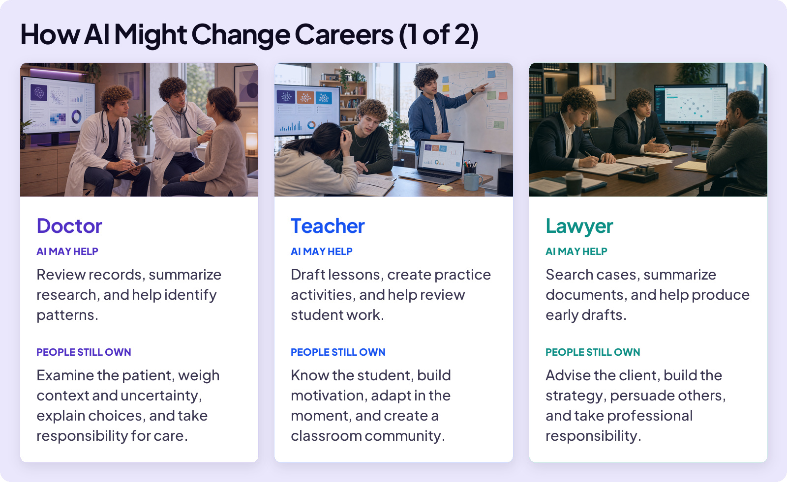
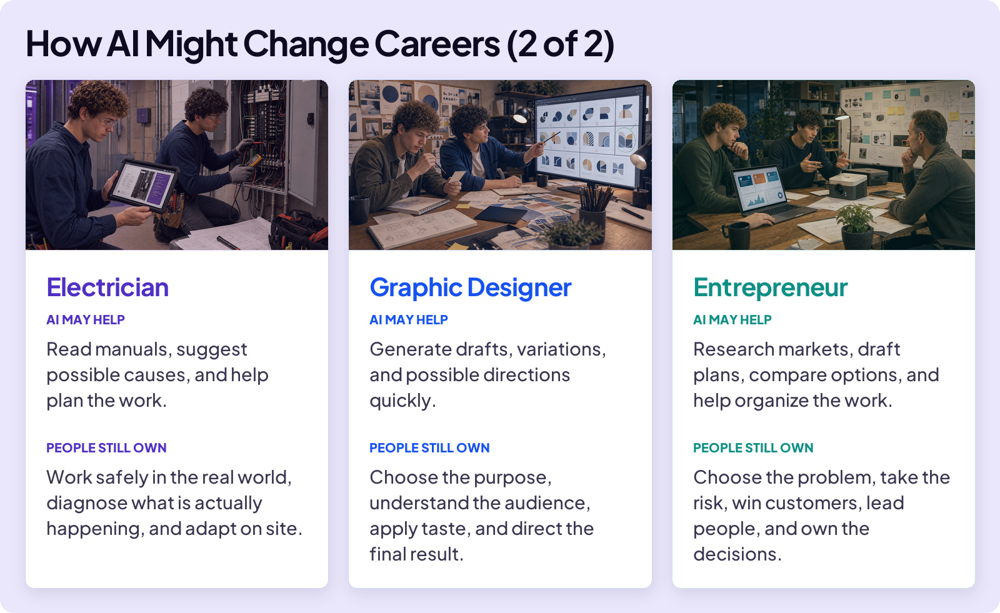

## BUILD YOUR SKILLS

# Make Your Move

Draft Lesson. Still working on it.

Imagine you started a basketball team with friends. You learned the fundamentals, practiced regularly, and became better players. Then someone asks, “What’s next? Are we joining a league? Are we actually going to play?”

That is where you are now with AI. You have learned the fundamentals and built important skills. Now it is time to decide what you will do with them.

## A NOTE FROM NATE AND LUKE

We’re still in high school, too. We’re not qualified to tell you what to do next. But we learned a lot while building this course. Use these moves as starting points, talk with adults who know you, and remember that nobody can predict what the future will look like.

## AI AND YOUR FUTURE CAREER

If you’re thinking about how AI might change careers, you’re not alone. But remember: jobs are made up of many different tasks, and AI will not affect every task in the same way.

## SKILLS THAT TRAVEL

In every example above, AI may take on more tasks, but people are responsible for the most important work. That points to a practical move: build skills you can carry into almost any career.

### Four Skills to Build

**Work well with people:**Listen, explain ideas clearly, collaborate, build trust, and help lead others.

**Critical thinking and judgment:**Decide what matters, evaluate information, recognize tradeoffs, and take responsibility for decisions.

**Create and solve problems:**Find new angles, combine ideas, test possibilities, and improve what already exists.

**Stay curious and flexible:**Keep learning, explore new tools, test new approaches, and change when something better appears.

## FOUR MOVES TO MAKE

You do not need to choose your entire future today. These four moves work whether you already have a career in mind or are still exploring.

### Moves to Make

**Learn from people in the field:**Talk with someone in the field. Ask what a normal week looks like, what is changing, and what students usually misunderstand.

**Build real depth:**Choose something worth learning seriously. Take the class, do the reps, find feedback, and learn enough to catch what AI misses.

**Make something real:**Use AI to build a project, run an event, start a small business, conduct research, or solve a problem. Keep the finished work as proof.

**Step into responsibility:**Join a club, volunteer, organize something, help lead a team, or become responsible for a result that matters to other people.

You know how to be smarter than the tool.

Keep learning. Keep building. Make your move.
