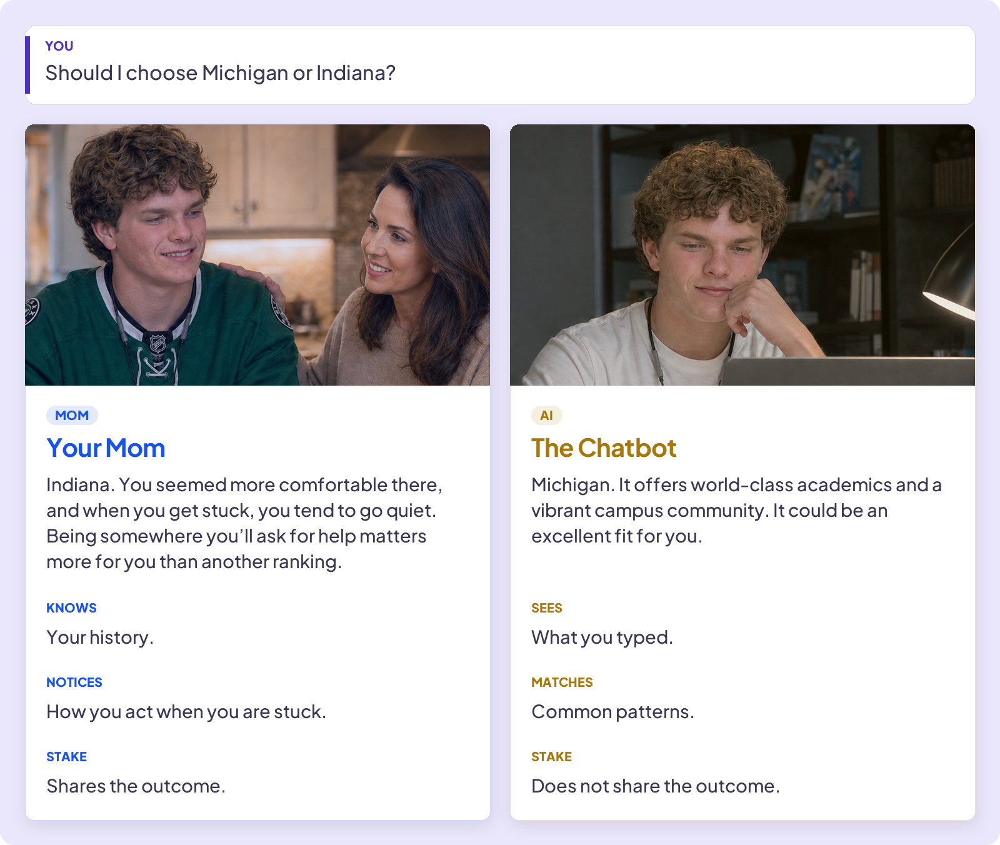
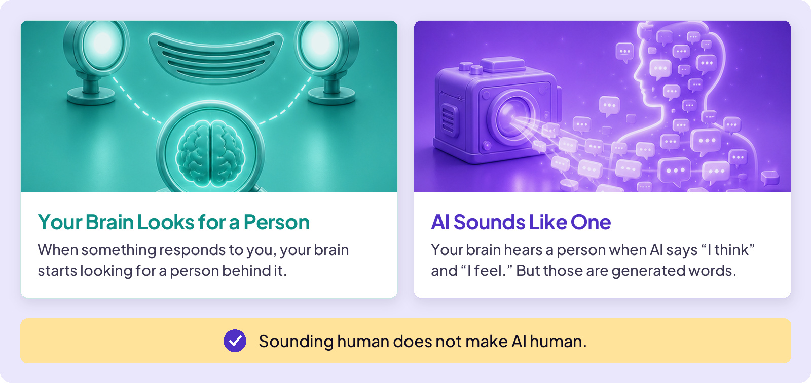

## AVOID TRAPS

# Mind Trap

Some AI traps aren’t about whether the answer is correct. They’re about how the answer feels, and what that feeling makes you trust.

You know AI isn’t a person and doesn’t think. So why can chatting with it still feel like talking to somebody?

Think about picking a college. Ask the same question twice, once at the dinner table and once in a chat window:

## The Same Question. Two Different Kinds of Knowing.

The AI answer is smooth, confident, and easy to like. But it could have been written for almost anyone. **Mind Trap is giving a human-sounding answer the trust you would give someone who knows you.**

## The ELIZA Effect

In the 1960s, some people began treating a simple chatbot called ELIZA as if it understood them. But ELIZA mostly matched patterns and turned their words back into questions. That response became known as the ELIZA effect.

## Why AI Feels Like Somebody

When AI feels like a person, its advice can start to carry the weight of advice from someone who knows you.

## For Decisions That Matter

AI can gather facts, lay out options, and challenge your thinking. But it does not know you or live with the result. Talk it through with people who do. Then make the call.

**For decisions that matter**

Use AI to think. You make the call.
