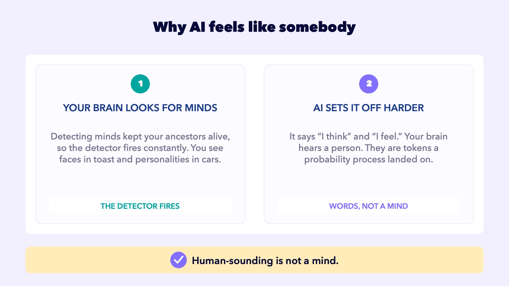

## AVOID TRAPS

# Mind Trap

The next four traps are different from the first three. They’re not about whether the answer is correct. They’re about how the answer feels, and what that feeling makes you trust.

You know AI isn’t a person and doesn’t think. This lesson is why it keeps feeling like somebody is anyway, and what that feeling does to you.

Think about picking a college. Ask the same question twice, once at the dinner table and once in a chat window:

Should I go to the University of Michigan or Indiana University?

🧑

Your Mom

Indiana. When you’re stuck, you go quiet, and in Michigan’s 300-person lectures nobody notices quiet. Indiana’s classes are small enough that your professors will.

## What happened

Searched eighteen years of knowing you

Knows how you act when you’re stuck

Has a stake in how it turns out

🤖

AI

Great question! Michigan offers world-class academics and a vibrant campus community. It could be an excellent fit for you.

## What happened

Matched a million college-advice pages

No memory of you, no stake in the outcome

Nobody behind the words

Notice which answer sounds better. The AI’s is smoother, more confident, easier to like. And it could have been written for anyone. **Mind Trap is accepting AI’s words as human advice.**

## Not a new problem

In the 1960s, users of a simple chatbot called ELIZA reported feeling that it understood them, even though the program just rearranged their words into questions. Researchers named the pattern the *ELIZA effect*.

🔑 **Don’t let AI make the decisions that matter.**It doesn’t think, it doesn’t know you, and it can’t care how your life turns out. Let it gather the facts, lay out the options, pressure-test your thinking. Then take the decision to people, the ones with a stake in the answer.

Human-sounding isn’t a mind.

The words are real. Nobody’s home.
