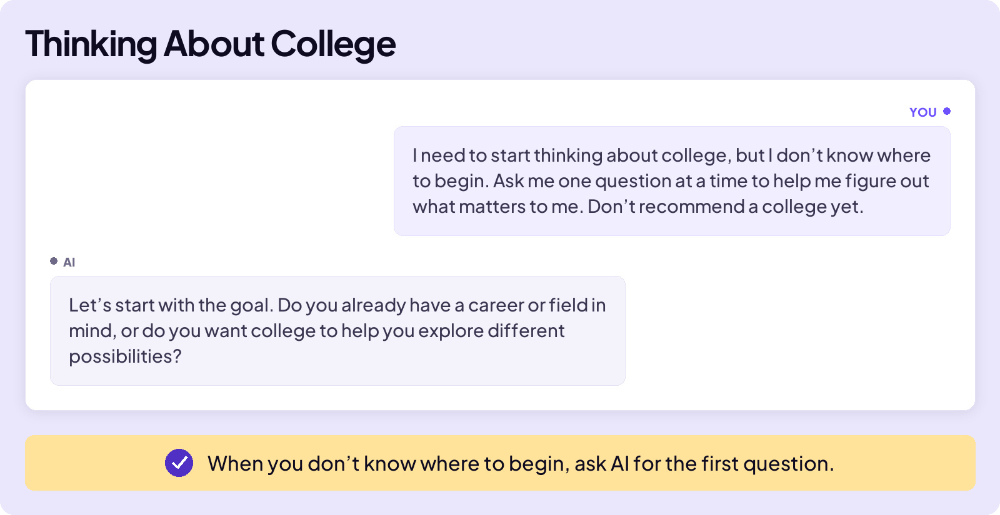
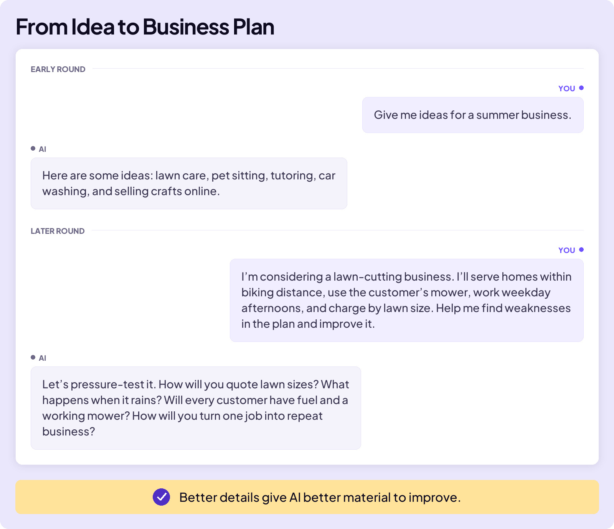
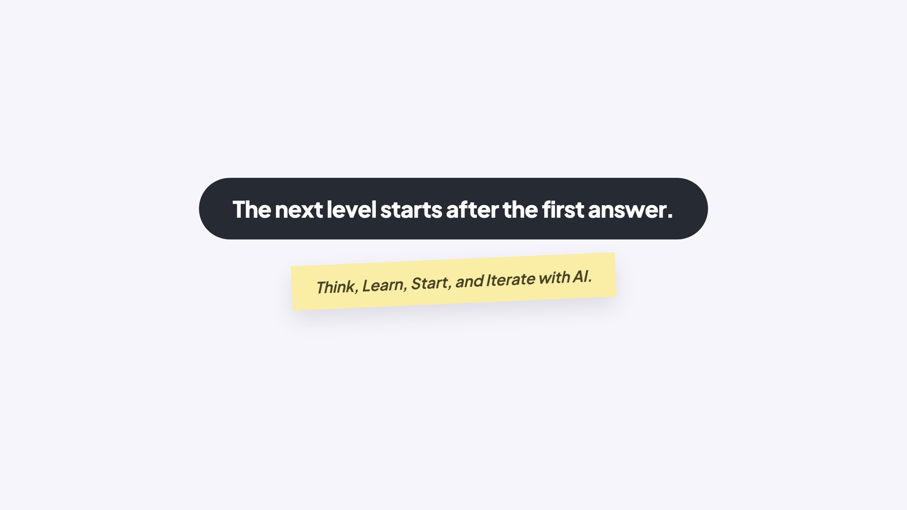

## BUILD YOUR SKILLS

# Next Level Moves

Most people think AI works like this: you type the perfect prompt, and AI returns the perfect answer. That’s only the start.

Think back to the best group project you’ve ever done in history class. Your group didn’t start with the perfect finished project. You shared ideas, figured out what was missing, and improved it together. That’s the same way you should work with AI. The group is smaller, just you and AI, but the best result still takes a conversation and several rounds of improvement.

There are four moves: think, learn, start, and iterate.

## THOUGHT PARTNER

During that history project, your group brainstormed ideas, asked questions, suggested next steps, and helped one another decide what worked. The group acted as your thought partner.

Work with AI like it’s a two-person group project: you and AI. Ask each other questions and bounce ideas off each other. But remember that you make the final decisions.

### Board 1: Starting a Summer Business

**Image file:** `next-level-moves-1-summer-business.jpg`

**Teaching content:**

Here is the conversation on the board. The student says: “I’d like to earn money this summer by starting a small business. Can we talk through what might fit me?”

AI answers: “Absolutely. Let’s start with where you are. What are you already good at, and what problems do people around you regularly need help solving?”

The student says: “I’m good with dogs and teaching younger kids math, I can get around my neighborhood, and I have afternoons free.”

AI answers: “That gives us three realistic directions: pet care, math tutoring, and a neighborhood errand service. Which sounds most interesting to you, and which would be easiest to start?”

Notice what AI did first. It did not hand over a list of jobs. It asked about the student before it answered.

**Takeaway:** A good conversation asks about you before it answers.

## LEARN WITH AI

During the history group project, some members probably knew more about the subject than others. If a group member didn’t understand a concept, they asked the group.

Work with AI in the same way. When something does not make sense, ask it to explain. Ask follow-up questions, connect the idea to something you already know, and check whether you understand it. Then explain the idea back in your own words and ask what you missed.

### Board 2: Understanding Profit

**Image file:** `next-level-moves-2-profit.jpg`

**Teaching content:**

The student says: “I might start a business this summer mowing lawns. I have three friends who are available part-time to help me. I know that sales is the money customers pay me. What is profit, and how do I calculate it? Explain it using simple numbers that apply to a lawn-mowing business.”

AI answers: “Profit is the money left after you subtract every cost from your sales. Suppose your crew mows 10 lawns at $30 each. Your sales are $300. You pay each of your three friends $40, so labor costs $120. Gas and supplies cost another $30. Your total costs are $150, leaving you with $150 in profit. The formula is: Sales minus Costs equals Profit.”

The student asked for the idea in a situation they already knew, so the numbers made sense: $300 in sales, $150 in costs, $150 in profit.

**Takeaway:** Ask AI to explain the idea using a situation you know.

## FIND A PLACE TO START

For the history project, the teacher gave your group a clear topic, such as “What caused the Civil War?” The group knew where to start.

Real life isn’t always that clear. What if you face a big decision or issue, and don’t even know where to start? In those moments, AI can help. Ask it for the first question.

### Board 3: Thinking About College

**Image file:** `next-level-moves-3-college.jpg`

**Teaching content:**

The student says: “I need to start thinking about college, but I don’t know where to begin. Ask me one question at a time to help me figure out what matters to me. Don’t recommend a college yet.”

AI answers: “Let’s start with the goal. Do you already have a career or field in mind, or do you want college to help you explore different possibilities?”

The student set the rules: one question at a time, and no recommendation yet. AI’s first question gave the student a place to start.

**Takeaway:** When you don’t know where to begin, ask AI for the first question.

## ITERATE WITH AI

That history group project lasted four weeks. At the end of week one, your project was only average. Each week the group made it better and better. And, by the time you presented it to the class, it was a masterpiece!

That process is called iteration. To iterate means to build something in versions, using each version to improve the next.

Working with AI follows the same pattern. As you add details, correct weak spots, and improve the draft, AI has better material to question, evaluate, and improve.

### Board 4: From Idea to Business Plan

**Image file:** `next-level-moves-4-iteration.jpg`

**Teaching content:**

The board shows an early round and a later round.

Early round. The student says: “Give me ideas for a summer business.” AI answers: “Here are some ideas: lawn care, pet sitting, tutoring, car washing, and selling crafts online.” A vague request got a generic list.

Later round. The student says: “I’m considering a lawn-cutting business. I’ll serve homes within biking distance, use the customer’s mower, work weekday afternoons, and charge by lawn size. Help me find weaknesses in the plan and improve it.” AI answers: “Let’s pressure-test it. How will you quote lawn sizes? What happens when it rains? Will every customer have fuel and a working mower? How will you turn one job into repeat business?”

The difference is the details. In the later round, AI had a real plan to test, so it found real weaknesses.

**Takeaway:** Better details give AI better material to improve.

### Board 5: Close

**Image file:** `next-level-moves-5-close.jpg`

## Closing Message

The next level starts after the first answer.

Think, Learn, Start, and Iterate with AI.
