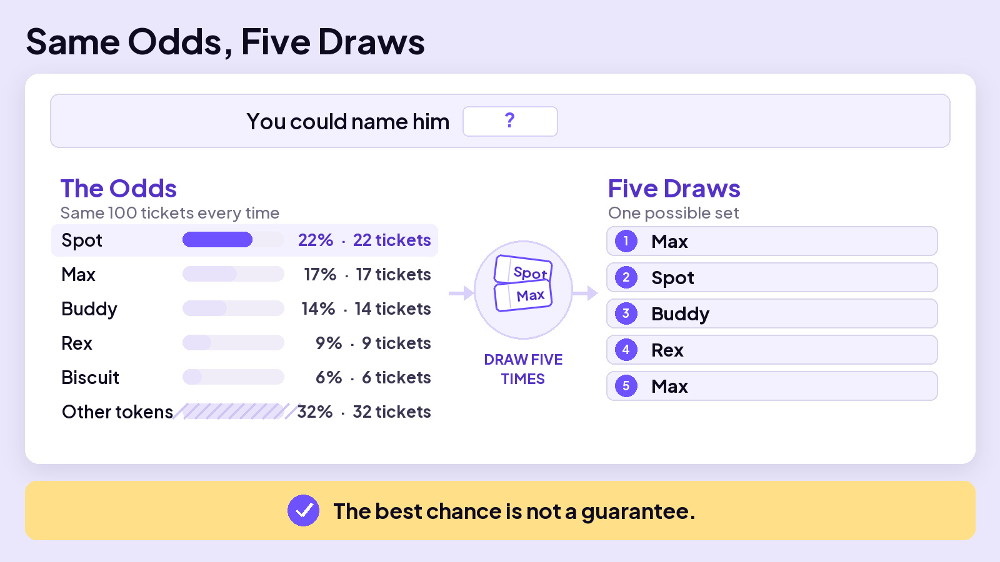
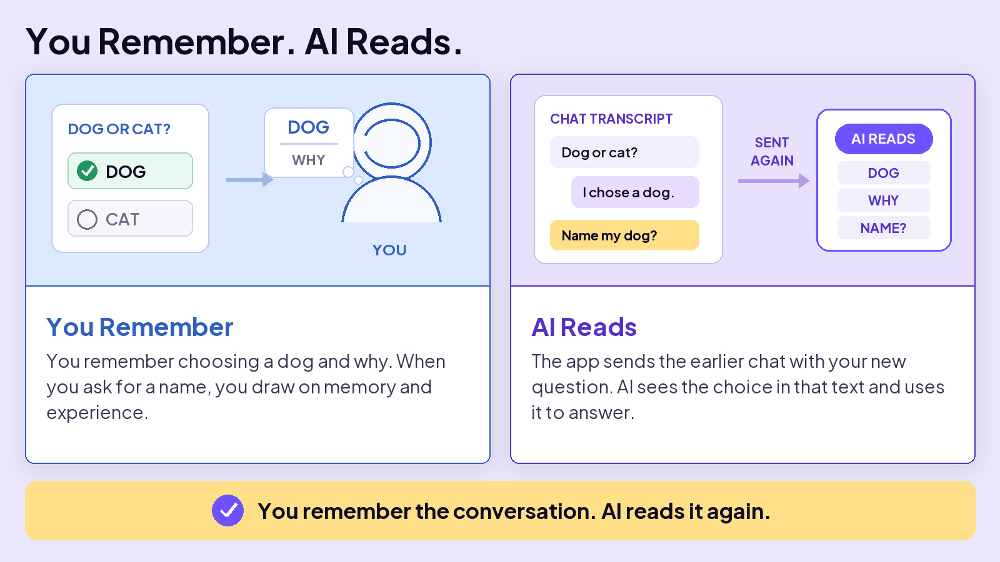
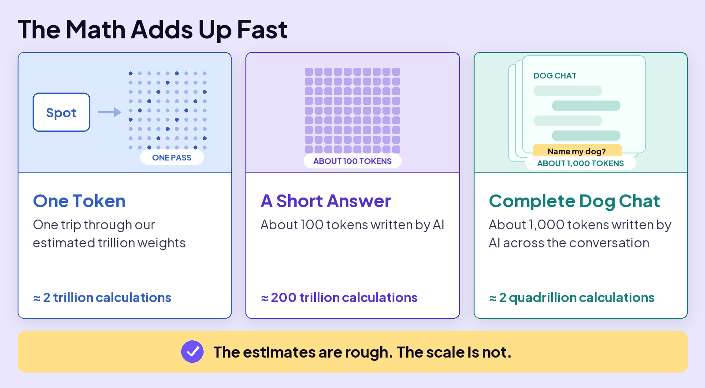

## UNDERSTAND AI

# One More Thing

One more thing. Actually, three.

Across this section, you built the machine from tokens to predictions. Three questions remain: Why can the same prompt produce a different answer? How does a chat seem to remember what came before? And how much math does one answer require?

Answer those, and the whole process comes together.

## The top token does not always win

When AI builds an answer, it scores many possible next tokens and ranks them. The token at the top has the best chance of being selected, but it does not always win. Another likely token can be chosen instead. That is one reason the same question can produce different answers.

Suppose you ask AI, “What should I name my new dog?” As it builds the answer, it reaches the place where a dog name comes next.

Think of the choice as a weighted drawing. If Spot has a 22% chance, imagine Spot holding 22 of 100 tickets. Max holds 17, Buddy holds 14, and the other possible tokens share the rest.

Spot has more tickets than any single choice, so it has the best chance to win. But the other choices hold 78 tickets together. Most drawings will select something other than Spot.

Why give other choices a chance? If AI always selected the safest token, its answers would start to sound repetitive. Letting other likely choices win gives the writing more variety.

When AI selects a different token, every prediction that follows starts from a different place. The replies do not just differ by one word. They can take different paths.

## AI doesn’t remember

Back to naming your dog. This time, the question comes at the end of a long chat about whether to get a dog or a cat. After choosing a dog, you ask, “What should I name my new dog?”

AI can use that earlier discussion, which makes it seem like it remembers. It doesn’t. The app keeps the chat transcript and sends it along with your new question. The model sees the dog-or-cat discussion again and uses it to answer. The words are in front of it, not stored as a memory of making the decision with you.

AI does not even remember the last word it wrote. It doesn’t have to. AI adds each new word to the reply and uses that growing reply to make the next prediction. The rest of the context window stays in front of AI too. That is how it uses earlier information without remembering it.

## The scale of the math

Now count what an answer takes. Training created the model’s weights, the numbers that shape every prediction. When you use AI, those weights stay fixed. For each new token, AI uses those weights in a massive set of calculations.

OpenAI doesn’t publish enough about the model behind ChatGPT to count its calculations exactly. So this is a rough guess. The exact number is not the point. What matters is how quickly the math becomes enormous.

Let’s estimate one trillion weights in an LLM. If each weight requires roughly a multiply and an add for every token, that comes to about two trillion calculations for one token.

A longer chat gives AI more information to work with, but it also creates more work. More text has to be processed and kept available while the reply is built. That can make long conversations slower. Starting a new chat for a different task keeps the work focused.

Not a mind. Math, at a scale nobody can picture.

Every time you hit send.
