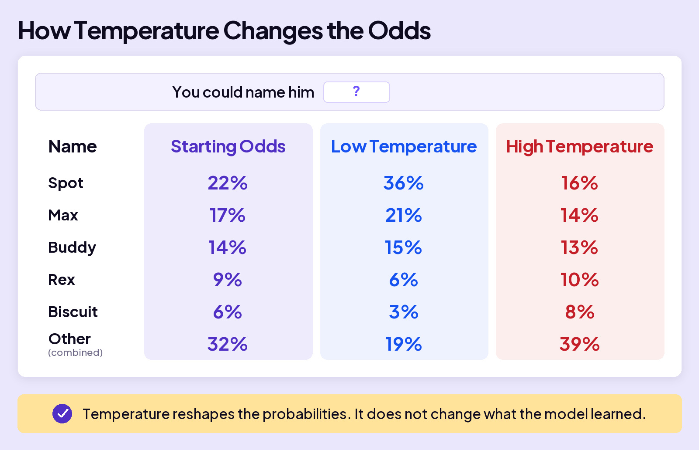

## UNDERSTAND AI

# One More Thing

One more thing. Actually, three.

Why can the same prompt produce a different answer? What makes AI’s answers more predictable or more varied? And how much math does one answer require?

## The Top Choice Doesn’t Always Win

You ask AI, “What should I name my new dog?” When AI reaches the name, it calculates a probability for every token in its vocabulary. Spot is the top choice at 22%, so you might expect AI to pick it every time.

But having the highest probability doesn’t guarantee selection. A 22% probability means AI would pick Spot about 22 times out of 100 tries, on average, if the odds stay the same.

### Board 1: Same Probabilities, Different Choices

**Image file:** `one-more-thing-1-draws.jpg`

**Teaching content:**

**Answer so far:** “You could name him **?**”

| Possible next token | Probability |
| --- | --- |
| Spot | 22% |
| Max | 17% |
| Buddy | 14% |
| Rex | 9% |
| Biscuit | 6% |
| Other tokens combined | 32% |

Five separate tries with these probabilities unchanged produce **Max, Spot, Buddy, Rex, Max**. These are separate selections at the same point in the answer, not five successive tokens in one reply. They show one possible set of outcomes, not a required pattern.

**Takeaway:** The best chance is not a guarantee.

**Two important points:**

- Choosing the most likely token every time can make answers repetitive. Giving other likely tokens a chance adds variety.
- Each token AI chooses shapes what comes next, so one different choice can send the answer in a different direction.

## Temperature

Behind the scenes, the app uses a setting called **temperature** to reshape the probabilities before AI picks a token. Low temperature makes the most likely choices even more likely. High temperature gives less likely choices a better chance.

Start with the same probabilities. Watch how they change with temperature.

### Board 2: How Temperature Changes the Odds

**Image file:** `one-more-thing-2-temperature.jpg`

**Teaching content:**

**Answer so far:** “You could name him **?**”

| Name | Starting Odds | Low Temperature | High Temperature |
| --- | --- | --- | --- |
| Spot | 22% | 36% | 16% |
| Max | 17% | 21% | 14% |
| Buddy | 14% | 15% | 13% |
| Rex | 9% | 6% | 10% |
| Biscuit | 6% | 3% | 8% |
| Other tokens combined | 32% | 19% | 39% |

The starting odds match the previous board. Low temperature concentrates probability on the most likely choices. High temperature spreads it more evenly, giving less likely choices a better chance. Each column totals 100%, with percentages rounded to whole numbers.

**Takeaway:** Temperature reshapes the probabilities. It does not change what the model learned.

## The scale of the math

Now count what an answer takes. Training created the model’s weights, the numbers that shape every prediction. When you use AI, those weights stay fixed. For each new token, AI uses those weights in a massive set of calculations.

To picture the scale, imagine a model that uses one trillion weights for each token it produces. At roughly two calculations per weight, that would mean about two trillion calculations for one token.

### Board 3: The Math Adds Up Fast

**Image file:** `one-more-thing-3-bill.jpg`

**Teaching content:**

Use the hypothetical model described above: one trillion weights used for each new token, with roughly two calculations per weight.

| Amount written by AI | Approximate calculations |
| --- | --- |
| One token | 2 trillion |
| A short answer: about 100 tokens | 200 trillion |
| A longer conversation: about 1,000 tokens written by AI across the conversation | 2 quadrillion |

These estimates concern the tokens AI writes. They do not assume that all earlier work is repeated for every new token.

**Takeaway:** Even a short answer takes trillions of calculations.

## Closing Message

Not a mind. Math, at a scale nobody can picture.

Every time you hit send.
